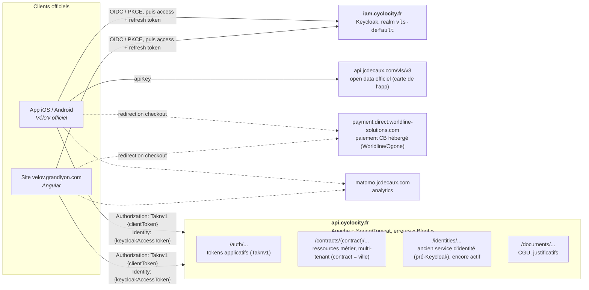
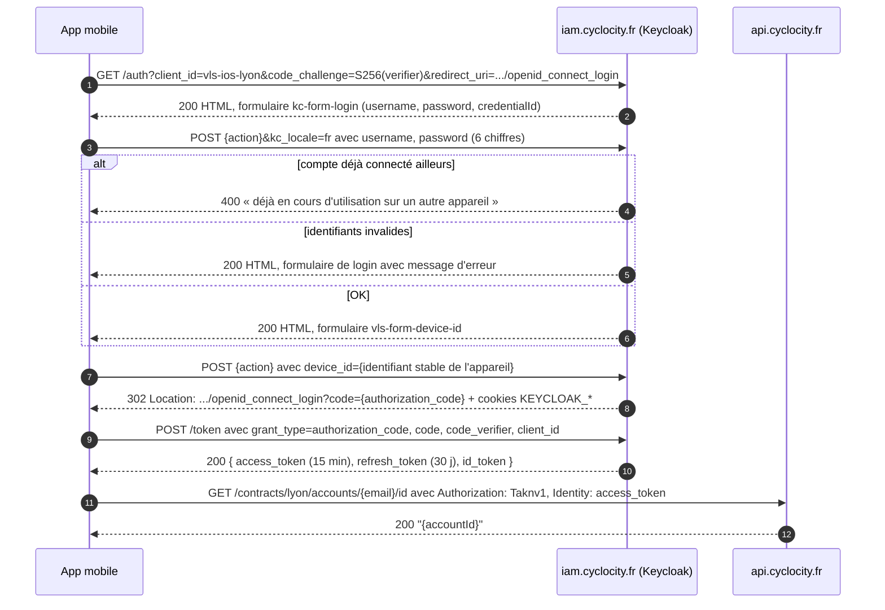
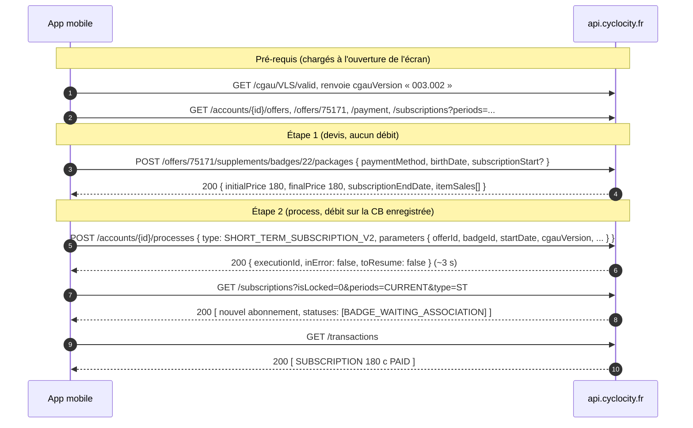
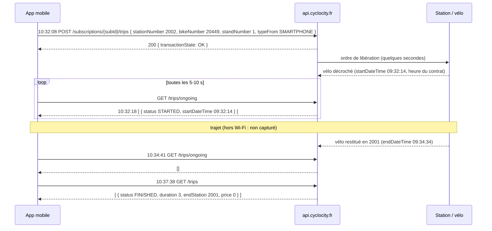

# API Cyclocity (Vélo'v Lyon) : documentation communautaire non officielle

[](#avertissement) [](#1-méthodologie-et-sources) [](#5-référence-des-endpoints) [](#licence) [](cyclocity.openapi.yaml) [](#contribuer)

> Documentation reverse-engineered de l'API **Cyclocity** de JCDecaux (`api.cyclocity.fr`) telle qu'utilisée par l'application **Vélo'v officiel** (iOS 3.3.1, puis 3.6.1) et par le site **velov.grandlyon.com**. Elle est destinée aux développeurs qui veulent construire des outils autour du service Vélo'v (et, par extension, des autres services JCDecaux motorisés par la même plateforme : Bicloo, Villo!, Vel'oh!, dublinbikes, VélôToulouse...).
>
> **En bref** : une clé publique suffit pour lire stations, vélos, offres et configuration ; un compte Vélo'v (login Keycloak) est nécessaire pour les abonnements, trajets, paiements et le déverrouillage. Tout est vérifiable avec `curl` : voir [Démarrage en 2 minutes](#démarrage-en-2-minutes).

<a id="avertissement"></a>

> ⚠️ **Non officielle, sans garantie.** Rien de ce qui suit n'est supporté par JCDecaux ni par la Métropole de Lyon. Les endpoints, clés et formats peuvent changer ou être révoqués sans préavis. Utilisez uniquement **votre propre compte** et respectez les CGU du service. Pour de la simple donnée « stations / disponibilités », préférez l'**open data** (§ 10) qui est officiel et libre.

## Pourquoi cette documentation ?

Des ressources existent déjà : [Pikari0](https://github.com/Pikari0/doc_velov_api) (2018, décompilation Android, ancien flow `/identities`), [VLSKit](https://github.com/Fyroeo/VLSKit) (2026, client Swift reconstruit depuis l'app Android) et quelques trackers de stations par ville. Celle-ci s'en distingue sur plusieurs points :

- **Captures réseau réelles** de l'app iOS officielle et du site web : headers, corps et réponses confirmés, pas déduits du code.
- **Parcours complets de bout en bout** : login Keycloak « headless » avec le mécanisme `device_id`, création de compte, achat d'un ticket (devis puis process, avec la sérialisation typée réellement envoyée), déverrouillage d'un vélo et trajet réel avec le polling associé, logout propre.
- **Table exhaustive des routes du front web** (~110, avec leurs media-types versionnés), énumérations et paramètres obligatoires des process extraits du bundle.
- **Contenu décodé des tokens** : permissions, 21 contrats, durées de vie.
- **Configuration complète du contrat Lyon** (175 features) et catalogue des offres/prix/badges.
- **Inventaire live des 17 652 vélos** et de leurs statuts.
- **Comportements d'erreur** (`406`/`415`, shapes legacy) vérifiés par requêtes directes.
- **Statut de vérification par endpoint** (✅ observé / 🌐 déclaré / 📱 lu dans l'app Android / 📚 🧩 rapporté) pour savoir à quoi se fier (légende en tête du § 5).
- Le tout **en français**, avec l'open data officiel comme alternative recommandée.

## Démarrage en 2 minutes

Prérequis : `curl` et `jq`. Aucun compte n'est nécessaire pour ces trois appels : le couple `code`/`key` ci-dessous est la **clé publique du site web** (§ 3.1), commune à tous les visiteurs de velov.grandlyon.com.

```bash
# 1. Obtenir un client token (valable 2 h)
TAKN=$(curl -s -X POST https://api.cyclocity.fr/auth/environments/PRD/client_tokens \
  -H 'Content-Type: application/json' \
  -d '{"code":"vls.web.lyon:PRD","key":"c3d9f5c22a9157a7cc7fe0e38269573bdd2f13ec48f867360ecdcbd35b196f87"}' \
  | jq -r .accessToken)

# 2. Une station en temps réel (bornes libres, vélos mécaniques / électriques)
curl -s "https://api.cyclocity.fr/contracts/lyon/stations/2002" \
  -H "Authorization: Taknv1 $TAKN" -H 'Accept: application/vnd.station.v4+json' \
  | jq '{name, open, availabilities: .availabilities.main}'

# 3. Les vélos garés dans cette station (numéro, borne, type, batterie)
curl -s "https://api.cyclocity.fr/contracts/lyon/bikes?stationNumber=2002" \
  -H "Authorization: Taknv1 $TAKN" -H 'Accept: application/vnd.bikes.v3+json' \
  | jq '.[] | {number, standNumber, type, battery}'
```

Et ensuite ?

- **Données de compte** (abonnements, trajets, paiement, déverrouillage) : il faut en plus un access token Keycloak dans le header `Identity` -> § 3.2 (login « headless »), puis § 3.3 pour résoudre son `accountId`.
- **Juste les stations pour une carte** : préférez le flux GBFS officiel, sans aucune authentification -> `curl -s https://api.cyclocity.fr/contracts/lyon/gbfs/v3/station_status.json | jq '.data.stations[0]'` (§ 10).
- **Ça ne marche pas ?** Tableau de dépannage § 4.2 (`401`, `403`, `406`, `415`...) et FAQ § 12.
- **Plutôt Postman / OpenAPI ?** Importez [`cyclocity.postman_collection.json`](cyclocity.postman_collection.json) (le premier appel remplit le token) ou ouvrez [`cyclocity.openapi.yaml`](cyclocity.openapi.yaml) dans Swagger UI / Redoc / Insomnia.

---

## Sommaire

- [Pourquoi cette documentation ?](#pourquoi-cette-documentation-)
- [Démarrage en 2 minutes](#démarrage-en-2-minutes)
- Fichiers annexes : [`cyclocity.openapi.yaml`](cyclocity.openapi.yaml) (OpenAPI 3.1), [`cyclocity.postman_collection.json`](cyclocity.postman_collection.json) (Postman v2.1)

1. [Méthodologie et sources](#1-méthodologie-et-sources)
2. [Architecture générale](#2-architecture-générale)
3. [Authentification](#3-authentification)
4. [Conventions de l'API](#4-conventions-de-lapi), dont [Erreurs et dépannage](#42-erreurs-et-dépannage)
5. [Référence des endpoints](#5-référence-des-endpoints)
6. [Process (souscription, paiement, changement de badge)](#6-process-souscription-paiement-changement-de-badge)
7. [Séquences observées dans l'app officielle](#7-séquences-observées-dans-lapp-officielle)
8. [Énumérations et codes](#8-énumérations-et-codes)
9. [Configuration du contrat Lyon (features)](#9-configuration-du-contrat-lyon-features)
10. [Open data et API officielles](#10-open-data-et-api-officielles)
11. [Autres villes / contrats Cyclocity](#11-autres-villes--contrats-cyclocity)
12. [FAQ](#12-faq)
13. [Sources, remerciements, contribution](#13-sources-remerciements-contribution), dont [Contribuer](#contribuer) et [Licence](#licence)

---

## 1. Méthodologie et sources

| Source                                                                                                                                                                                             | Ce qu'elle apporte                                                                                                                                                                                                                                                |
| -------------------------------------------------------------------------------------------------------------------------------------------------------------------------------------------------- | ----------------------------------------------------------------------------------------------------------------------------------------------------------------------------------------------------------------------------------------------------------------- |
| **13 sessions Charles Proxy** (fév.-mars 2026, puis sept. 2026) sur l'app iOS _Vélo'v officiel_ 3.3.1 puis 3.6.1 (`com.jcdecaux.vls.lyon`, Alamofire) et sur le site Angular `velov.grandlyon.com` | Requêtes/réponses réelles : auth Keycloak, **connexion Google / Apple**, achat de ticket, déverrouillage d'un vélo, trajet complet, statistiques, favoris, logout, **création de compte**. ~1 250 requêtes vers `api.cyclocity.fr`, ~230 vers `iam.cyclocity.fr`. |
| **Bundle JavaScript du site web** (`main-*.js`, `chunk-*.js`, capturé)                                                                                                                             | La table de configuration complète des endpoints du front (~110 routes avec leur `Content-Type`/version), les énumérations (statuts, types de process, alertes...), les paramètres obligatoires des process, la sérialisation typée des paramètres.               |
| **Thème Keycloak `vls-lyon`** (`device.js`, `authChecker.js`, `broprint.js`)                                                                                                                       | Génération du `device_id` (empreinte navigateur), polling de session.                                                                                                                                                                                             |
| Décodage des JWT (`Taknv1` compressé, tokens Keycloak)                                                                                                                                             | Permissions du client token, liste des contrats/villes, durées de vie.                                                                                                                                                                                            |
| **APK Android officiel 3.3.10** (`com.jcdecaux.vls.lyon`, mars 2026, `apktool d`)                                                                                                                  | Le code de l'app courante : interfaces Retrofit (routes, méthodes, media-types), modèles des corps de requête, énumérations de notifications push. Sert à documenter ce que les captures n'ont pas exercé (notation d'un vélo, types de défauts).                 |
| [Pikari0/doc_velov_api](https://github.com/Pikari0/doc_velov_api) (2018)                                                                                                                           | Code décompilé de l'ancienne app Android (Retrofit) : endpoints supplémentaires, ancien flow `/identities`.                                                                                                                                                       |
| [Fyroeo/VLSKit](https://github.com/Fyroeo/VLSKit) (Swift, juil. 2026) et son [`API_REFERENCE.md`](https://github.com/Fyroeo/VLSKit/blob/main/API_REFERENCE.md)                                     | Client complet reconstruit depuis l'app Android : endpoints supplémentaires (bookings, trace GPS, `via`, promocode, parkings), énumérations, comportements d'erreur.                                                                                              |
| Une dizaine d'autres projets communautaires (Nantes, Dublin, Valence, Bruxelles, Ljubljana..., § 13)                                                                                               | Confirment que la même API sert toutes les villes ; variantes de headers/versions.                                                                                                                                                                                |
| Documentation JCDecaux Developer, GBFS Grand Lyon, transport.data.gouv.fr                                                                                                                          | Sources officielles pour les stations (§ 10).                                                                                                                                                                                                                     |

### 1.1 Méthodologie de capture (Charles Proxy)

**Montage de base (Mac + iPhone sur le même Wi-Fi)** : c'est ainsi qu'ont été faites les 13 sessions de ce document :

1. Sur le Mac : Charles Proxy, port `8888` (_Proxy > Proxy Settings_), **SSL Proxying** activé pour `*.cyclocity.fr`, `api.jcdecaux.com`, `velov.grandlyon.com` (_Proxy > SSL Proxying Settings > Include_). Inutile de tout intercepter : le reste (Apple, Firebase, Bugsnag, Matomo) fait du bruit.
2. Sur l'iPhone : _Réglages > Wi-Fi > (réseau) > Configurer le proxy > Manuel_, hôte = IP du Mac, port `8888`. Puis ouvrir `chls.pro/ssl` dans Safari pour installer le certificat racine Charles, l'**installer** (_Réglages > Général > VPN et gestion de l'appareil_) puis l'**approuver** (_Réglages > Général > Informations > Réglages des certificats_). L'app Vélo'v n'a pas de certificate pinning : tout passe.
3. Un **fichier de session par scénario** (_File > New Session_ avant chaque parcours) : démarrage à froid (tuer l'app d'abord, c'est là que passent `client_tokens`, `sponsoring`, `contracts/lyon` et les 4 refresh Keycloak), login/logout, écran station, achat de ticket, déverrouillage, profil/abonnements/paiements, stats... Nommer et sauvegarder (`.chls`) immédiatement : une session qui mélange tout est pénible à relire.
4. Astuces : _View > Structure_ pour lire par hôte, _Focus_ sur `api.cyclocity.fr` et `iam.cyclocity.fr`, laisser l'app **au premier plan** (en arrière-plan iOS coupe le réseau et l'app repolle tout au retour), noter l'heure des actions physiques (« 10:32:08 : appui sur Déverrouiller », « 10:32:16 : vélo décroché ») pour les recouper avec les timestamps.

**Sur le terrain (le vélo, lui, ne reste pas dans le salon)** : le proxy iOS ne s'applique qu'à un réseau Wi-Fi ; dès que le téléphone bascule en 4G/5G, **plus rien n'est capturé** (l'app continue de fonctionner normalement, simplement hors proxy). Trois façons de contourner :

**1. Station à portée du Wi-Fi** : méthode utilisée ici (session 8).

- _Comment_ : choisir une station visible depuis chez soi ou un café dont on a le Wi-Fi ; rester connecté au Wi-Fi domestique pendant le déverrouillage ; partir, revenir en Wi-Fi à la restitution ou après.
- _Ce qu'on capture_ : le déverrouillage, le premier `trips/ongoing` (10 s après), puis la reprise du polling au retour (`[]`, historique `FINISHED`).
- _Limites_ : rien pendant le trajet lui-même (dans nos captures, un trou de 10:32:18 à 10:34:41). Convient pour documenter les endpoints, pas pour tracer un trajet en continu.

**2. Charles Proxy pour iOS** (app payante sur l'App Store) : recommandé pour la mobilité.

- _Comment_ : Charles tourne **sur le téléphone** sous forme de VPN local ; activer _SSL Proxying_ pour les mêmes hôtes, installer/approuver son certificat, puis lancer l'enregistrement et se promener. Les sessions s'exportent en `.chls` (Fichiers / AirDrop) et se relisent dans Charles Mac exactement comme les nôtres.
- _Ce qu'on capture_ : tout, y compris en cellulaire : trajet complet, polling `trips/ongoing` toutes les 5-10 s, `via` (station pleine), notifications de fin de trajet...
- _Limites_ : l'app doit rester active en tâche de fond ; consommation batterie ; sessions à découper à la main.

**3. Hotspot d'un second téléphone.**

- _Comment_ : un téléphone B partage sa connexion ; le Mac (dans le sac à dos) et l'iPhone A s'y connectent ; sur l'iPhone A, proxy Wi-Fi = IP du Mac sur ce hotspot ; Charles Mac enregistre.
- _Ce qu'on capture_ : idem, tout le parcours.
- _Limites_ : encombrant ; le Mac ne doit pas s'endormir (_caféine_ / capot ouvert) ; débits variables.

Ne pas essayer de proxifier l'iPhone à travers son **propre** partage de connexion : iOS n'applique pas de proxy à l'interface hotspot, et un Mac branché sur ce hotspot ne voit pas le trafic du téléphone. mitmproxy sur un routeur de voyage ou un Raspberry Pi alimenté par batterie fonctionne aussi (même principe : le téléphone doit rester sur _son_ Wi-Fi).

**Android** : mêmes réglages de proxy Wi-Fi, mais depuis Android 7 les apps ignorent les certificats utilisateur -> soit un appareil rooté (certificat dans le magasin système), soit un APK repackagé avec un `network_security_config` autorisant `<certificates src="user" />` (`apktool d` -> éditer `res/xml/...` et le manifeste -> `apktool b` -> `zipalign` + `apksigner`), soit Frida/objection. La clé client Android se lit directement dans `res/values/strings.xml` (§ 3.1).

**Après la capture**, Charles Mac sait convertir en JSON exploitable par script : `/Applications/Charles.app/Contents/MacOS/Charles convert session.chls session.chlsj` (chaque entrée contient méthode, hôte, chemin, query, headers, corps requête/réponse décodés, temps). C'est de ces `.chlsj` que sont issus les inventaires d'endpoints, les timelines et les exemples de ce document. **Avant de partager quoi que ce soit** : les fichiers contiennent votre email, votre `accountId`, vos tokens Keycloak (valides 15 min / 30 jours), votre `deviceToken` push, votre numéro de téléphone, votre adresse et vos 4 derniers chiffres de carte. Anonymisez ou ne publiez que des extraits.

Chaque endpoint du § 5 porte un **statut de vérification** (✅ observé en capture, ✅ live vérifié par requête directe, 🌐 déclaré dans le front web, 📱 lu dans le binaire de l'app Android 3.3.10, 📚 / 🧩 rapporté par Pikari0 / VLSKit) ; légende complète en tête du § 5.

Toutes les données personnelles (emails, identifiants de compte, tokens, numéros de carte, adresses) ont été remplacées par des valeurs fictives ou des `{placeholders}`.

---

## 2. Architecture générale



- **Base URL** : `https://api.cyclocity.fr`
- **Contrat Lyon** : `lyon` -> toutes les routes métier sont préfixées `/contracts/lyon/...`
- **Identité** : Keycloak, `https://iam.cyclocity.fr/realms/vls-default`
- **Backend** : le contrat Lyon est de type `VLS2` (feature `vls.type`), l'ancien système « Kiwi » subsiste comme référentiel externe (`externalSrc: "KIWI"`, `kiwiId`, `subtypeKiwiId`).
- **User-Agent** de l'app officielle : `Velov/3.3.1 (com.jcdecaux.vls.lyon; build:030301; iOS 26.3.0) Alamofire/5.10.2`, puis `Velov/3.6.1 (com.jcdecaux.vls.lyon; build:030601; iOS 27.0.0) Alamofire/5.10.2` en septembre 2026 (aucun contrôle de User-Agent constaté). Les appels au token endpoint Keycloak partent hors Alamofire, en `Velov/030601 CFNetwork/... Darwin/27.0.0`.

---

## 3. Authentification

Deux systèmes de tokens **indépendants et cumulatifs** :

| Token                                                | Émetteur                                                    | Identifie             | Header                          | Durée de vie observée                            |
| ---------------------------------------------------- | ----------------------------------------------------------- | --------------------- | ------------------------------- | ------------------------------------------------ |
| **Client token** (JWT `RS256`, compressé `zip: DEF`) | `POST api.cyclocity.fr/auth/environments/PRD/client_tokens` | l'application cliente | `Authorization: Taknv1 {token}` | **2 h** (`exp` - émission), renouvelable         |
| **Access token** Keycloak (JWT)                      | `iam.cyclocity.fr`                                          | l'utilisateur         | `Identity: {token}`             | `expires_in: 900` -> **15 min**                  |
| **Refresh token** Keycloak (JWT `HS512`)             | `iam.cyclocity.fr`                                          | -                     | (interne)                       | `refresh_expires_in ~2 590 000` -> **~30 jours** |

- Endpoints **publics** (contrat, stations, offres, FAQ, vélos...) -> `Authorization: Taknv1` suffit.
- Endpoints **compte** (`/accounts/{id}/...`) -> `Authorization: Taknv1` **et** `Identity` obligatoires.

### 3.1 Client token (`Taknv1`)

```http
POST https://api.cyclocity.fr/auth/environments/PRD/client_tokens
Content-Type: application/json

{ "code": "vls.web.lyon:PRD", "key": "c3d9f5c22a9157a7cc7fe0e38269573bdd2f13ec48f867360ecdcbd35b196f87" }
```

Réponse `200` :

```json
{
  "refreshToken": "f5f2f35f-...",
  "accessToken": "eyJhbGciOiJSUzI1NiIsInppcCI6IkRFRiJ9.eJzV..."
}
```

En ligne de commande :

```bash
# Obtenir un client token (clé publique du site web) et le garder dans $TAKN
TAKN=$(curl -s -X POST https://api.cyclocity.fr/auth/environments/PRD/client_tokens \
  -H 'Content-Type: application/json' \
  -d '{"code":"vls.web.lyon:PRD","key":"c3d9f5c22a9157a7cc7fe0e38269573bdd2f13ec48f867360ecdcbd35b196f87"}' \
  | jq -r .accessToken)

# Premier appel public
curl -s "https://api.cyclocity.fr/contracts/lyon" -H "Authorization: Taknv1 $TAKN" | jq '{name, commercialName, type, features: (.features | length)}'

# Renouveler avec le refreshToken reçu (valable tant qu'il n'a pas expiré)
curl -s -X POST https://api.cyclocity.fr/auth/access_tokens \
  -H 'Content-Type: application/json' -d '{"refreshToken":"f5f2f35f-..."}'
```

Deux couples `code`/`key` circulent, un par front (les deux donnent des tokens quasi identiques) :

| `code`                                      | Utilisé par                                                                                                           | Différences de permissions                                                    |
| ------------------------------------------- | --------------------------------------------------------------------------------------------------------------------- | ----------------------------------------------------------------------------- |
| `vls.web.lyon:PRD`                          | site `velov.grandlyon.com` (clé publique, dans le bundle JS)                                                          | + `cards:read`, `pricing:read`, `stationbikes:read`, `processes.patch.mail:*` |
| `vls.ios.lyon:PRD` / `vls.android.lyon:PRD` | app iOS / app Android (clés embarquées, distinctes ; non reproduites ici, voir « Où trouver les couples » ci-dessous) | permissions de base                                                           |

Le JWT (payload zlib-compressé) contient : `sub` (= code), `aud: "urn:takn-domain:cyclo:PRD"`, `exp`, `ver: "1"` et une map `prm` de permissions par micro-service (`com.jcdecaux.cyclocity.<service>` -> `ten` (tenants/contrats autorisés), `rol` (rôles)) :

```text
contracts:read, faqs:read, documents:{read,write,delete}, bikes:read, shops:read, stationevents:read
offers:read, contents:read, rewards:read, accounts:client, identities:client, news:read
parkings:read, defects:read, stations:read, events:read  (+ web : cards:read, pricing:read, stationbikes:read, processes.patch.mail:*)
```

Les tenants listés sont les **21 contrats** de la plateforme (voir § 11).

#### Où trouver les couples `code`/`key`

Ce sont des constantes de configuration des clients officiels (identiques pour tous les utilisateurs, **non liées à un compte**) ; JCDecaux peut les faire tourner à tout moment.

- **Site web** (`vls.web.lyon:PRD`) : dans le bundle Angular de `velov.grandlyon.com`, ouvrir `main-*.js` et chercher `clientKey:"..."` (objet `oAuth:{authHost, env:"PRD", clientKey, clientCode}`). Un simple `curl` du bundle suffit ; c'est la clé utilisée par la plupart des projets communautaires (et par le [Démarrage en 2 minutes](#démarrage-en-2-minutes)).
- **App Android** (`vls.android.lyon:PRD`) : décompiler l'APK (`apktool d com.jcdecaux.vls.lyon.apk`) ; `res/values/strings.xml` contient `auth_code`, `auth_key`, `auth_url`, `iam_client` (`vls-android-lyon`), `iam_url`, `iam_scope`, `redirect_uri`, `api_url`, ainsi que `opendata_url`/`opendata_key` (clé JCDecaux). La clé Android est **différente** de la clé iOS.
- **App iOS** (`vls.ios.lyon:PRD`) : pas de fichier de ressources lisible sans jailbreak ; la voie simple est une **capture réseau** de la requête `POST /auth/environments/PRD/client_tokens` (Charles Proxy / mitmproxy, avec le certificat racine du proxy installé et approuvé dans _Réglages > Général > Informations > Réglages des certificats_ ; l'app n'utilise pas de certificate pinning). Le couple n'est envoyé qu'à ce moment-là (au premier lancement ou quand le refresh token client a expiré, cf. ci-dessous) : il faut donc capturer un démarrage « à froid » ou provoquer l'expiration.

Sur Android récent, une capture MITM nécessite en plus que l'app fasse confiance aux certificats utilisateur : soit un appareil rooté, soit repackager l'APK avec un `network_security_config` autorisant `<certificates src="user" />` (méthode utilisée pour ces captures), soit Frida. Le `client_id` Keycloak et les `redirect_uri` sont dans les mêmes ressources.

**Renouvellement** (utilisé par l'app iOS quand le token approche de l'expiration) :

```http
POST /auth/access_tokens
Content-Type: application/json

{ "refreshToken": "f5f2f35f-..." }
```

-> `200 { "accessToken": "..." }` (le refresh token reste le même). Si le refresh token a expiré :

```http
HTTP/1.1 401
Bloot-Error-Code: auth.error.token.expiredRefreshToken

{ "code": "auth.error.token.expiredRefreshToken", "message": "Expired refresh token" }
```

-> l'app refait alors un `POST /auth/environments/PRD/client_tokens`.

### 3.2 Utilisateur : Keycloak (OpenID Connect + PKCE)

Découverte OIDC : `https://iam.cyclocity.fr/realms/vls-default/.well-known/openid-configuration`

| Endpoint                   | URL                                                    |
| -------------------------- | ------------------------------------------------------ |
| authorization              | `/realms/vls-default/protocol/openid-connect/auth`     |
| token                      | `/realms/vls-default/protocol/openid-connect/token`    |
| logout (end_session)       | `/realms/vls-default/protocol/openid-connect/logout`   |
| userinfo                   | `/realms/vls-default/protocol/openid-connect/userinfo` |
| jwks                       | `/realms/vls-default/protocol/openid-connect/certs`    |
| introspection / revocation | `.../token/introspect`, `.../revoke`                   |

`code_challenge_methods_supported: [plain, S256]` ; grants : `authorization_code`, `refresh_token`, `password`, `client_credentials`, `device_code`, `ciba` (déclarés par Keycloak, seuls `authorization_code` et `refresh_token` sont observés côté clients publics).

**Clients OIDC** (publics, sans secret) :

| `client_id`                         | Front                                                 | `redirect_uri`                                                                                                                              | Particularités                                                            |
| ----------------------------------- | ----------------------------------------------------- | ------------------------------------------------------------------------------------------------------------------------------------------- | ------------------------------------------------------------------------- |
| `vls-ios-lyon` / `vls-android-lyon` | app iOS / app Android (VLSKit : `scope=openid email`) | `https://velov.grandlyon.com/openid_connect_login` (l'app intercepte la redirection)                                                        | scope `openid`, `ui_locales=fr`, `response_type=code`, PKCE S256, `nonce` |
| `vls-web-lyon`                      | site web                                              | `https://velov.grandlyon.com/openid_connect_login` (`response_mode=fragment`) et `.../assets/silent-check-sso.html` (`prompt=none`, iframe) | scope `openid`, PKCE S256                                                 |

Rôles realm présents dans l'access token : `contract-lyon-user`, `default-roles-vls-default`, `offline_access`, `uma_authorization`. Claims utiles : `sub` = **email** de l'utilisateur, `preferred_username` = email, `email_verified`, `locale`, `sid`, `azp` (client), `allowed-origins` (`https://velov.grandlyon.com`, `https://www.velov.grandlyon.com`, `https://velov.cyclocity.fr`).

#### Flow de connexion (tel que le réalise l'app mobile, en « headless »)



Détail des requêtes et des réponses HTML :

```text
1. GET  https://iam.cyclocity.fr/realms/vls-default/protocol/openid-connect/auth
        ?client_id=vls-ios-lyon&response_type=code&scope=openid&ui_locales=fr
        &redirect_uri=https://velov.grandlyon.com/openid_connect_login
        &code_challenge={S256(code_verifier)}&code_challenge_method=S256
        &state={state}&nonce={nonce}
   <- 200 HTML : <form id="kc-form-login" action="https://iam.cyclocity.fr/realms/vls-default/login-actions/authenticate?session_code=...&execution=...&client_id=vls-ios-lyon&tab_id=...&client_data=...">
        champs : username, password (placeholder « Votre code secret (6 chiffres) »), credentialId (hidden, vide)
        liens : .../login-actions/reset-credentials (mot de passe oublié), .../login-actions/registration (créer un compte),
                .../broker/lyon-google/login et .../broker/lyon-apple/login (connexion Google / Apple, voir plus bas)

2. POST {action du formulaire}&kc_locale=fr           (application/x-www-form-urlencoded)
        username={email}&password={code 6 chiffres}&credentialId=
   <- 200 HTML : <form id="vls-form-device-id" action=".../login-actions/authenticate?session_code=...&execution=...">
        champ caché device_id (rempli côté navigateur par device.js -> empreinte broprint.js)
     ou <- 400 HTML « Accès refusé. Ce compte est déjà en cours d'utilisation sur un autre appareil. »
     ou <- 200 HTML formulaire de login avec message d'erreur (identifiants invalides)

3. POST {action du formulaire device}                  device_id={identifiant stable de l'appareil}
   <- 302 Location: https://velov.grandlyon.com/openid_connect_login?state=...&session_state=...&iss=...&code={authorization_code}
        + cookies KEYCLOAK_SESSION / KEYCLOAK_IDENTITY (Max-Age 2 592 000 s = 30 j)

4. POST https://iam.cyclocity.fr/realms/vls-default/protocol/openid-connect/token
        grant_type=authorization_code&code={code}&code_verifier={verifier}
        &redirect_uri=https://velov.grandlyon.com/openid_connect_login&client_id=vls-ios-lyon
   <- 200 { access_token, expires_in: 900, refresh_expires_in: 2591998, refresh_token,
           token_type: "Bearer", id_token, "not-before-policy": 0, session_state, scope: "openid profile email" }
```

Points importants :

- Le **mot de passe est un code à 6 chiffres** (contrainte du realm, placeholder du formulaire).
- Le **`device_id` doit être stable** par appareil : Keycloak applique une politique _1 compte = 1 appareil connecté_. Un `device_id` différent à chaque login (ou une session non fermée ailleurs) déclenche `400 « Ce compte est déjà en cours d'utilisation sur un autre appareil »`. Sur le web, `device.js` calcule une empreinte navigateur (broprint.js) ; l'app mobile envoie un identifiant numérique persistant.
- `client_data` (base64url JSON `{ru: redirect_uri, rt: "code", st: state}`) et `tab_id` sont générés par Keycloak et doivent être renvoyés tels quels.
- Le formulaire de login inclut `authChecker.js` : un polling de session toutes les 2 s vers `.../login-actions/restart?...&skip_logout=true`.
- Le token endpoint est aussi appelé avec un **double slash** par l'app (`//realms/vls-default/...`), toléré par le serveur.
- Un `redirect_uri` sans le chemin `/openid_connect_login` est refusé (`400 Paramètre invalide : redirect_uri`, VLSKit). Le domaine de redirection dépend de la ville (`www.dublinbikes.ie`, `www.valenbisi.es`...).
- Le front web (et VLSKit) déclare un endpoint `POST /auth/environments/PRD/account_tokens` (non observé).

En ligne de commande (une fois le `code` obtenu par le flow ci-dessus) :

```bash
# Échange code -> tokens (PKCE)
curl -s -X POST https://iam.cyclocity.fr/realms/vls-default/protocol/openid-connect/token \
  -H 'Content-Type: application/x-www-form-urlencoded' \
  --data-urlencode grant_type=authorization_code \
  --data-urlencode client_id=vls-ios-lyon \
  --data-urlencode redirect_uri=https://velov.grandlyon.com/openid_connect_login \
  --data-urlencode "code=$CODE" \
  --data-urlencode "code_verifier=$CODE_VERIFIER"
# -> { access_token, expires_in: 900, refresh_expires_in, refresh_token, id_token, ... } ; IDENTITY=access_token

# Refresh
curl -s -X POST https://iam.cyclocity.fr/realms/vls-default/protocol/openid-connect/token \
  --data-urlencode grant_type=refresh_token --data-urlencode client_id=vls-ios-lyon \
  --data-urlencode "refresh_token=$REFRESH_TOKEN"

# Logout (RP-initiated)
curl -s -o /dev/null -w '%{http_code} %{redirect_url}\n' \
  "https://iam.cyclocity.fr/realms/vls-default/protocol/openid-connect/logout?id_token_hint=$ID_TOKEN&post_logout_redirect_uri=cyclocity-kc%3A%2F%2Fhttps%3A%2F%2Fvelov.grandlyon.com%2Fopenid_connect_logout"
```

**Refresh** :

```http
POST /realms/vls-default/protocol/openid-connect/token
Content-Type: application/x-www-form-urlencoded

grant_type=refresh_token&refresh_token={refresh_token}&client_id=vls-ios-lyon
```

L'app officielle envoie jusqu'à **4 refresh en parallèle** au démarrage (chaque module rafraîchit de son côté) ; tous répondent 200 (rotation de refresh token désactivée ou tolérante).

**Logout** (RP-initiated, tel que fait par l'app), voir aussi § 7.5 :

```text
GET /realms/vls-default/protocol/openid-connect/logout
    ?id_token_hint={id_token}
    &post_logout_redirect_uri=cyclocity-kc://https://velov.grandlyon.com/openid_connect_logout
    &state={state}
<- 302 Location: cyclocity-kc://https://velov.grandlyon.com/openid_connect_logout?state=...
```

Le schéma custom `cyclocity-kc://` est intercepté par l'app ; la 3.6.1 raccourcit la valeur en `post_logout_redirect_uri=cyclocity-kc://openid_connect_logout` (les deux formes sont acceptées, `302` vers la valeur envoyée). Un logout par `POST .../logout` avec `refresh_token` fonctionne aussi mais **ne libère pas toujours l'association device**, d'où l'erreur « déjà en cours d'utilisation » à la reconnexion : utilisez `id_token_hint`.

#### Création de compte (observée, session 12)

L'inscription se fait **entièrement dans Keycloak** ; le compte Cyclocity est créé automatiquement au premier login :

```text
1. GET  /realms/vls-default/login-actions/registration?client_id=vls-ios-lyon&tab_id=...&client_data=...&kc_locale=fr
   <- formulaire kc-register-form : email, password, password-confirm
2. POST /realms/vls-default/login-actions/registration?session_code=...&execution=...&client_id=...&tab_id=...&client_data=...&kc_locale=fr
        email={email}&password={6 chiffres}&password-confirm={6 chiffres}
   <- 302 .../login-actions/required-action?execution=VERIFY_EMAIL&...
3. GET  .../required-action?execution=VERIFY_EMAIL     <- « Un email avec des instructions... a été envoyé »
4. (clic sur le lien du mail) GET .../login-actions/action-token?key={jwt}&client_id=...&tab_id=...&client_data=...
   <- page « Confirmez la validité de l'adresse mail » puis « Votre email a été vérifié. »
5. Retour dans l'app : le flow reprend, redirection avec ?code=... ; si le flow a expiré :
   .../login-actions/restart -> 302 .../openid_connect_login?error=temporarily_unavailable&error_description=authentication_expired
6. Login normal -> GET /contracts/lyon/accounts/{email}/id retourne un nouvel UUID ; le compte est créé « vide » :
   { type:"END_USER", email, address:{}, defaultLocale:"fr", optInSystem:"UNSEEN", optInPartner:"UNSEEN",
     completion:0.0, paymentInfosId, isAnonymous:false, isLocked:false, children:[], stations:[], tags:[] }
   GET .../payment -> { paymentValid:false } ; GET .../rewards -> 404 rewards.exception.notfound.account ;
   GET .../alerts -> [NO_VALID_SUBSCRIPTIONS]
```

La complétion du profil (nom, prénom, date de naissance, adresse, téléphone) passe ensuite par `PATCH /contracts/lyon/accounts/{id}` (§ 5.3) et l'enregistrement d'une CB par un process `REGISTER_PAYMENT_METHOD` (§ 6).

#### Connexion par Google ou Apple (observée, session 13, app 3.6.1)

La page de login Keycloak propose deux **identity providers** (brokers), `lyon-google` et `lyon-apple`. Le flow reste celui de l'app (PKCE, `client_id=vls-ios-lyon`, même `redirect_uri`) ; seule l'étape « formulaire de login » est remplacée par un aller-retour chez le fournisseur, et **le formulaire `device_id` est rejoué après le retour** (`post-broker-login`) : la politique « 1 compte = 1 appareil » s'applique aussi aux comptes sociaux.

```text
1. GET  /realms/vls-default/protocol/openid-connect/auth?client_id=vls-ios-lyon&...          (comme ci-dessus)
   <- 200 HTML, liens <a href="/realms/vls-default/broker/lyon-google/login?client_id=vls-ios-lyon&tab_id=...&client_data=...&session_code=...">
2. GET  /realms/vls-default/broker/lyon-google/login?client_id=...&tab_id=...&client_data=...&session_code=...
   <- 303 Location: https://accounts.google.com/o/oauth2/v2/auth?scope=openid+profile+email&state={state Keycloak}&...
      (Apple : 303 Location: https://appleid.apple.com/auth/authorize?response_mode=form_post&scope=openid+name+email&...)
3. (consentement chez le fournisseur)
   Google : GET  /realms/vls-default/broker/lyon-google/endpoint?state=...&code=...&scope=...   -> 302
   Apple  : POST /realms/vls-default/broker/lyon-apple/endpoint  state=...&code=...  (form_post) -> 302
4. Première connexion avec ce fournisseur seulement :
   GET /realms/vls-default/login-actions/first-broker-login?client_id=...&tab_id=...&client_data=...  -> 302
   GET /realms/vls-default/broker/after-first-broker-login?session_code=...&client_id=...&tab_id=...   -> 302
   (aucun formulaire ni vérification d'email : l'utilisateur Keycloak est créé sans intervention)
5. GET  /realms/vls-default/login-actions/post-broker-login?client_id=...&tab_id=...&client_data=...
   <- 200 HTML : le même <form id="vls-form-device-id"> qu'au login par mot de passe
   POST /realms/vls-default/login-actions/post-broker-login?session_code=...&execution=...   device_id={identifiant stable}
   <- 302 Location: .../broker/after-post-broker-login?session_code=...&client_id=...&client_data=...
   GET  .../broker/after-post-broker-login?...
   <- 302 Location: https://velov.grandlyon.com/openid_connect_login?state=...&session_state=...&iss=...&code={authorization_code}
6. POST /token (grant_type=authorization_code, code, code_verifier...)   -> tokens, comme au login par mot de passe
```

Côté API, le compte Cyclocity est créé **au premier `GET /accounts/{email}/id`** qui suit (`createdAt` = l'instant du login), pré-rempli avec ce que le fournisseur transmet :

- `email` = celui du profil Google, ou l'**adresse relais** `xxxxxxxxxx@privaterelay.appleid.com` si l'utilisateur a choisi « Masquer mon adresse » chez Apple : c'est cette adresse que porte le token Keycloak et que l'app résout avec `/accounts/{email}/id`, pas l'adresse Apple réelle ;
- `firstName` / `lastName` remplis, `defaultLocale` repris du fournisseur (`"en"` observé via Google), `completion: 0.4`, `optInSystem` / `optInPartner: "UNSEEN"`, `address: {}` ;
- `GET .../payment` -> `{ paymentValid: false }`, `GET .../rewards/` -> `404 rewards.exception.notfound.account`, `GET .../alerts` -> `[NO_VALID_SUBSCRIPTIONS]` (comme un compte créé par le formulaire, § précédent).

Un compte créé ainsi n'a vraisemblablement pas de code secret tant que l'utilisateur n'en définit pas un via `.../login-actions/reset-credentials` (comportement standard de Keycloak, non testé) : le formulaire `kc-form-login` ne le connecte donc pas. Le logout est le même (`GET .../logout?id_token_hint=...`, § 7.5).

Pour sauter la page de login et partir directement chez le fournisseur, `GET .../auth` accepte le paramètre standard `kc_idp_hint=lyon-google` ou `kc_idp_hint=lyon-apple` : Keycloak répond alors `303 Location: .../broker/{alias}/login?session_code=...&client_id=vls-ios-lyon&tab_id=...` sans servir le formulaire (vérifié par requête directe le 15/09/2026). Le `redirect_uri` reste le seul autorisé, `https://velov.grandlyon.com/openid_connect_login` : tout schéma custom (`cyclocity-kc://...`, `love://...`) est refusé (`400 Paramètre invalide : redirect_uri`), même si l'app utilise `cyclocity-kc://` en `post_logout_redirect_uri`.

### 3.3 Requêtes authentifiées : résumé

```http
GET /contracts/lyon/accounts/{accountId}
Authorization: Taknv1 {clientToken}
Identity: {keycloakAccessToken}
Accept: application/vnd.account.v4+json
```

```bash
# Résoudre son accountId puis lire son profil
ACCOUNT_ID=$(curl -s "https://api.cyclocity.fr/contracts/lyon/accounts/user%40example.com/id" -H "Authorization: Taknv1 $TAKN" -H "Identity: $IDENTITY" | tr -d '"')
curl -s "https://api.cyclocity.fr/contracts/lyon/accounts/$ACCOUNT_ID" -H "Authorization: Taknv1 $TAKN" -H "Identity: $IDENTITY" -H 'Accept: application/vnd.account.v4+json' | jq .
```

- L'`accountId` (UUID) se résout depuis l'email : `GET /contracts/lyon/accounts/{email}/id` -> `"0f1e2d3c-..."` (chaîne JSON). L'app appelle cet endpoint (deux fois !) juste après le token exchange.
- L'UUID est accepté **en majuscules ou minuscules** (l'app iOS envoie en majuscules).
- Sans `Identity` (ou avec un `accountId` invalide comme `null`) -> `403` HTML Tomcat.
- Comportements rapportés par VLSKit (non revérifiés) : `Identity` seul suffit à certaines lectures, mais `POST .../trips` sans `Taknv1` -> `401 {"code":"accounts.exception.unauthorized.access"}` ; JWT Keycloak mis dans `Authorization` -> `403 {"message":"Invalid Takn"}` ; aucun `Authorization` -> `403 {"code":"role.not.allowed"}` ; refresh token Keycloak envoyé à `/auth/access_tokens` -> `401 auth.error.token.badRefreshToken` ; `Authorization: Bearer {clientToken}` accepté comme alias de `Taknv1`.
- Certains endpoints répondent **`415 Unsupported Media Type`** avec `Accept: */*` et **`406 Not Acceptable`** avec un mauvais `Accept` (`rewards/configurations`, `bikes/ratings`, `defects`, `transactions`) : il faut le media-type versionné exact ; d'autres basculent sur une **shape legacy** (`stations/{n}` sans `Accept` -> `{label, open, connected, code, country, agency, district, nbBikeBases, nbBikes, bikes:[{bikeType, bikeBaseNo, bikeNo, bikeAvailable}], bonus}`).

### 3.4 Ancien service d'identité `/identities/...` (pré-Keycloak)

Toujours déployé et déclaré dans le front web (feature `keycloak.enabled: true` sur Lyon -> non utilisé, mais d'autres contrats peuvent encore l'utiliser) :

| Méthode            | Endpoint                                                                                  | Rôle                                                                                                     | Statut             |
| ------------------ | ----------------------------------------------------------------------------------------- | -------------------------------------------------------------------------------------------------------- | ------------------ |
| `GET`              | `/identities/users/login?takn={clientToken}&email=&password=&redirect_uri=`               | login legacy -> `302 {redirect_uri}?error=401&error_description=identities.exception.bad.logon` si échec | ✅ (échec observé) |
| `GET`              | `/identities/contracts/{contract}/users/login`                                            | login sur un contrat                                                                                     | 🌐                 |
| `POST`             | `/identities/token`                                                                       | échange de token                                                                                         | 🌐 📚              |
| `POST`             | `/identities/contracts/{contract}/users`                                                  | créer un utilisateur                                                                                     | 🌐 📚              |
| `GET/PATCH/DELETE` | `/identities/contracts/{contract}/users/{email}/`                                         | lire / modifier / supprimer                                                                              | 🌐 📚              |
| `GET`              | `/identities/contracts/{contract}/users/{email}/verify`                                   | vérifier l'existence                                                                                     | 🌐                 |
| `POST`             | `/identities/contracts/{contract}/users/{email}/reset`                                    | reset mot de passe                                                                                       | 🌐 📚              |
| `GET`              | `/identities/contracts/{contract}/verify/{email}/registration`, `/reset`, `/redefineMail` | liens de validation par email                                                                            | 🌐                 |
| `GET`              | `/identities/users/{email}`, `/identities/users/{email}/reset`                            | contrôle email / reset (multi-contrats)                                                                  | 🌐                 |
| `GET`              | `/identities/contracts/{contract}/anonymous?password=&stationId=&redirect_uri=`           | accès anonyme (borne)                                                                                    | 📚                 |

Flow legacy complet (Pikari0 2018, encore utilisé par [konnectors/velov](https://github.com/konnectors/velov) en 2024 et [haylinmoore/dublinbikes](https://github.com/haylinmoore/dublinbikes)) : `GET /identities/users/login?takn={clientToken}&email=...&password=...&redirect_uri=https://velov.grandlyon.com/openid_connect_login` -> `302 .../openid_connect_login?code={code}` -> `POST /identities/token?grant_type=authorization_code&code={code}&redirect_uri=...` (header `Authorization: Taknv1`, corps vide) -> `{ access_token, token_type, refresh_token, expires_in, scope, id_token }` ; l'**`id_token`** servait alors de header `Identity` ; refresh via `POST /identities/token?grant_type=refresh_token&refresh_token=...&redirect_uri=...`. Sur Lyon (`keycloak.enabled: true`) c'est le flow Keycloak (§ 3.2) qui fait foi.

```bash
# Login legacy (suivre la redirection et lire ?code=... ou ?error=... dans l'URL finale)
curl -s -o /dev/null -w '%{redirect_url}\n' \
  "https://api.cyclocity.fr/identities/users/login?takn=$TAKN&email=user%40example.com&password=123456&redirect_uri=https%3A%2F%2Fvelov.grandlyon.com%2Fopenid_connect_login"
# -> https://velov.grandlyon.com/openid_connect_login?code=...   (ou ?error=401&error_description=identities.exception.bad.logon)
curl -s -X POST "https://api.cyclocity.fr/identities/token?grant_type=authorization_code&code=$CODE&redirect_uri=https%3A%2F%2Fvelov.grandlyon.com%2Fopenid_connect_login" -H "Authorization: Taknv1 $TAKN"
```

Codes d'erreur `identities.exception.*` : `bad.logon`, `bad.token`, `generic`, `notfound.user`, `conflict.user.email`, `internal.send.mail`, `token.invalid`, `token.invalid.contract`, `email.token.expired`, `email.validation.done`, `email.not.verified`, `email.validation.errorRedirect.failed`, `password.validation.failed`, `login.too_many_attempts`.

---

## 4. Conventions de l'API

### 4.1 Négociation de contenu versionnée

La plupart des ressources sont versionnées **par le header `Accept`** (et `Content-Type` pour les corps) sous la forme `application/vnd.{ressource}.v{n}+json`. Sans `Accept` précis, l'API répond généralement avec un type par défaut (`application/json`, `application/booking+json`, `application/message+json`, `application/shop+json`, `application/faq+json`...), mais certaines ressources exigent le bon `Accept` (`stations`, `subscriptions`, `trips`, `account`...).

Table de référence (versions du front web + observations mobile) :

| Ressource                | `Accept` / `Content-Type`                                                                                                                | Endpoints                                                                                          |
| ------------------------ | ---------------------------------------------------------------------------------------------------------------------------------------- | -------------------------------------------------------------------------------------------------- |
| Compte                   | `application/vnd.account.v4+json` (le front déclare aussi un `v3` pour `GET /accounts`)                                                  | `accounts/{id}`, `/alerts`, `/cgau`, `/offers`, `/offerGroups/{g}/offers`, `/stationbookmarks/{s}` |
| Abonnements              | `application/vnd.subscription.v6+json`                                                                                                   | `subscriptions`, `/statuses`, `/rentbike`                                                          |
| Offres de renouvellement | `application/vnd.renewalOffer.v2+json`                                                                                                   | `subscriptions/{s}/renewaloffers`                                                                  |
| Trajets                  | `application/vnd.trip.v5+json` (ce document) ; l'app 3.6.1 demande `application/vnd.trip.v6+json` sur `trips` et `trips/ongoing` (§ 5.6) | `trips`, `trips/ongoing`, `POST .../trips`, `POST .../trips/{tripId}/rate`                         |
| Offres                   | `application/vnd.offer.v2+json`                                                                                                          | `offers`, `offers/{id}`, `offers/{id}/price`, `offerGroups`, `offerGroups/{g}/offers`, `/picture`  |
| Stations                 | `application/vnd.station.v4+json`                                                                                                        | `stations`, `stations/{n}`                                                                         |
| Vélos                    | `application/vnd.bikes.v3+json` (mobile) / `v4` (web)                                                                                    | `bikes`                                                                                            |
| Cartes partenaires       | `application/vnd.card.v3+json`                                                                                                           | `cards/search`                                                                                     |
| Modèles de vélo (VLD)    | `application/vnd.bikemodel.v1+json`                                                                                                      | `accounts/{id}/bikemodel`                                                                          |
| Solde                    | `application/vnd.balance.v1+json`                                                                                                        | `balance`                                                                                          |
| Paiement                 | `application/vnd.payment.v3+json`                                                                                                        | `payment`, `payment/mandate`                                                                       |
| Checkout                 | `application/vnd.pay.v1+json`                                                                                                            | `pay/checkout`, `pay/payment-infos/register`                                                       |
| Ventes                   | `application/vnd.sale.v1+json` (l'app l'envoie en `Content-Type` sur le `GET` ; la réponse porte ce type)                                | `sales`                                                                                            |
| Transactions             | `application/vnd.transaction.v1+json`                                                                                                    | `transactions`, `/{tx}`, `/{tx}/bill`                                                              |
| Process                  | `application/vnd.processes.v2+json`                                                                                                      | `processes`, `processes/{id}`, `POST .../packages`                                                 |
| Statistiques             | `application/vnd.stats.v1+json`                                                                                                          | `stats`                                                                                            |
| Récompenses              | `application/vnd.rewards.v5+json`                                                                                                        | `rewards`, `rewards/history`, `rewards/configurations`                                             |
| FAQ / topics             | `application/vnd.faq.v2+json` / `application/vnd.topic.v2+json`                                                                          | `faqs/search`, `faqs/{id}`, `topics`                                                               |
| CGU                      | `application/vnd.cgau.v2+json`                                                                                                           | `cgau`, `cgau/{type}/valid`, `.../file`, `.../versions/{v}`                                        |
| Documents / assets       | `application/vnd.document.v3+json`                                                                                                       | `assets/{id}`, `accounts/{id}/documents/{id}`                                                      |
| Boutiques                | `application/vnd.shop.v1+json`                                                                                                           | `shops`                                                                                            |
| Types de défauts         | `application/vnd.defect-type.v1+json`                                                                                                    | `defect-types`                                                                                     |
| Devices (push)           | `application/vnd.message.v2+json` (`Content-Type`)                                                                                       | `POST/DELETE .../devices`                                                                          |
| Fil d'actus              | `application/rss+xml`                                                                                                                    | `news/feed/{platform}`                                                                             |
| Réservations             | (réponse `application/booking+json`)                                                                                                     | `bookings`                                                                                         |

### 4.2 Erreurs et dépannage

Format JSON standard, doublé d'un header **`Bloot-Error-Code`** :

```json
{ "code": "stats.exception.stats.not.found", "message": "No stats found" }
```

Codes rencontrés : `auth.error.token.expiredRefreshToken` (401), `stats.exception.stats.not.found` (404), `document.exception.notfound` (404), `rewards.exception.notfound.account` (404), `accounts.exception.notfound.searched.periods` (404, § 5.5), `identities.exception.bad.logon` (401 via redirect). Codes présents dans le front : `accounts.exception.conflict.account.email.exist`, `accounts.exception.notacceptable.account.phone.invalid`, `contracts.exception.in.maintenance.contract`, `pay.exception.ingenico.payment-methods.rejected`, `pre-authorization.exception`. Refus du déverrouillage lus dans l'app Android : § 5.6.

Un `403` avec page HTML Tomcat signale un `Identity` manquant/invalide ; un `401` sans corps un `Taknv1` manquant.

**Dépannage : symptôme, cause probable, correctif** (tout a été reproduit par requête directe) :

| Symptôme                                                                                          | Cause probable                                                                                             | Correctif                                                                                                     |
| ------------------------------------------------------------------------------------------------- | ---------------------------------------------------------------------------------------------------------- | ------------------------------------------------------------------------------------------------------------- |
| `401` sans corps                                                                                  | Header `Authorization: Taknv1 ...` absent                                                                  | Obtenir un client token (§ 3.1) et l'envoyer sur **toutes** les requêtes, même publiques                      |
| `401` `auth.error.token.expiredRefreshToken` sur `POST /auth/access_tokens`                       | Le refresh token **client** a expiré                                                                       | Refaire `POST /auth/environments/PRD/client_tokens` avec le couple `code`/`key`                               |
| `401` `auth.error.token.badRefreshToken`                                                          | Un refresh token **Keycloak** a été envoyé à `/auth/access_tokens`                                         | Les deux systèmes de tokens sont indépendants : refresh Keycloak sur `iam.cyclocity.fr/.../token` (§ 3.2)     |
| `403` page HTML Tomcat sur `/accounts/...`                                                        | Header `Identity` absent, access token Keycloak expiré (15 min) ou `accountId` invalide (`null`)           | Rafraîchir l'access token (`grant_type=refresh_token`) et vérifier l'`accountId` (`GET /accounts/{email}/id`) |
| `403` `{"message":"Invalid Takn"}`                                                                | Un JWT Keycloak a été mis dans `Authorization`                                                             | `Authorization` reçoit le client token (`Taknv1 ...`), `Identity` reçoit l'access token Keycloak              |
| `403` `role.not.allowed`                                                                          | Aucun `Authorization` sur un endpoint qui l'exige                                                          | Ajouter `Authorization: Taknv1 ...`                                                                           |
| `403` (ou coupure TLS) sur `/bikes`, `/stations`... depuis un script                              | `User-Agent: node` (défaut de Node.js/vitest) bloqué par le WAF                                            | Envoyer n'importe quel autre `User-Agent` (§ 4.3)                                                             |
| `406 Not Acceptable`                                                                              | Mauvais `Accept` (ex. `application/pdf` sur `/transactions/{id}/bill`)                                     | Utiliser le media-type versionné exact du § 4.1 ; pour les reçus, `POST .../periods/{id}/reports`             |
| `415 Unsupported Media Type`                                                                      | `Accept: */*` (ou absent) sur `rewards/configurations`, `bikes/ratings`, `defects`, `transactions`         | Envoyer l'`Accept` versionné (`application/vnd.rewards.v5+json`, `application/vnd.bikes.v4+json`...)          |
| `405 Method Not Allowed` sur `GET /faqs`, `GET /offers/{id}/price`                                | Mauvaise méthode                                                                                           | `POST /faqs/search` avec un corps ; `price` n'accepte pas `GET`                                               |
| Réponse « bizarre » sur `GET /stations/{n}` (`label`, `nbBikes`, `bikes[]`...)                    | Pas d'`Accept` versionné -> **shape legacy**                                                               | Ajouter `Accept: application/vnd.station.v4+json`                                                             |
| `[]` sur `GET /accounts/{id}/subscriptions` alors qu'un abonnement existe                         | Sans `periods`, seuls les abonnements **courants** sont renvoyés                                           | `?periods=PAST,CURRENT,FUTURE` (§ 5.5)                                                                        |
| `404` `stats.exception.stats.not.found`                                                           | Aucun trajet sur la période demandée                                                                       | Normal : élargir la période (l'app remonte année par année)                                                   |
| `404` `rewards.exception.notfound.account`                                                        | Compte neuf sans historique fidélité                                                                       | Normal : traiter comme un solde à 0                                                                           |
| Login Keycloak : `400` « déjà en cours d'utilisation sur un autre appareil »                      | `device_id` différent d'un login à l'autre, ou session non fermée ailleurs                                 | Persister un `device_id` stable par appareil ; se déconnecter avec `id_token_hint` (§ 3.2)                    |
| Login Keycloak : `400 Paramètre invalide : redirect_uri`                                          | `redirect_uri` sans le chemin `/openid_connect_login` ou domaine d'une autre ville                         | Reprendre exactement `https://velov.grandlyon.com/openid_connect_login`                                       |
| Login Keycloak : retour `?error=temporarily_unavailable&error_description=authentication_expired` | Le flow (session_code/execution) a expiré, ex. après une validation d'email trop longue                    | Recommencer depuis `GET .../auth`                                                                             |
| Le vélo ne se décroche pas malgré `{ "transactionState": "OK" }`                                  | Vélo non retiré dans les quelques secondes de déverrouillage : la borne se reverrouille, aucun trajet créé | Recommencer le `POST .../trips` ; surveiller `GET /trips/ongoing` (§ 5.6)                                     |
| Process renvoyé avec `toResume: true`                                                             | Une étape externe est attendue (retour 3-DS / Worldline)                                                   | Terminer l'étape puis `PATCH .../processes/{executionId}` (§ 6)                                               |
| Caractères « é » dans les réponses                                                               | `charset` non déclaré : artefact d'affichage                                                               | Décoder en UTF-8, les octets sont corrects                                                                    |

### 4.3 Formats

- **Montants en centimes** (`180` = 1,80 €), devise du contrat (`EUR`).
- **Dates** : ISO 8601 **sans fuseau**, en heure locale du contrat (`Europe/Paris`) : `"2026-03-02T09:32:14"`. Quelques champs sont en UTC explicite (`startTime` des process : `...+00:00`), et `startDate` des process est un timestamp **millisecondes**.
- **Identifiants** : UUID (compte, abonnement, période, trajet, transaction), entiers (offres, badges, groupes d'offres, stations, vélos).
- **Slash final** : `/accounts/{id}` et `/accounts/{id}/`, `/offers/{id}` et `/offers/{id}/` sont équivalents.
- **Cache HTTP** : ressources publiques servies avec `ETag` -> `304 Not Modified` fréquents (`contracts/lyon`, `features`, `offerGroups`, `sponsoring`, `assets`).
- **CORS** : `Origin: https://velov.grandlyon.com` autorisé (pré-vols `OPTIONS` sur toutes les routes) ; un front tiers dans un navigateur sera bloqué par CORS, pas par l'API.
- **Anti-bot** : un `User-Agent` littéralement `node` (défaut de Node.js/vitest) est **bloqué** (`403`, parfois coupure TLS) par le WAF sur certaines routes (`/bikes`...). N'importe quel autre `User-Agent` passe ; l'app envoie le sien (Alamofire/okhttp).
- **Encodage** : UTF-8 (les captures montrent des « é » quand le `charset` n'est pas déclaré : c'est un artefact d'affichage, les octets sont bien en UTF-8).

### 4.4 Paramètres « typés » des process

Le corps des `POST /processes` sérialise certains paramètres sous forme de **chaînes préfixées par un type Java** (convention du front web, `FORMAT_LONG`, `FORMAT_DATE`, `FORMAT_UUID`) :

| Préfixe                                                                                  | Champs concernés                                                 |
| ---------------------------------------------------------------------------------------- | ---------------------------------------------------------------- |
| `<[Format:java.lang.Long]>` (l'app iOS écrit `<[Format : java.lang.Long]>` avec espaces) | `offerId`, `badgeId`, `kiwiId`, `bikeModelId`                    |
| `<[Format:java.util.Date]>`                                                              | `startDate`, `subscriptionStart`, `endDate` (timestamp ms)       |
| `<[Format:java.util.UUID]>`                                                              | `subscriptionId`, `transactionId`, `parkingId`, `deliveryShopId`, `tripId`, `saleId` |

Exemple réel : `"badgeId": "<[Format : java.lang.Long]>22"`, `"startDate": "<[Format : java.util.Date]>1772562420000"`. Voir § 6.

---

## 5. Référence des endpoints

Toutes les routes ci-dessous sont relatives à `https://api.cyclocity.fr` et préfixées `/contracts/lyon` sauf mention contraire. Colonne **Auth** : `C` = client token seul, `C+I` = client token + `Identity`.

**Légende de la colonne Statut** (à quoi se fier) :

| Statut  | Signification                                                                                                                                                                                            | Niveau de confiance            |
| ------- | -------------------------------------------------------------------------------------------------------------------------------------------------------------------------------------------------------- | ------------------------------ |
| ✅      | **Observé** en capture réseau de l'app iOS officielle ou du site web : méthode, headers, corps et réponse confirmés                                                                                      | Élevé                          |
| ✅ live | **Vérifié par requête directe** le 18/08/2026 avec le client token web (comportement reproduit hors de l'app)                                                                                            | Élevé                          |
| ⚠️ live | Testé en direct, mais réponse inattendue (voir la description : media-type inconnu, `406`...)                                                                                                            | À creuser                      |
| 🌐      | **Déclaré** dans la configuration du front web `velov.grandlyon.com` (route et media-type existent, non exercée en capture)                                                                              | Moyen                          |
| 📱      | **Lu dans le binaire de l'app Android officielle 3.3.10** (interfaces Retrofit décompilées ici, mars 2026) : route, méthode, media-type et forme du corps confirmés dans le code, non exercés en capture | Élevé sur la forme, non exercé |
| 📚      | **Documenté par Pikari0** (app Android décompilée, 2018), non revérifié ici                                                                                                                              | Faible (peut avoir changé)     |
| 🧩      | **Documenté par VLSKit** (client Swift communautaire, 2026), non revérifié ici                                                                                                                           | Moyen                          |

Plusieurs symboles sur une ligne = plusieurs variantes de la route (ex. `✅ / 🌐` : la première forme est observée, la seconde seulement déclarée).

> 🧰 Les endpoints ✅ / ✅ live et les principaux 🌐 de cette section sont aussi disponibles en **OpenAPI 3.1** ([`cyclocity.openapi.yaml`](cyclocity.openapi.yaml), extension `x-status` = cette légende) et en **collection Postman** ([`cyclocity.postman_collection.json`](cyclocity.postman_collection.json)). Ce document reste la référence ; les deux fichiers en sont dérivés.

### 5.1 Contrat, configuration, contenus

| Méth.             | Endpoint                                                                                                                                                   | Auth  | Description                                                                                                                                                                                                                                                                                                                                                                                                                                  | Statut            |
| ----------------- | ---------------------------------------------------------------------------------------------------------------------------------------------------------- | ----- | -------------------------------------------------------------------------------------------------------------------------------------------------------------------------------------------------------------------------------------------------------------------------------------------------------------------------------------------------------------------------------------------------------------------------------------------- | ----------------- |
| `GET`             | `/contracts`                                                                                                                                               | C     | Liste des 21 contrats (objets complets, `features` incluses)                                                                                                                                                                                                                                                                                                                                                                                 | ✅ live           |
| `GET`             | `/contracts/lyon`                                                                                                                                          | C     | Métadonnées du contrat + **175 `features`** (§ 9)                                                                                                                                                                                                                                                                                                                                                                                            | ✅                |
| `GET`             | `/contracts/lyon/features`, `/features/{name}`                                                                                                             | C     | Les mêmes features, seules (176 entrées) / une feature                                                                                                                                                                                                                                                                                                                                                                                       | ✅ / ✅ live      |
| `GET`             | `/contracts/lyon/sponsoring?active=true&platform={WEB\|MOBILE}&type={BANNER\|WELCOME_IMAGE}`                                                               | C     | Bannières / splash screen (sans filtre : tout l'historique, 55 entrées)                                                                                                                                                                                                                                                                                                                                                                      | ✅                |
| `GET`             | `/contracts/lyon/assets/{documentId}`                                                                                                                      | C     | Téléchargement d'un asset (image...) en base64                                                                                                                                                                                                                                                                                                                                                                                               | ✅                |
| `GET`             | `/contracts/lyon/documents/{documentId}`, `/documents/{id}` (racine)                                                                                       | C     | Documents (CGU, justificatifs)                                                                                                                                                                                                                                                                                                                                                                                                               | 🌐 📚             |
| `POST` / `DELETE` | `/documents`, `/documents/{id}`                                                                                                                            | C     | Upload multipart / suppression d'un justificatif                                                                                                                                                                                                                                                                                                                                                                                             | 📚                |
| `GET`             | `/contracts/lyon/shops`                                                                                                                                    | C     | Points de vente physiques                                                                                                                                                                                                                                                                                                                                                                                                                    | ✅                |
| `GET`             | `/contracts/lyon/events?page=0&size=100`, `/events/{id}`, `/events/{search}`                                                                               | C     | Événements stations (fermetures, travaux), paginé Spring ; `/events/{id}` renvoie l'objet seul ; `/events/search` -> 404 (paramètre attendu inconnu)                                                                                                                                                                                                                                                                                         | ✅ / ✅ live / 🌐 |
| `GET`             | `/contracts/lyon/news/feed/MOBILE`                                                                                                                         | C     | Fil RSS d'actualités (vide sur Lyon, `news.activated.onmobile=false`) ; `/news/feed/WEB` -> 404                                                                                                                                                                                                                                                                                                                                              | ✅                |
| `POST`            | `/contracts/lyon/faqs/search` `{"language":"fr","code":"RIDE"}`                                                                                            | C     | FAQ d'un topic (`GET /faqs` -> 405)                                                                                                                                                                                                                                                                                                                                                                                                          | ✅                |
| `GET`             | `/contracts/lyon/topics`, `/faqs/{faqId}`                                                                                                                  | C     | Topics de FAQ -> `[{ id, code, contractName }]`, codes Lyon `RIDE`, `ABO`, `PAY`, `REWARDS` (`Accept: application/vnd.topic.v2+json`) / une FAQ                                                                                                                                                                                                                                                                                              | ✅ live / 🌐      |
| `GET`             | `/contracts/lyon/contents[?contentType=...]`                                                                                                               | C     | Contenus éditoriaux HTML : `[{ id, locale, contentType, contractName, object (HTML), createdAt, lastEditionAt... }]` ; types Lyon : `LEGAL_NOTICE`, `PRIVACY_POLICY`, `ACCESSIBILITY_REPORT_WEB                                                                                                                 \|IOS                                                                                \|ANDROID`, `INV_DETAILS`, `JUSTIF_ABO` | ✅ live           |
| `GET`             | `/contracts/lyon/defect-types?domain=&category=&active=`                                                                                                   | C     | Types de défauts signalables, `Accept: application/vnd.defect-type.v1+json` -> `[{ id (UUID), rating, order, cdrCode, isElectricBike }]` ; `domain` : `BIKE`, `STAND`, `STATION`, `UNKNOWN` ; `category` : `DECLARED_CUSTOMER` (signalé par le client), `DECLARED_AGENT` ; c'est ce `cdrCode` que reprend la notation d'un vélo (§ 5.6)                                                                                                      | 🧩 📱             |
| `GET`             | `/contracts/lyon/cgau`, `/cgau/{VLS\|VLD\|PARKING}/valid`, `/cgau/valid`, `.../valid/file`, `.../versions/{v}`, `.../versions/{v}/file`, `/cgau/{id}/file` | C     | Conditions générales d'utilisation, toutes versions ou version valide par type (voir notes ci-dessous)                                                                                                                                                                                                                                                                                                                                       | ✅ / ✅ live / 🌐 |
| `GET`             | `/contracts/lyon/locales/{locale}/proofs`, `/proofs/{id}`, `/proofs/{id}/content`                                                                          | C     | Justificatifs demandés par les offres (voir notes ci-dessous)                                                                                                                                                                                                                                                                                                                                                                                | ✅ live / 🌐      |
| `GET`             | `/contracts/lyon/options`, `/options/{id}/logo`, `/items/{id}/logo`                                                                                        | C     | Options / suppléments (VLD) : `[{ id, name, description, optionType: EQUIPMENT..., paymentPlace: SHOP                                                                                                                                                                                                           \|ONLINE, amount, paymentFrequency, validityStart }]` (8 sur Lyon : panier, antivol...)                                      | ✅ live / 🌐      |
| `GET`             | `/contracts/lyon/bikemodels?isValid=true`, `/bikemodels/{id}`, `/bikemodels/{id}/picture`                                                                  | C     | Modèles de vélo en location longue durée (« MyVélo'v »)                                                                                                                                                                                                                                                                                                                                                                                      | ✅ / ✅ live / 🌐 |
| `GET`             | `/contracts/lyon/parkings[?number=]`, `/parkings/{id}`, `POST .../parkings/{id}/open`                                                                      | C(+I) | Parkings vélo sécurisés (`vnd.parkings.v2`, `[]` sur Lyon ; `/parks` -> 404)                                                                                                                                                                                                                                                                                                                                                                 | ✅ live / 🧩      |
| `GET`             | `/contracts/lyon/campaigns`, `/campaigns/{id}`                                                                                                             | C     | Campagnes promotionnelles, 36 sur Lyon dont des codes génériques (voir notes ci-dessous)                                                                                                                                                                                                                                                                                                                                                     | ✅ live           |
| `GET`             | `/contracts/lyon/defects?valid=`                                                                                                                           | C     | **Obsolète.** Défauts, répond `415`/`406` sans le bon media-type (inconnu) ; route de 2018, absente du site web actuel comme de l'app Android 3.3.10, qui lisent `/defect-types` ci-dessus. Ne pas s'y appuyer                                                                                                                                                                                                                                                                                                                   | 📚                |
| `GET`             | `/contracts/lyon/migrations`, `/migrations/{kiwiId}/login`, `PATCH /migrations/{id}`                                                                       | C     | Migration VLS1 vers VLS2 (historique)                                                                                                                                                                                                                                                                                                                                                                                                        | 🌐                |

**Exemples :**

```bash
curl -s "https://api.cyclocity.fr/contracts/lyon" -H "Authorization: Taknv1 $TAKN" | jq '.features[] | select(.name=="bike.release.distance")'
curl -s "https://api.cyclocity.fr/contracts/lyon/features/default.short.term.offer.id" -H "Authorization: Taknv1 $TAKN"
curl -s "https://api.cyclocity.fr/contracts/lyon/sponsoring?active=true&platform=MOBILE&type=WELCOME_IMAGE" -H "Authorization: Taknv1 $TAKN"
curl -s "https://api.cyclocity.fr/contracts/lyon/assets/d01af98e-..." -H "Authorization: Taknv1 $TAKN" -H 'Accept: application/vnd.document.v3+json' | jq -r .content | base64 -d > splash.jpg
curl -s "https://api.cyclocity.fr/contracts/lyon/events?page=0&size=100" -H "Authorization: Taknv1 $TAKN" | jq '.content[] | {type, nature, startDate, stations}'
curl -s "https://api.cyclocity.fr/contracts/lyon/cgau/VLS/valid" -H "Authorization: Taknv1 $TAKN" -H 'Accept: application/vnd.cgau.v2+json'
curl -s "https://api.cyclocity.fr/contracts/lyon/cgau/VLS/valid/file" -H "Authorization: Taknv1 $TAKN" -H 'Accept: application/vnd.cgau.v2+json' | jq -r .translations.content | base64 -d > cgau.pdf
curl -s "https://api.cyclocity.fr/contracts/lyon/topics" -H "Authorization: Taknv1 $TAKN" -H 'Accept: application/vnd.topic.v2+json'
curl -s -X POST "https://api.cyclocity.fr/contracts/lyon/faqs/search" -H "Authorization: Taknv1 $TAKN" -H 'Content-Type: application/json' -d '{"language":"fr","code":"RIDE"}'
curl -s "https://api.cyclocity.fr/contracts/lyon/shops" -H "Authorization: Taknv1 $TAKN" -H 'Accept: application/vnd.shop.v1+json'
curl -s "https://api.cyclocity.fr/contracts/lyon/campaigns" -H "Authorization: Taknv1 $TAKN" | jq 'map(select(.genericPromoCode)) | .[] | {name, discount, promo: .genericPromoCode.value}'
```

**`GET /contracts/lyon`** (extrait) :

```json
{
  "id": 1,
  "name": "lyon",
  "commercialName": "Vélov",
  "language": "fr",
  "kiwiName": "GRAND LYON",
  "currency": "EUR",
  "timezone": "Europe/Paris",
  "url": "https://velov.grandlyon.com/",
  "type": "VLS2",
  "inMaintenance": false,
  "aliases": [],
  "contractLanguages": [
    { "locale": "fr", "defaultLanguage": true },
    { "locale": "en", "defaultLanguage": false }
  ],
  "geoPosition": { "latitude": "45.758436", "longitude": "4.8537" },
  "features": [
    {
      "active": true,
      "name": "bike.release.distance",
      "description": "...",
      "parameter": { "name": "...", "defaultValue": "...", "value": "200" }
    },
    "..."
  ]
}
```

**`GET /sponsoring`** -> `[{ id, contractCode, platform, type, documentId, active, link?, clickable: "NO"|"YES", color?, colorBtn?, createdAt, updatedAt }]`.
**`GET /assets/{id}`** -> `{ id, filename, mimeType, content: "<base64>" }` (splash screen : `image/jpeg`).
**`GET /shops`** -> `[{ id, contractName, name, address{street, zipCode, city, country}, businessHours[], services[{service{name: shop.crc|shop.batteries|shop.vld}, activated}], status: OPEN|CLOSED, content[], updatedAt }]`.
**`GET /events`** -> page Spring `{ content: [{ id, type: "CLOSING", nature: "WORKS"|"DETERIORATION", startDate, endDate?, highPriority?, stations[{code,label}], content{language,title,description} }], pageable, totalPages, totalElements, size, number, sort, numberOfElements }`.
**`POST /faqs/search`** -> `[{ id, topicId, topicCode, contractName, rank, contents[{question, response, language}] }]`. Réponses en **texte brut**, `language: "fr"` seulement ; 35 questions sur Lyon au 16/09/2026 (`RIDE` 10, `ABO` 20, `PAY` 5, `REWARDS` 0). Plusieurs décrivent des gestes de l'app officielle (« cliquez sur la notification de fin de trajet »), ce qui se voit dans un autre client. **Aucune session Charles ne montre un client appeler cet endpoint** : la FAQ est rendue par le site (composant `vls-faq-list-container`, page tutoriels et espace client), et le menu « Besoin d'aide » de l'app ne l'affiche pas (§ 7.4).
**`GET /cgau/VLS/valid`** -> `{ "version": "003.002", "type": "VLS", "amendmentLevel": "MINOR", "validityStart": "2025-06-13", "isValid": true, "documentId": "34428d07-..." }` ; la `version` est à renvoyer dans les process (`cgauVersion`).
**`GET /bikemodels?isValid=true`** -> `[{ id: 75870, name: "myvélo'v", description, characteristics, price: 0, availabilityStart, supply: 604, availabilityEstimation, contractCode }]`.
**`GET /cgau`** -> liste toutes les versions des CGU (`003.002` MINOR 2025-06-13 valide, `003.001` MAJOR 2025-01-01, `002.001` 2020-01-24...) ; `/cgau/{VLS|VLD|PARKING}/valid` renvoie la version valide d'un type.
**`GET /cgau/{type}/valid/file`** et **`.../versions/{v}/file`** -> **pas le PDF brut** mais une enveloppe JSON, comme `/badges/{id}/logo` : `{ id: "<documentId>", filename: "20250101_CGAU Vélo'v 2.pdf", mimeType: "application/pdf", translations: { id, locale: "fr", content: "<PDF base64>" } }` (~450 Ko). Le media-type est exigé : `Accept: application/vnd.cgau.v2+json` -> `200` ; sans `Accept` ou avec `*/*` -> `415` ; `application/json` ou `application/pdf` -> `406` (pages HTML Tomcat). Sans client token -> `403 role.not.allowed`. `/cgau/valid/file` et `/cgau/{documentId}/file` répondent `404 cgau.exception.notfound.cgau` ; `/cgau/valid` (sans type) répond en `application/json` mais `406` en `vnd.cgau.v2+json`. Vérifié live le 22/09/2026.
**`GET /locales/{locale}/proofs`** -> `[{ id, contractCode, name, tacitRenewal, ageMin?, ageMax?, blocking, modelId?, typeReference? }]`. Sur Lyon : pièce d'identité (25 ans max), attestation RSA, autorisation parentale (17 ans max, bloquante), justificatif de domicile, fiche contact, éligibilité Toodego, RIB...
**`GET /campaigns`** -> `[{ id, name, campaignType: UNIQUE|GENERIC, promotionType: PERCENTAGE|FIX_AMOUNT, discount, genericPromoCode?: { id, value, lastUpdate }, validityStart, validityEnd?, offersIds[], friend, sponsorship }]`.
**`GET /defect-types`** -> `[{ id, rating, order, cdrCode, isElectricBike }]`. **Aucun libellé n'est rendu** : l'app officielle n'affiche que des icônes, une par `cdrCode`. Les sept codes de son atlas d'icônes (📱, `res/drawable/ic_defect_*`), à traduire côté client :

| `cdrCode`         | Icône de l'app officielle       | Sens                                                                                                                             |
| ----------------- | ------------------------------- | -------------------------------------------------------------------------------------------------------------------------------- |
| `DT_DECLARED_312` | `ic_defect_feu`                 | Éclairage                                                                                                                        |
| `DT_DECLARED_313` | `ic_defect_roue`                | Roue ou pneu                                                                                                                     |
| `DT_DECLARED_314` | `ic_defect_frein`               | Freins                                                                                                                           |
| `DT_DECLARED_315` | `ic_defect_pedale`              | Pédales                                                                                                                          |
| `DT_DECLARED_316` | `ic_defect_guidon`              | Guidon                                                                                                                           |
| `DT_DECLARED_317` | `ic_defect_selle`               | Selle                                                                                                                            |
| `DT_DECLARED_441` | `ic_defect_other`               | Autre                                                                                                                            |
| (tout autre code) | `ic_defect_electric_assistance` | Assistance électrique — c'est la branche par défaut du mapping, donc au moins un huitième code existe, non nommé dans le binaire |

Prévoir un repli pour un code inconnu : la liste vient du serveur, elle peut s'allonger sans que l'app le sache.

### 5.2 Stations et vélos

| Méth.          | Endpoint                                                                       | Auth         | Description                                                                                                                                                                                                                                                                   | Statut       |
| -------------- | ------------------------------------------------------------------------------ | ------------ | ----------------------------------------------------------------------------------------------------------------------------------------------------------------------------------------------------------------------------------------------------------------------------- | ------------ |
| `GET`          | `/contracts/lyon/stations/{number}`                                            | C            | Détail temps réel d'une station                                                                                                                                                                                                                                               | ✅           |
| `GET`          | `/contracts/lyon/stations[?bonus=true]`                                        | C            | Toutes les stations : sans `Accept` versionné -> shape legacy `[{ label, open, connected, code, country, agency, district, nbBikeBases, nbBikes, bonus }]` (inclut des stations de test « DEMO UX », « CYCLOBURO ») ; avec `vnd.station.v4` et `?bonus=true` -> `[]` sur Lyon | ✅ live      |
| `GET`          | `/contracts/lyon/stations/{number}/info`                                       | C            | Infos station                                                                                                                                                                                                                                                                 | 🌐           |
| `GET`          | `/contracts/lyon/bikes?stationNumber={n}`, `?number={bikeNumber}`, sans filtre | C            | Vélos d'une station / un vélo (renvoie un tableau) / **tout le parc** (17 652 entrées, ~1,3 Mo, tous statuts, voir § 8)                                                                                                                                                       | ✅ / ✅ live |
| `GET`          | `/contracts/lyon/bikes/ratings?id=...`                                         | C            | Notes de vélos, exige `Accept: application/vnd.bikes.v4+json` (sinon 415/406) ; `[]` observé                                                                                                                                                                                  | ✅ live      |
| `POST`         | `/contracts/lyon/accounts/{id}/trips/{tripId}/rate`                            | C+I          | Noter le vélo d'un trajet : `{ bikeId, recommended, contract, cdrCode }` en `application/vnd.trip.v5+json` (§ 5.6)                                                                                                                                                            | 📱           |
| `GET`          | `/contracts/lyon/gbfs/gbfs.json`, `/gbfs/v2/...`, `/gbfs/v3/...`               | **aucune**   | Flux GBFS officiels (2.3 et 3.0) servis par l'API, voir § 10                                                                                                                                                                                                                  | ✅ (live)    |
| `GET`          | `/contracts/lyon/stations/{n}/info`                                            | C            | `{ label, code, country, agency, district }`                                                                                                                                                                                                                                  | ✅ live      |
| `GET` / `POST` | `/accounts/{id}/trips/{tripId}/route`                                          | C+I          | Trace GPS du trajet (GeoJSON / points) ; l'app enregistre le GPS (`tracking_gps.enabled`)                                                                                                                                                                                     | 🧩           |
| `GET`          | `https://api.jcdecaux.com/vls/v3/stations?contract=lyon&apiKey={votre clé}`    | clé JCDecaux | **Utilisé par l'app iOS pour afficher la carte** (440 stations, rafraîchi en continu)                                                                                                                                                                                         | ✅           |
| `GET`          | `/open-data-platform-webapp/vls/v3/stations`                                   | -            | Proxy open data déclaré dans le front web                                                                                                                                                                                                                                     | 🌐           |

**Exemples :**

```bash
curl -s "https://api.cyclocity.fr/contracts/lyon/stations/2002" -H "Authorization: Taknv1 $TAKN" -H 'Accept: application/vnd.station.v4+json' | jq .availabilities.main
curl -s "https://api.cyclocity.fr/contracts/lyon/stations/2002" -H "Authorization: Taknv1 $TAKN"                       # sans Accept versionné -> shape legacy avec la liste des vélos
curl -s "https://api.cyclocity.fr/contracts/lyon/bikes?stationNumber=2002" -H "Authorization: Taknv1 $TAKN" -H 'Accept: application/vnd.bikes.v3+json' | jq '.[] | {number, standNumber, type, battery}'
curl -s "https://api.cyclocity.fr/contracts/lyon/bikes?number=20449" -H "Authorization: Taknv1 $TAKN" -H 'Accept: application/vnd.bikes.v4+json'
curl -s "https://api.cyclocity.fr/contracts/lyon/bikes" -H "Authorization: Taknv1 $TAKN" -H 'Accept: application/vnd.bikes.v4+json' | jq 'group_by(.status) | map({(.[0].status): length}) | add'   # tout le parc (~1,3 Mo)
curl -s "https://api.jcdecaux.com/vls/v3/stations?contract=lyon&apiKey=$JCDECAUX_KEY" | jq '.[0]'
curl -s https://api.cyclocity.fr/contracts/lyon/gbfs/v3/station_status.json | jq '.data.stations[0]'          # sans auth
```

**`GET /stations/2002`** (`Accept: application/vnd.station.v4+json`) :

```json
{
  "id": "01390e5e-...",
  "contractName": "lyon",
  "number": 2002,
  "name": "2002 - BELLECOUR / ST EXUPÉRY",
  "open": true,
  "connected": true,
  "connectionState": "CONNECTED",
  "maintenance": false,
  "active": true,
  "furnitureId": { "country": 0, "agency": 8, "district": 1 },
  "capacity": { "main": 40, "overflow": 0 },
  "bonus": false,
  "address": "PLACE BELLECOUR Côté rue Lintier",
  "location": { "latitude": 45.758149, "longitude": 4.830428 },
  "hasShape": false,
  "overflow": false,
  "availabilities": {
    "main": {
      "stands": 11,
      "bikes": {
        "mechanical": 17,
        "electrical": 12,
        "electricalInternalBattery": 12,
        "electricalRemovableBattery": 0
      }
    },
    "overflow": {
      "stands": 0,
      "bikes": {
        "mechanical": 0,
        "electrical": 0,
        "electricalInternalBattery": 0,
        "electricalRemovableBattery": 0
      }
    }
  },
  "lastComm": "2026-02-25T02:09:34",
  "paymentTerminal": false,
  "metricsEnabled": true,
  "createdAt": "2018-12-10T21:30:25.065",
  "updatedAt": "2026-02-25T16:01:22.726558"
}
```

**`GET /bikes?stationNumber=2002`** (`Accept: application/vnd.bikes.v3+json`) -> tableau :

```json
{
  "id": "5732c21f-...",
  "number": 22743,
  "contractName": "lyon",
  "type": "MECHANICAL",
  "frameId": "LP18130420",
  "stationNumber": 2002,
  "standNumber": 40,
  "status": "AVAILABLE",
  "statusLabel": "Accroché",
  "hasBattery": false,
  "hasLock": false,
  "rating": { "value": 100.0, "count": 4, "lastRatingDateTime": "2026-02-24T22:47:54.198684" },
  "checked": false,
  "createdAt": "2018-12-10T22:09:17.651776",
  "updatedAt": "2026-02-25T16:01:22.738007709",
  "lastDataFrameDate": "2026-02-24T12:43:28",
  "bikeBatteryMv": 2792,
  "bikeTopSwVersion": "002.017",
  "bikeTopHwVersion": "C",
  "zedSwVersion": "004.003"
}
```

`GET /stations/{n}` **sans** `Accept` versionné renvoie une shape legacy qui contient encore la liste des vélos : `{ label, open, connected, code, country, agency, district, nbBikeBases, nbBikes, bikes: [{ bikeType, bikeBaseNo, bikeNo, bikeAvailable }], bonus }`.

Vélos électriques : `type: "ELECTRICAL"`, `hasBattery: true`, `battery: { percentage, type, level }` avec `type` à `INTERNAL` ou `REMOVABLE`, plus `motorControllerSwVersion/HwVersion`, `bmsSwVersion`. Seuils d'affichage batterie dans les features (`BATTERY.HIGH/LOW.THRESHOLD.ELECTRICAL` = 60 % / 10 %). `level` est un palier calculé, `ceil(percentage / 25)` : 0 à vide, puis 1 à 4 par quart (vérifié sur les 4 061 vélos électriques du parc le 23/09/2026) ; l'app Android dessine un palier par `level` de 0 à 4 et une pile en erreur (`ic_pile_error`) à partir de 5 ; le site n'affiche l'icône que pour un `level` entre 0 et 5. Les deux clients ne montrent la batterie que d'un vélo `INTERNAL` : celle d'un `REMOVABLE` n'est jamais affichée. **`percentage` n'est pas toujours un pourcentage** : 353 vélos ce jour-là, dont 331 `REMOVABLE`, portaient des valeurs de 2 059 à 3 691, et donc un `level` de 83 à 148 par la même formule — une tension en millivolts, vraisemblablement. Écarter toute valeur hors de 0-100. Aucun client officiel ne lit `percentage` : l'app Android et le site n'utilisent que `level`. `number` (entier) est le numéro à utiliser pour déverrouiller ; `frameId` est le numéro de cadre. `rating` est la note des usagers (moyenne de votes à 100, 60 ou 30, § 5.6). Sur le parc sans filtre, `status: AVAILABLE` ne dit pas qu'un vélo roule : le 22/09/2026, 14 564 fiches étaient `AVAILABLE` ou `RENTED` mais 4 798 seulement avaient un `lastTripDateTime` de moins de 30 jours ; les autres sont des fiches dormantes du référentiel. Le vélo n° 1 (`MECHANICAL`, sans station) cumule plus de 5 600 avis : un numéro de test ou par défaut, à écarter de toute statistique. Dates d'entretien, présentes sur une partie du parc seulement : `lastControlDateTime` (dernier contrôle, qui remet `rating` à zéro, § 5.6) et `nextCheck`, fixé à contrôle + 5 jours ; `lastRevisionDateTime` (révision complète) et `nextReview`, fixé à révision + 730 jours ; `lastTripDateTime`, le dernier trajet — le seul champ qui dise si un vélo roule vraiment. `checked` s'affiche « Révisé » (§ 5.6) : il marque un vélo contrôlé qui n'a reçu aucun avis depuis. Un vélo hors station porte `stationNumber = 101010` (feature `bike.station.disabled`). **Champs propres à `bikes.v4`** (le site ; l'app mobile demande `v3`, sans eux) : `isReserved`, `energySource` et les quatre dates d'entretien. `isReserved` ne recoupe pas le statut `RESERVED` : le 23/09/2026, 880 vélos portaient `isReserved: true`, dont 434 `RENTED` et 372 `AVAILABLE`, pour un seul vélo `RESERVED` ; son sens reste à établir, et aucun client ne le lit (l'app Android ne le connaît que sur les vélos cargo, `Cargo.isReserved`). `energySource` vaut `0` sur un vélo mécanique, `1` ou `2` sur un électrique ; il manque sur les 483 vélos à batterie `REMOVABLE` — ceux-là mêmes dont `percentage` déraille —, ce qui fait penser à une génération plus ancienne (non vérifié). Aucun client ne le lit. `hasLock` vaut `false` sur tout le parc lyonnais (17 651 vélos) et n'apporte rien à Lyon. L'app Android le lit avec un objet `lock: { latitude, longitude, batteryPercentage }` — un cadenas connecté et géolocalisé — qu'aucun écran n'affiche.

**`GET api.jcdecaux.com/vls/v3/stations`** (élément) :

```json
{
  "number": 2010,
  "contractName": "lyon",
  "name": "2010 - CONFLUENCE / DARSE",
  "address": "...",
  "position": { "latitude": 45.743317, "longitude": 4.815747 },
  "banking": true,
  "bonus": false,
  "status": "OPEN",
  "lastUpdate": "2026-03-02T13:09:30Z",
  "connected": true,
  "overflow": false,
  "shape": null,
  "totalStands": {
    "availabilities": {
      "bikes": 14,
      "stands": 7,
      "mechanicalBikes": 6,
      "electricalBikes": 8,
      "electricalInternalBatteryBikes": 8,
      "electricalRemovableBatteryBikes": 0
    },
    "capacity": 22
  },
  "mainStands": { "...": "idem" },
  "overflowStands": null
}
```

**Stations bonus et stations virtuelles.** Ni l'une ni l'autre n'a de liste ou d'endpoint à part : ce sont deux drapeaux portés par chaque station, lus dans l'app Android 3.3.10 (📱, modèles `OpenDataStation` et `Station`, mappers `yg/l` et `yg/o`).

| Station                                   | `vls/v3/stations` (carte de l'app)                                                                                 | `stations/{n}` en `vnd.station.v4`                                                                  | Ce qu'en fait l'app Android                                                                                                                                                                                                                                                                                                                                                                                                                                                                                                                                                                                                 |
| ----------------------------------------- | ------------------------------------------------------------------------------------------------------------------ | --------------------------------------------------------------------------------------------------- | --------------------------------------------------------------------------------------------------------------------------------------------------------------------------------------------------------------------------------------------------------------------------------------------------------------------------------------------------------------------------------------------------------------------------------------------------------------------------------------------------------------------------------------------------------------------------------------------------------------------------- |
| **Bonus** (la repose rapporte des points) | `bonus: true`                                                                                                      | `bonus: true`                                                                                       | Pastille `ic_bonus` (repère de carte marqué d'un « + ») à côté du nom, sur l'écran station seulement : le repère de la carte ne change pas. En fin de trajet, la notification push porte `isBonus` et l'app écrit « en déposant votre vélo dans une station bonus, vous gagnez +N PTS » ; la règle de fidélité est `TRIP_BONUS`, 10 points (§ 5.8)                                                                                                                                                                                                                                                                          |
| **Virtuelle** (`overflow`, débordement)   | `overflow: true`, `overflowStands: { capacity, availabilities }`, `shape: { vertices: [{ latitude, longitude }] }` | `overflow: true`, `capacity.overflow`, `availabilities.overflow`, `hasShape`, `shape: { vertices }` | Repère `ic_marker_open_overflow` à la place de `ic_marker_open`, mais seulement si la feature `overflow.enabled` est vraie (§ 9) et la station ouverte et connectée. Sur l'écran station, un compteur de places virtuelles (`ic_places_overflow`) et une section « Station virtuelle » qui regroupe les vélos sans `standNumber`. La zone est le polygone `shape.vertices`, gardé en base locale mais dessiné par aucun écran. Rendre un vélo dans la zone (« arrêt définitif en station virtuelle ») exige une station pleine, le Bluetooth et d'être à portée ; en reprendre un rapporte `START_TRIP_OVERFLOW`, 20 points |

Le GBFS (§ 10.1) ne transmet ni l'un ni l'autre : `station_information` s'arrête à `address, capacity, lat, lon, name, station_id`, et aucune station n'y porte `is_virtual_station`. Il faut donc l'API JCDecaux v3, `stations/{n}` ou l'`all.json` de la Métropole (§ 10.3), qui en garde les deux champs.

**À Lyon, aucune station n'est ni bonus ni virtuelle.** Le 24/09/2026, les 458 stations de l'`all.json` portaient toutes `bonus: false` et `overflow: false`, `?bonus=true` renvoie `[]` et la feature `overflow.enabled` vaut `false`. Les deux règles de fidélité restent pourtant configurées. L'écran station décrit la pastille par `station_bonus`, « This station can grant you reward points », une chaîne jamais traduite en français.

### 5.3 Compte

| Méth.             | Endpoint                                                               | Auth | Description                                                                                                        | Statut  |
| ----------------- | ---------------------------------------------------------------------- | ---- | ------------------------------------------------------------------------------------------------------------------ | ------- |
| `GET`             | `/accounts/{email}/id`                                                 | C+I  | Résolution email -> UUID (retourne une chaîne JSON)                                                                | ✅      |
| `GET`             | `/accounts/{id}`                                                       | C+I  | Profil complet                                                                                                     | ✅      |
| `PATCH`           | `/accounts/{id}`                                                       | C+I  | Modifier le profil (adresse, téléphone, ville, pays... ; corps partiel)                                            | ✅      |
| `DELETE`          | `/accounts/{email}`                                                    | C+I  | Supprimer le compte                                                                                                | 📚      |
| `GET`             | `/accounts`                                                            | C    | Liste (front web, `vnd.account.v3`), usage back-office probable                                                    | 🌐      |
| `GET`             | `/accounts/{id}/alerts`                                                | C+I  | Alertes bloquantes ou non                                                                                          | ✅      |
| `GET`             | `/accounts/{id}/cgau`                                                  | C+I  | État d'acceptation des CGU (`vlsCgauValidated`, `vldCgauValidated`, `parkingCgauValidated`)                        | ✅      |
| `GET`             | `/accounts/{id}/offers[?platform=WEB,PRIVATE]`                         | C+I  | **IDs** des offres accessibles au compte                                                                           | ✅      |
| `GET`             | `/accounts/{id}/offerGroups/{groupId}/offers`                          | C+I  | Éligibilité par offre d'un groupe                                                                                  | ✅      |
| `POST` / `DELETE` | `/accounts/{id}/devices` `{"deviceToken": "{FCM}", "platform": "IOS"}` | C+I  | Enregistrer / supprimer le token push (au login / logout)                                                          | ✅      |
| `GET`             | `/accounts/{id}/devices`                                               | C+I  | Appareils enregistrés                                                                                              | 📚      |
| `POST` / `DELETE` | `/accounts/{id}/stationbookmarks/{stationNumber}`                      | C+I  | Ajouter (`POST` -> `200` avec le numéro, ex. `2002`) / retirer (`DELETE` -> `204 No Content`) une station favorite | ✅ live |
| `GET` / `POST`    | `/accounts/{id}/bookings`                                              | C+I  | Réservations de vélo (`[]` observé) / réserver un vélo pour 15 min et 10 points (§ 5.9)                            | ✅ / 📱 |
| `POST`            | `/accounts/{id}/mail`                                                  | C+I  | Envoyer un message au service client (multipart, « nous contacter »)                                               | 🌐 🧩   |
| `GET`             | `/accounts/{id}/documents/{id}`                                        | C+I  | Document lié au compte                                                                                             | 🌐      |
| `GET`             | `/accounts/{id}/bikemodel`                                             | C+I  | Modèle de vélo (location longue durée)                                                                             | 🌐      |
| `GET`             | `/tempAccesses/{phoneNumber}`                                          | C    | Accès temporaire                                                                                                   | 📚      |

**Exemples :**

```bash
A="https://api.cyclocity.fr/contracts/lyon/accounts/$ACCOUNT_ID"
curl -s "$A" -H "Authorization: Taknv1 $TAKN" -H "Identity: $IDENTITY" -H 'Accept: application/vnd.account.v4+json'
curl -s -X PATCH "$A" -H "Authorization: Taknv1 $TAKN" -H "Identity: $IDENTITY" -H 'Content-Type: application/vnd.account.v4+json' \
  -d '{"country":"FR","zipCode":"69008","city":"Lyon","phoneNumber":"+33600000000","address":{"name":"1 rue Exemple","complement":""}}'
curl -s "$A/alerts" -H "Authorization: Taknv1 $TAKN" -H "Identity: $IDENTITY" -H 'Accept: application/vnd.account.v4+json'
curl -s "$A/cgau" -H "Authorization: Taknv1 $TAKN" -H "Identity: $IDENTITY" -H 'Accept: application/vnd.account.v4+json'
curl -s "$A/offers" -H "Authorization: Taknv1 $TAKN" -H "Identity: $IDENTITY" -H 'Accept: application/vnd.account.v4+json'                       # -> [161, 170, 171, ...]
curl -s "$A/offerGroups/603560/offers" -H "Authorization: Taknv1 $TAKN" -H "Identity: $IDENTITY" -H 'Accept: application/vnd.account.v4+json'   # éligibilité
curl -s -X POST "$A/devices" -H "Authorization: Taknv1 $TAKN" -H "Identity: $IDENTITY" -H 'Content-Type: application/vnd.message.v2+json' -d '{"platform":"IOS","deviceToken":"<token FCM>"}'
curl -s -X POST "$A/stationbookmarks/2002" -H "Authorization: Taknv1 $TAKN" -H "Identity: $IDENTITY" -H 'Accept: application/vnd.account.v4+json'   # POST -> 200 "2002" ; DELETE -> 204
curl -s "$A/bookings" -H "Authorization: Taknv1 $TAKN" -H "Identity: $IDENTITY"
```

**Profil** (`Accept: application/vnd.account.v4+json`) :

```json
{
  "type": "END_USER",
  "id": "0f1e2d3c-...",
  "email": "user@example.com",
  "createdAt": "2019-04-02T10:20:34.345",
  "updatedAt": "2019-04-02T19:39:25.622",
  "contractCode": "lyon",
  "firstName": "Jean",
  "lastName": "Dupont",
  "sex": "M",
  "phoneNumber": "+33600000000",
  "birthDate": "1984-09-12",
  "address": { "name": "1 rue Exemple", "complement": "" },
  "zipCode": "69008",
  "city": "Lyon",
  "country": "FR",
  "defaultLocale": "fr",
  "optInSystem": "SEEN",
  "optInPartner": "SEEN",
  "children": [],
  "completion": 1.0,
  "paymentInfosId": "a1b2c3d4-...",
  "stations": [],
  "isAnonymous": false,
  "isLocked": false,
  "tags": []
}
```

`type` : `END_USER | ENTERPRISE | VIP` ; `optIn*` : `UNSEEN | SEEN | ...` ; `completion` (0->1) pilote l'écran « compléter mon profil » ; `stations` = favoris.

**`PATCH /accounts/{id}`** (`Content-Type: application/vnd.account.v4+json`), corps observé :

```json
{
  "country": "FR",
  "zipCode": "69008",
  "city": "Lyon",
  "phoneNumber": "+33600000000",
  "address": { "name": "1 rue Exemple", "complement": "" }
}
```

-> `200` profil complet mis à jour. Longueur max adresse : 38 caractères (feature `max.length.address`).

**Alertes** : `[{ "value": "NO_VALID_SUBSCRIPTIONS", "key": "no.valid.subscriptions", "isBlockingStatus": true, "blockingStatus": true }]`. Valeurs connues (front) : `NO_VALID_SUBSCRIPTIONS`, `POST_PAYMENT_REJECTED`, `INVALID_CB`, `EXPIRING_CB`, `PROOF_WAITING`.

**Éligibilité** : `[{ "offerId": 1101252, "eligible": true, "eligibilityDetails": "ELIGIBLE" }, { "offerId": 1101203, "eligible": false, "eligibilityDetails": "OFFER_AGE_INVALID" }]`. Valeurs : `ELIGIBLE`, `OFFER_AGE_INVALID`, `ALREADY_VALID_SUBSCRIPTION`, `BATTERY_SUBSCRIPTION_INELIGIBLE`.

**Devices** : `POST .../devices` `Content-Type: application/vnd.message.v2+json` `{"platform":"IOS","deviceToken":"<token FCM>"}` -> `200` echo. `DELETE` avec le même corps -> `200` echo. L'app 3.3.1 le fait **avant** le logout Keycloak, la 3.6.1 une seconde **après** (§ 7.5) : les deux ordres passent.

### 5.4 Offres, groupes d'offres, badges

| Méth.  | Endpoint                                                                                     | Auth | Description                                                                               | Statut  |
| ------ | -------------------------------------------------------------------------------------------- | ---- | ----------------------------------------------------------------------------------------- | ------- |
| `GET`  | `/offers`                                                                                    | C    | **Toutes** les offres du contrat (48 sur Lyon, y compris `PRIVATE`/`TERMINAL`/entreprise) | ✅      |
| `GET`  | `/offers/{offerId}`                                                                          | C    | Détail d'une offre                                                                        | ✅      |
| `GET`? | `/offers/{offerId}/price`                                                                    | C    | Prix calculé (`GET` -> 405 : autre méthode)                                               | 🌐      |
| `GET`  | `/offers/{offerId}/supplements?isValid=true`, `/supplements/{id}`, `/supplements/{id}/items` | C    | Suppléments (assurance, livraison... VLD), `[]` sur les offres VLS                        | ✅ / 🌐 |
| `POST` | `/offers/{offerId}/supplements/badges/{badgeId}/packages`                                    | C+I  | **Devis / pré-achat** d'une offre pour un badge (voir § 6.1)                              | ✅      |
| `POST` | `/offers/{offerId}/supplements/packages`                                                     | C+I  | Idem pour les offres VU/VLD                                                               | 🌐      |
| `GET`  | `/offers/{offerId}/reports`                                                                  | C    | Rapport/reçu d'offre                                                                      | 🌐      |
| `GET`  | `/offerGroups[?platform=MOBILE\|WEB]`                                                        | C    | Groupes d'offres (rubriques)                                                              | ✅      |
| `GET`  | `/offerGroups/{groupId}/offers`                                                              | C    | Offres d'un groupe                                                                        | ✅      |
| `GET`  | `/offerGroups/{groupId}/picture`                                                             | C    | Image du groupe (`404 document.exception.notfound` sur Lyon)                              | ✅      |
| `GET`  | `/badges/{badgeId}`, `/badges/{badgeId}/logo`                                                | C    | Détail / logo (base64) d'un badge (support d'accès)                                       | ✅      |
| `GET`  | `/cards/search`                                                                              | C    | Recherche de carte partenaire (TCL, OùRA...), `500` sans les bons paramètres              | 🌐      |

**Exemples :**

```bash
curl -s "https://api.cyclocity.fr/contracts/lyon/offerGroups?platform=MOBILE" -H "Authorization: Taknv1 $TAKN" -H 'Accept: application/vnd.offer.v2+json' | jq '.[] | {id, title, offerIds}'
curl -s "https://api.cyclocity.fr/contracts/lyon/offerGroups/190/offers" -H "Authorization: Taknv1 $TAKN" -H 'Accept: application/vnd.offer.v2+json' | jq '.[] | {id, title, price, type}'
curl -s "https://api.cyclocity.fr/contracts/lyon/offers/75171" -H "Authorization: Taknv1 $TAKN" -H 'Accept: application/vnd.offer.v2+json'
curl -s "https://api.cyclocity.fr/contracts/lyon/offers" -H "Authorization: Taknv1 $TAKN" -H 'Accept: application/vnd.offer.v2+json' | jq 'map(select(.platforms | index("MOBILE"))) | length'
curl -s "https://api.cyclocity.fr/contracts/lyon/offers/75171/supplements?isValid=true" -H "Authorization: Taknv1 $TAKN"
curl -s "https://api.cyclocity.fr/contracts/lyon/badges/22" -H "Authorization: Taknv1 $TAKN"
curl -s "https://api.cyclocity.fr/contracts/lyon/badges/40/logo" -H "Authorization: Taknv1 $TAKN" | jq -r .translations.content | base64 -d > tcl.png
# Devis (ne débite pas), nécessite Identity
curl -s -X POST "https://api.cyclocity.fr/contracts/lyon/offers/75171/supplements/badges/22/packages" -H "Authorization: Taknv1 $TAKN" -H "Identity: $IDENTITY" -H 'Content-Type: application/json' \
  -d '{"paymentMethod":"CB","birthDate":"1984-09-12T00:00:00","supplements":[]}'
```

**Groupes d'offres Lyon** (`GET /offerGroups`) :

| `id`   | `title`                         | `offerIds`                                                    | `platforms`                    |
| ------ | ------------------------------- | ------------------------------------------------------------- | ------------------------------ |
| 180    | Au quotidien : Vélo'v Classique | 172, 1101101, 160, 1101102, 161, 1101151                      | MOBILE, PRIVATE, TERMINAL, WEB |
| 603560 | Au quotidien : Vélo'v Plus      | 1101252, 1101253, 1101203, 1101251, 1101204, 1101202, 1100201 | idem                           |
| 190    | À l'occasion                    | 75171, 171, 170                                               | idem                           |

Structure : `{ id, contractCode, title, description (HTML), platforms[], offerIds[], position }`.

**Offres grand public Lyon** (extrait de `GET /offers`, prix en centimes, `duration` en jours pour `IMMEDIATE`, en mois pour `MONTHLY`) :

| `id`                      | Titre                                             | `type`  | `price`     | `duration` | `paymentFrequency` | `platforms`           | Badges                         | `nbTickets` | Auto-renouv. |
| ------------------------- | ------------------------------------------------- | ------- | ----------- | ---------- | ------------------ | --------------------- | ------------------------------ | ----------- | ------------ |
| 75171                     | Vélo'v 1 trajet                                   | ST      | 180         | 1          | IMMEDIATE          | MOBILE, WEB           | 22                             | 5           | non          |
| 171                       | Vélo'v 24 heures                                  | ST      | 400         | 1          | IMMEDIATE          | MOBILE, WEB           | 22                             | 5           | non          |
| 170                       | Vélo'v Lyon City Card                             | ST      | 500         | 3          | IMMEDIATE          | MOBILE, WEB           | 42                             | 1           | non          |
| 172                       | Vélo'v 1 an, paiement comptant                    | LT      | 3900        | 365        | IMMEDIATE          | MOBILE, WEB           | 40, 41, 43, 44, 94077, 1009355 | 1           | oui          |
| 1101101                   | Vélo'v 1 an, paiement mensualisé                  | LT      | 325         | 12         | MONTHLY            | MOBILE, WEB           | idem                           | 1           | oui          |
| 160                       | Vélo'v 1 an Jeunes, comptant                      | LT      | 1950        | 365        | IMMEDIATE          | MOBILE, WEB           | idem                           | 1           | oui          |
| 1101102                   | Vélo'v 1 an Jeunes, mensualisé                    | LT      | 163         | 12         | MONTHLY            | MOBILE, WEB           | idem                           | 1           | oui          |
| 161                       | Vélo'v 1 an Solidaire, comptant                   | LT      | 1500        | 365        | IMMEDIATE          | MOBILE, WEB           | idem                           | 1           | non          |
| 1101151                   | Vélo'v 1 an Solidaire, mensualisé                 | LT      | 125         | 12         | MONTHLY            | MOBILE, WEB           | idem                           | 1           | non          |
| 1101252                   | Vélo'v Plus 1 an, comptant                        | LT      | 9900        | 365        | IMMEDIATE          | MOBILE, WEB           | idem                           | 1           | oui          |
| 1101253                   | Vélo'v Plus 1 an, mensualisé                      | LT      | 825         | 12         | MONTHLY            | MOBILE, WEB           | idem                           | 1           | oui          |
| 1101251                   | Vélo'v Plus 1 an Jeunes, comptant                 | LT      | 7800        | 365        | IMMEDIATE          | MOBILE, WEB           | idem                           | 1           | oui          |
| 1101203                   | Vélo'v Plus 1 an Jeunes, mensualisé               | LT      | 650         | 12         | MONTHLY            | MOBILE, WEB           | idem                           | 1           | oui          |
| 1101202                   | Vélo'v Plus 1 an Solidaire, comptant              | LT      | 4920        | 365        | IMMEDIATE          | MOBILE, WEB           | idem                           | 1           | non          |
| 1101204                   | Vélo'v Plus 1 an Solidaire, mensualisé            | LT      | 410         | 12         | MONTHLY            | MOBILE, WEB           | idem                           | 1           | non          |
| 1100201                   | Vélo'v Offre Découverte Mobilités                 | LT      | 2475        | 92         | IMMEDIATE          | MOBILE, PRIVATE, WEB  | idem                           | 1           | non          |
| 599360                    | e-Vélo'v (batterie amovible)                      | BATTERY | 700         | 1          | MONTHLY            | MOBILE, WEB           | 75860                          | 1           | oui          |
| 75740 / 75794 / 255048... | MyVélo'v (location longue durée)                  | UB      | 3500-6000   | 1-12       | MONTHLY            | WEB                   | 75860                          | 1           | non          |
| 579060                    | Invitation ami                                    | ST      | 100         | 1          | IMMEDIATE          | PRIVATE               | 22                             | 1           | non          |
| 75790 / 75791 / 75800     | Vélo'v 1 trajet / 1 jour « pollution » (gratuits) | ST      | 0           | 1          | IMMEDIATE          | PRIVATE / MOBILE, WEB | 22 / 75130                     |             |              |
| 75090 / 75091 / 1101751   | Offres entreprises 39/49/99 €                     | LT      | 3900-9900   | 365        | IMMEDIATE          | PRIVATE               | 44                             | 1           |              |
| 75170 / 75180 / 75200     | 24 h / 7 jours / 1 trajet **borne**               | ST      | 400/500/180 | 1/7/1      | IMMEDIATE          | TERMINAL              | 75130                          |             |              |

**Objet offre** (`GET /offers/75171`, `Accept: application/vnd.offer.v2+json`) :

```json
{
  "accountType": "END_USER",
  "id": 75171,
  "contractCode": "lyon",
  "title": "Vélo'v 1 trajet",
  "description": "Ticket valable pour UN SEUL TRAJET, incluant les 30 premières minutes gratuites...",
  "shortDescription": "...",
  "duration": 1,
  "invoicingLag": 0,
  "price": 180,
  "type": "ST",
  "validityStart": "2018-05-31",
  "badges": [
    {
      "id": 22,
      "name": "Ticket",
      "description": "...",
      "type": "EXTERNAL",
      "paymentMethods": ["CB"],
      "validityStart": "2018-01-18",
      "ratePlanId": "41d21d78-...",
      "amountReedit": 0,
      "isControlledPlugIn": false,
      "badgeOrder": 1,
      "canBeOrdered": false,
      "proofIds": []
    }
  ],
  "hasCampaigns": true,
  "platforms": ["MOBILE", "WEB"],
  "paymentMethods": ["CB"],
  "paymentFrequency": "IMMEDIATE",
  "proofs": [],
  "renewal": {
    "isAuto": false,
    "isManual": false,
    "defaultIsAuto": false,
    "defaultIsManual": false,
    "manualOffers": [],
    "autoOffers": []
  },
  "nbTickets": 5,
  "optionIds": [],
  "relatedOffers": [],
  "offersMigration": [],
  "creditedOffer": false,
  "supplementIds": [],
  "ageMin": null,
  "ageMax": null
}
```

Types d'offre (`type`) : `ST` (courte durée : ticket, pass), `LT` (longue durée : abonnement annuel), `CT`, `VU`, `UB` (location longue durée « MyVélo'v »), `BATTERY` (batterie amovible e-Vélo'v), `PARKING`. Comptes : `END_USER`, `ENTERPRISE`, `VIP`.

**Badges / supports** (`GET /badges/{id}`) : un badge est le support physique ou virtuel qui porte l'abonnement :

| `id`            | Nom                                     | `type`   | Commentaire                                                                     |
| --------------- | --------------------------------------- | -------- | ------------------------------------------------------------------------------- |
| 22              | Ticket                                  | EXTERNAL | Ticket dématérialisé (offres ST mobiles/web)                                    |
| 42              | (Lyon City Card)                        | EXTERNAL | offre 170                                                                       |
| 40              | Carte TCL                               | EXTERNAL | 45 min gratuites                                                                |
| 41              | Carte OùRA!                             | EXTERNAL | 45 min gratuites                                                                |
| 43              | Carte parking (LPA...)                  | EXTERNAL |                                                                                 |
| 44              | Carte Vélo'v                            | OWNER    | Carte propre au service, envoyée à domicile (~7 j), `paymentMethods: [ADP, CB]` |
| 94077           | Carte Citiz                             | EXTERNAL |                                                                                 |
| 1009355         | Je ne souhaite pas de carte             | EXTERNAL | Accès app uniquement                                                            |
| 20 / 21 / 76690 | Carte Vélo'v Express / bluely / trabool | EXTERNAL | historiques                                                                     |
| 75130           | (ticket borne)                          | -        | offres `TERMINAL`                                                               |
| 75860           | (support VLD/batterie)                  | -        | offres `UB`/`BATTERY`                                                           |
| 454532 / 454543 | (Benur)                                 | -        | offres PMR                                                                      |

Structure : `{ id, name, description, type: OWNER|EXTERNAL|TICKET|NO_BADGE, paymentMethods[], validityStart, amountReedit, isControlledPlugIn, badgeOrder, canBeOrdered, proofIds[] }`. `GET /badges/{id}/logo` -> `{ id, filename, mimeType, translations: { id, content: "<base64>" } }`.

### 5.5 Abonnements

| Méth.   | Endpoint                                                                    | Auth | Description                                                                                          | Statut   |
| ------- | --------------------------------------------------------------------------- | ---- | ---------------------------------------------------------------------------------------------------- | -------- |
| `GET`   | `/accounts/{id}/subscriptions[?periods=...&type=...&isLocked=...&sort=...]` | C+I  | Liste des abonnements                                                                                | ✅       |
| `GET`   | `/accounts/{id}/subscriptions/{subId}`                                      | C+I  | Détail                                                                                               | ✅       |
| `GET`   | `/accounts/{id}/subscriptions/{subId}/statuses`, `/statuses/{status}`       | C+I  | Statuts                                                                                              | ✅ / 🌐  |
| `GET`   | `/accounts/{id}/subscriptions/{subId}/rentbike`                             | C+I  | « Une location est-elle en cours ? » (booléen)                                                       | 🌐 📚    |
| `GET`   | `/accounts/{id}/subscriptions/{subId}/renewaloffers`                        | C+I  | Offres de renouvellement possibles (`vnd.renewalOffer.v2`)                                           | 🌐       |
| `PATCH` | `/accounts/{id}/subscriptions/{subId}`                                      | C+I  | Auto-renouvellement                                                                                  | 📚       |
| `POST`  | `/accounts/{id}/subscriptions/{subId}/badges`                               | C+I  | Changer de badge (le front web passe par un process `CHANGE_BADGE`)                                  | 📚       |
| `POST`  | `/accounts/{id}/subscriptions/{subId}/periods/{periodId}/reports`           | C+I  | **Reçu PDF** d'une période (base64), sans corps                                                      | ✅       |
| `GET`   | `/accounts/{id}/subscriptions/{subId}/receipts`                             | C+I  | Reçu                                                                                                 | 📚       |
| `GET`   | `/subscriptions/{kiwiId}/email`                                             | C    | Email lié à un abonnement                                                                            | 📚       |
| `POST`  | `/accounts/{id}/subscriptions/{subId}/via` `{ "stationId" }`                | C+I  | « 15 minutes de plus » quand la station d'arrivée est pleine                                         | 🧩       |
| `GET`   | `/accounts/{id}/periods?periodIds=a,b,c`                                    | C+I  | Périodes par identifiants ; seul un `404 accounts.exception.notfound.searched.periods` a été observé | ✅ (404) |

**Exemples :**

```bash
S="https://api.cyclocity.fr/contracts/lyon/accounts/$ACCOUNT_ID/subscriptions"; V='Accept: application/vnd.subscription.v6+json'
curl -s "$S?periods=PAST,CURRENT,FUTURE" -H "Authorization: Taknv1 $TAKN" -H "Identity: $IDENTITY" -H "$V" | jq '.[] | {id, type, isLocked, statuses, validity: .periods[-1].validityEnd}'
curl -s "$S?isLocked=0&periods=CURRENT&type=ST" -H "Authorization: Taknv1 $TAKN" -H "Identity: $IDENTITY" -H "$V"     # abonnement utilisable pour déverrouiller
curl -s "$S/$SUB_ID" -H "Authorization: Taknv1 $TAKN" -H "Identity: $IDENTITY" -H "$V"
curl -s "$S/$SUB_ID/statuses" -H "Authorization: Taknv1 $TAKN" -H "Identity: $IDENTITY" -H "$V"
curl -s -X POST "$S/$SUB_ID/periods/$PERIOD_ID/reports" -H "Authorization: Taknv1 $TAKN" -H "Identity: $IDENTITY" | jq -r .translations.content | base64 -d > recu.pdf
```

**Paramètres de requête** :

- `periods` = `CURRENT`, `PAST`, `FUTURE`, combinables (`periods=PAST,CURRENT,FUTURE`). **Sans `periods`, seuls les abonnements courants sont renvoyés** (`[]` si aucun).
- `type` = `ST` | `LT` | `UB` | `BATTERY` | `PARKING` (les quatre derniers sont interrogés un à un par l'app 3.6.1).
- `noStatus` (répétable) : exclut les abonnements portant ce statut ; observé avec `CLOSED`, `INCOMPLETE_FILE` et `NOT_VALID_YET` (`?noStatus=CLOSED&noStatus=INCOMPLETE_FILE&noStatus=NOT_VALID_YET&periods=CURRENT&type=LT`, app 3.6.1).
- `isLocked=0` : exclut les abonnements verrouillés (expirés/clos).
- `sort=DESC` (front web).

Patterns de l'app : écran station -> `?isLocked=0&periods=CURRENT&type=ST` **et** `...&type=LT` en parallèle ; onglet « mes abonnements » -> `?periods=FUTURE`, `?periods=CURRENT`, `?periods=PAST` en parallèle ; site web -> `?periods=CURRENT,FUTURE,PAST&sort=DESC`. L'app 3.6.1 (sept. 2026) ajoute à l'ouverture du profil `?noStatus=CLOSED&periods=CURRENT|FUTURE&type=LT|BATTERY|PARKING|UB` (8 requêtes en parallèle) puis `?noStatus=CLOSED&noStatus=INCOMPLETE_FILE&noStatus=NOT_VALID_YET&periods=CURRENT|PAST&type=LT|PARKING` (4 requêtes) ; toutes ont répondu `[]` sur un compte sans abonnement annuel.

**Objet abonnement** (`Accept: application/vnd.subscription.v6+json`) :

```json
{
  "id": "5e6f7a8b-...",
  "externalRef": "12345678",
  "externalSrc": "KIWI",
  "displayRef": "S0AB",
  "accountEmail": "user@example.com",
  "accountId": "0f1e2d3c-...",
  "contractCode": "lyon",
  "type": "ST",
  "badgeId": 22,
  "periods": [
    {
      "id": "9c0d1e2f-...",
      "subscriptionId": "5e6f7a8b-...",
      "offerId": 75171,
      "renewalDetails": {
        "autoRenewalValue": false,
        "autoRenewalBtn": false,
        "autoRenewalMsg": false,
        "manuRenewalBtn": false
      },
      "validityStart": "2026-03-01T10:13:00",
      "validityEnd": "2026-03-02T10:13:00",
      "platform": "MOBILE",
      "subscriptionOptions": { "offerId": 75171 },
      "createdAt": "...",
      "updatedAt": "..."
    }
  ],
  "statuses": [{ "value": "BADGE_WAITING_ASSOCIATION", "locking": false }],
  "isLocked": false
}
```

- `externalRef` = identifiant Kiwi (`kiwiId`) ; `displayRef` = référence courte affichée (4 caractères).
- **Statuts** (`statuses[].value`, `locking` = bloque l'usage) : `BADGE_WAITING_ASSOCIATION` (ticket/app sans carte : normal, non bloquant), `EXPIRED`, `CLOSED`, `NOT_VALID_YET`, `INCOMPLETE_FILE`, `ADDRESS_EMPTY`, `BADGE_ORDER_IN_PROGRESS` (+ VLSKit : `BADGE_WAITING_MANDATORY_ASSOCIATION`, `BADGE_TEMPORARY_ASSOCIATED`).
- Renouvellement des offres annuelles (objet offre `renewal`) : `{ isAuto: true, isManual: true, defaultIsAuto: true, earlyPeriod: 30, expiredRenewalPeriod: 457 }` (jours). Un abonnement ST expiré passe `EXPIRED` puis `CLOSED` après 15 jours (`st.close.delay`).
- Un abonnement peut avoir plusieurs `periods` (renouvellements).

**Reçu PDF** : `POST .../periods/{periodId}/reports`. Avec `Accept: application/json` -> `{ "id": 0, "filename": "{periodId}-period-receipt.pdf", "mimeType": "application/pdf", "translations": { "id": 0, "locale": "fr_FR", "content": "<PDF base64>" } }` ; sans `Accept`, le PDF brut (`%PDF-...`) est renvoyé directement. Vérifié live.

**Périodes par identifiants** : `GET /accounts/{id}/periods?periodIds={id1},{id2},...` (virgules encodées `%2C`). L'app 3.6.1 l'appelle avec les `periodId` tirés de `GET /sales?infoType=PERIOD&natures=SUBSCRIPTION&status=PAID` (§ 5.7), en envoyant `Content-Type: application/vnd.subscription.v6+json` sans `Accept` précis. Seule réponse observée : `404 { "code": "accounts.exception.notfound.searched.periods", "message": "Listed periods for account could not be found" }` pour cinq périodes de tickets `ST` clos ; la forme du `200` reste à observer.

### 5.6 Trajets et statistiques

| Méth.  | Endpoint                                      | Auth | Description                                                                                                   | Statut  |
| ------ | --------------------------------------------- | ---- | ------------------------------------------------------------------------------------------------------------- | ------- |
| `POST` | `/accounts/{id}/subscriptions/{subId}/trips`  | C+I  | **Déverrouiller un vélo**                                                                                     | ✅      |
| `GET`  | `/accounts/{id}/trips/ongoing`                | C+I  | Trajet en cours (`[]` sinon)                                                                                  | ✅      |
| `GET`  | `/accounts/{id}/trips[?status=...]`           | C+I  | Historique (les plus récents en premier) ; l'app 3.6.1 filtre `?status=FINISHED&status=ERROR&status=REVERSED` | ✅ live |
| `GET`  | `/accounts/{id}/subscriptions/{kiwiId}/trips` | C+I  | Trajets d'un abonnement                                                                                       | 📚      |
| `POST` | `/accounts/{id}/trips/{tripId}/rate`          | C+I  | Noter le vélo (5 points de fidélité)                                                                          | 📱      |
| `GET`  | `/accounts/{id}/stats?...`                    | C+I  | Statistiques agrégées                                                                                         | ✅      |

**Exemples :**

```bash
A="https://api.cyclocity.fr/contracts/lyon/accounts/$ACCOUNT_ID"; V='Accept: application/vnd.trip.v5+json'
curl -s -X POST "$A/subscriptions/$SUB_ID/trips" -H "Authorization: Taknv1 $TAKN" -H "Identity: $IDENTITY" -H "$V" -H 'Content-Type: application/vnd.trip.v5+json' \
  -d '{"stationNumber":2002,"bikeNumber":20449,"standNumber":1,"typeFrom":"SMARTPHONE"}'   # -> {"transactionState":"OK"}
watch -n 5 "curl -s '$A/trips/ongoing' -H "Authorization: Taknv1 $TAKN" -H "Identity: $IDENTITY" -H '$V'"                                       # polling
curl -s "$A/trips" -H "Authorization: Taknv1 $TAKN" -H "Identity: $IDENTITY" -H "$V" | jq '.[0]'
curl -s "$A/stats?period=WEEK&startDate=2026-03-01T23:00:00&endDate=2026-03-08T22:59:59&statsType=TRIPS_COUNTS&statsType=TRIPS_DURATIONS&statsType=TRIPS_REWARDS" \
  -H "Authorization: Taknv1 $TAKN" -H "Identity: $IDENTITY" -H 'Accept: application/vnd.stats.v1+json'
```

**Déverrouillage** : toutes les valeurs proviennent de `GET /bikes?stationNumber=...` :

```http
POST /contracts/lyon/accounts/{id}/subscriptions/{subscriptionId}/trips
Authorization: Taknv1 ...
Identity: ...
Content-Type: application/vnd.trip.v5+json
Accept: application/vnd.trip.v5+json

{ "stationNumber": 2002, "bikeNumber": 20449, "standNumber": 1, "typeFrom": "SMARTPHONE" }
```

-> `200 { "transactionState": "OK" }`. `{subscriptionId}` = `id` d'un abonnement courant non verrouillé (`?isLocked=0&periods=CURRENT&type=ST|LT`). Si aucun abonnement valide, l'app propose l'offre `default.short.term.offer.id` (75171).

Les en-têtes ci-dessus sont ceux de la capture (session 8). L'interface Retrofit de l'app Android 3.3.10 (`tg/s`) ne déclare que le `Content-Type: application/vnd.trip.v5+json`, **sans `Accept`** ; la réponse ne porte que `transactionState`. Les trois nombres sont des `Integer` nullables : `standNumber` est absent pour un vélo de station virtuelle (§ 5.2), ce qui n'arrive pas à Lyon.

**La requête ne porte aucune position.** Le serveur ne peut donc pas vérifier que l'utilisateur se tient devant la borne : seul le client l'empêche de libérer un vélo à distance, qu'un autre pourrait emporter sur son compte.

**Ce que fait l'app Android avant le `POST`** (use case `il/g$a`, lu dans l'APK 3.3.10, jamais capturé tel quel) :

1. Trois contrôles locaux : l'utilisateur est connecté, le compte n'est pas verrouillé (`isLocked` de `GET /accounts/{id}`), le moyen de paiement est valide (`paymentValid` de `GET /accounts/{id}/payment`, § 5.7). Sinon, une boîte de dialogue dédiée et aucun appel.
2. Sauf si la feature `geolocation.check.disabled` vaut `true` : une position fraîche (GPS coupé : l'app ouvre les réglages ; permission refusée : « Vous devez être géolocalisé afin de pouvoir libérer un vélo. »). La distance à la station — position de `GET /stations/{n}`, à défaut celle de l'open data — ne doit pas dépasser `bike.release.distance` (200 m), sinon : « Vous y êtes presque ! Approchez-vous à moins de 200m d'une station pour pouvoir libérer un vélo. »
3. `GET /accounts/{id}/subscriptions?periods=CURRENT&typeList=ST&typeList=LT&isLocked=false` (`vnd.subscription.v6`, **une seule requête**, là où l'écran station en envoie deux avec `type=`, § 7.2), puis `GET /offers`. L'app garde les abonnements non `locked` qui ont au moins une période. Aucun : l'offre `default.short.term.offer.id`, ou à défaut l'écran des offres. Un seul : il est pris. Plusieurs : l'utilisateur choisit.
4. Le `POST`, avec `typeFrom: SMARTPHONE`.

**Ce qu'elle affiche après** (`StationActivity`, `kq/j`). Sur `OK` : « Votre vélo vous attend au point d'attache n° 12 ! » et « Pour le retirer, appuyez sur le bouton situé sur le point d'attache. », avec un compte à rebours de 60 s qui ramène à la carte. L'écran ne polle rien lui-même : `trips/ongoing` est relu par le polling général. Sur tout autre `transactionState` (`res/values-fr/strings.xml`) :

| `transactionState` | Message                                                              |
| ------------------ | -------------------------------------------------------------------- |
| `ABORT`            | « La libération du vélo a été annulée. »                             |
| `NOK`              | « La libération du vélo a échoué. »                                  |
| `TIME_OUT`         | « Le point d'attache n'a pas répondu à temps pour libérer le vélo. » |
| `NOT_CONNECTED`    | « Aucun vélo n'est connecté à la borne… »                            |
| tout autre état    | « La libération du vélo a échoué pour une raison inconnue… »         |

**Refus métier** : le corps d'erreur standard (§ 4.2) porte un `code` que l'app traduit (`ci/g`, tag `ApiErrorCodes`). Aucun n'a été capturé : leur statut HTTP n'est pas connu.

| `code`                                            | Message de l'app                                                |
| ------------------------------------------------- | --------------------------------------------------------------- |
| `trips.exception.invalid.customer.maxBikesRented` | « Impossible de libérer le vélo, un autre trajet est en cours » |
| `kiwi.exception.customer.rent.time.limit`         | « Délai entre deux courses non écoulé. »                        |
| `kiwi.exception.customer.insuffisant.right`       | « Abonnement hors validité. »                                   |
| `kiwi.exception.customer.paymentmode.not.valid`   | « Veuillez mettre à jour votre mode de paiement. »              |
| `kiwi.exception.no.release.bike`                  | « Problème technique lors de la libération de vélo. »           |
| `trips.exception.invalid.customer.credit`         | reconnu, sans message propre (message générique)                |

Après le `200`, la borne libère le vélo quelques secondes ; si le vélo n'est pas retiré, elle se reverrouille et **aucun trajet n'est créé** (`trips/ongoing` reste `[]`). L'app **polle `trips/ongoing` toutes les ~5-10 s** ; ~10 s après le décrochage le trajet apparaît :

```json
[
  {
    "id": "3a4b5c6d-...",
    "subscriptionId": "5e6f7a8b-...",
    "subscriptionRef": "12345678",
    "contractName": "lyon",
    "accountId": "...",
    "status": "STARTED",
    "bikeNumber": 20449,
    "startDateTime": "2026-03-02T09:32:14",
    "startStation": 2002,
    "startStand": 1,
    "reducedPrice": 0,
    "litigious": false,
    "isSpecial": false,
    "isRated": false,
    "token": "ABCDEFGHIJABCDEFGHIJ",
    "bikeType": 0,
    "origin": 4,
    "createdAt": "2026-03-02T09:32:08.604245",
    "updatedAt": "2026-03-02T09:32:16.677324"
  }
]
```

À la restitution, `trips/ongoing` -> `[]` et `GET /trips` contient le trajet `FINISHED` :

```json
{
  "id": "3a4b5c6d-...",
  "movementRef": "170000000",
  "subscriptionId": "...",
  "subscriptionRef": "12345678",
  "contractName": "lyon",
  "accountId": "...",
  "status": "FINISHED",
  "bikeNumber": 20449,
  "startDateTime": "2026-03-02T09:32:14",
  "startStation": 2002,
  "endDateTime": "2026-03-02T09:34:34",
  "endStation": 2001,
  "startStand": 1,
  "endStand": 12,
  "duration": 3,
  "rewardsEarned": 0,
  "rewardsSpent": 0,
  "price": 0,
  "discount": 0,
  "reducedPrice": 0,
  "litigious": false,
  "isSpecial": false,
  "isRated": false,
  "token": "ABCDEFGHIJABCDEFGHIJ",
  "bikeType": 0,
  "origin": 4,
  "createdAt": "...",
  "updatedAt": "..."
}
```

`duration` en **minutes arrondies au supérieur** ; `bikeType` `0` = mécanique, `1` = électrique ; `price`/`discount` en centimes ; `token` = code du trajet ; `origin: 4` = smartphone (valeur constante observée) ; `isRated` pilote l'invitation à noter le vélo (règle rewards `RATE_BIKE`). Statuts de trajet connus (VLSKit) : `REQUESTED, STARTED, FINISHED, REJECTED, TIMEOUT, PAUSED, AUTO_FINISHED, ERROR, WARNING, REVERSED` (`GET /trips?status=` filtre) ; champs supplémentaires possibles : `startStationName`, `endStationName`, `elecTripsNb`, `overchargeMaxTrips`, `overchargeAmount`. `transactionState` du déverrouillage : `NOT_CONNECTED, UNKNOW, UNSTARTED, RUNNING, OK, NOK, ABORT, TIME_OUT` ; `typeFrom` : `UNKNOWN, STATION_WITH_CREDENTIALS, STATION_WITH_BADGE, WEB, SYSTEM, SMARTPHONE, CARD`.

**Version `v6` du media-type** : depuis l'app 3.6.1 (sept. 2026), `GET /trips` et `GET /trips/ongoing` sont demandés avec `Accept: application/vnd.trip.v6+json`, et le serveur répond dans ce type. La session 13 n'a capturé que des listes vides (`[]`) : les différences de shape avec le `v5` décrit ici ne sont pas connues. Vérifié live le 15/09/2026 sur un compte sans trajet : les deux `Accept` répondent `200` avec le type demandé en écho. Le filtre `status` est répétable : l'app liste l'historique avec `?status=FINISHED&status=ERROR&status=REVERSED`. Les trajets facturés se relisent aussi, avec leur détail (noms de stations, surcoût électrique), dans `GET /sales?infoType=TRIP` (§ 5.7).

**Noter le vélo** : l'invitation n'est **pas** un push. Aucun des types de notification de l'app (`RIDE_START`, `RIDE_END`, `LONG_TRIP`, `FORGOTTEN_BATTERY`, `STATION_EVENT`) ne la déclenche ; c'est le champ `isRated: false` du dernier trajet, relu au retour dans l'app, qui l'affiche. La notation crédite **5 points** de fidélité (règle `RATE_BIKE`, § 5.8) et n'est possible qu'une fois par trajet.

```http
POST /contracts/lyon/accounts/{accountId}/trips/{tripId}/rate
Authorization: Taknv1 ...
Identity: ...
Content-Type: application/vnd.trip.v5+json

{ "bikeId": 20449, "recommended": true, "contract": "lyon", "cdrCode": null }
```

-> `200`, le même objet en écho.

| Champ         | Type             | Sens                                                                                                                                     |
| ------------- | ---------------- | ---------------------------------------------------------------------------------------------------------------------------------------- |
| `bikeId`      | entier           | **numéro** du vélo (`bikeNumber` du trajet), pas son UUID                                                                                |
| `recommended` | booléen          | l'UI officielle est binaire (« Je recommande ce vélo » / « Je déconseille ce vélo »), pas une note en étoiles                            |
| `contract`    | chaîne           | `lyon`                                                                                                                                   |
| `cdrCode`     | chaîne ou `null` | motif, **uniquement** si `recommended: false` ; pris dans `GET /defect-types?domain=BIKE&category=DECLARED_CUSTOMER&active=true` (§ 5.1) |

Effet visible ensuite : le vélo porte un `rating: { value, count, lastRatingDateTime }` dans `GET /bikes` (§ 5.2). **`value` n'est pas un pourcentage de recommandation** : c'est la moyenne de votes qui valent chacun **100, 60 ou 30**. Relevé sur tout le parc le 22/09/2026 (17 653 fiches) : les vélos à un seul avis ne prennent que ces trois valeurs (100 : 74 %, 60 : 13 %, 30 : 12 %), ceux à deux avis 45, 65 ou 80 — les moyennes deux à deux. 100 correspond à `recommended: true` ; 60 et 30 sont deux degrés de « je déconseille », vraisemblablement le `rating` du `cdrCode` choisi (§ 5.1, non vérifié : `GET /defect-types` répond `403 role.not.allowed` au seul client token). La moyenne ne suffit donc pas à retrouver le nombre de votes négatifs, seulement un encadrement : entre `(100 - value) × count / 70` et `(100 - value) × count / 40`. Un vélo jamais noté porte `rating: { count: 0 }`, sans `value` ni `lastRatingDateTime`.

**La note repart de zéro à chaque contrôle en atelier.** `rating` ne couvre que les votes reçus depuis `lastControlDateTime` : ce n'est pas l'historique du vélo. Rien ne l'annonce ; c'est déduit du parc complet le 22/09/2026, sur les vélos ayant roulé dans les 3 derniers jours :

| Depuis `lastControlDateTime` | Vélos | `count` médian |
| ---------------------------- | ----- | -------------- |
| < 1 jour                     | 493   | 0              |
| 1 à 2 jours                  | 374   | 9              |
| 4 à 7 jours                  | 946   | 27             |
| 14 à 30 jours                | 1 096 | 99             |
| 30 à 60 jours                | 369   | 226            |

Et pour 99,3 % des vélos notés, `lastRatingDateTime` est postérieur à `lastControlDateTime`. Conséquences pour un client :

- une sortie d'atelier se voit sans historique : `lastControlDateTime` avance et `count` retombe à 0 ;
- `checked: true` dit la même chose de façon explicite : le vélo a été contrôlé et aucun avis n'est arrivé depuis. Les clients officiels l'affichent **« Révisé »** à la place des étoiles — une coche verte sur le site (`vls-station-bike-item`, clé i18n `MAPPING.SIDE-BAR.CHECKED`), la chaîne `bike_rating_checked` dans l'app Android. Le drapeau tombe au premier avis et ne dépend d'aucune durée : relevé du 23/09/2026 sur tout le parc, aucun des 2 421 vélos `checked` n'a d'avis, et 98 % des 2 314 vélos contrôlés restés sans avis sont `checked`, y compris ceux dont le contrôle remonte à plus de 30 jours. Les 2 % restants se concentrent sur des contrôles de moins de 5 jours : un décalage de mise à jour, vraisemblablement. `nextCheck` n'y joue aucun rôle ;
- une dégradation se lit entre deux relevés du même vélo, à contrôle inchangé : `(value₂ × count₂ − value₁ × count₁) / (count₂ − count₁)` est la moyenne des votes arrivés entre les deux ; comparer les `value` successives ne suffit pas, les votes récents y sont dilués ;
- `value` est arrondi à deux décimales : au-delà de quelques centaines d'avis, l'erreur (± 0,005 × `count` sur la somme) brouille un vote isolé. Et 10 à 30 % des sommes `value × count` ne tombent pas sur un multiple de 10 : d'autres valeurs de vote que 100, 60 et 30 existent peut-être.

Route non exercée en capture : les 13 sessions ne contiennent aucun appel à `/rate` ni aucun trajet avec `isRated: true`. Méthode, chemin, media-type et forme du corps sont lus dans les interfaces Retrofit de l'app Android 3.3.10 (statut 📱).

**Statistiques** : `GET /accounts/{id}/stats` (`Accept: application/vnd.stats.v1+json`) :

| Param                   | Valeurs                                                                                                |
| ----------------------- | ------------------------------------------------------------------------------------------------------ |
| `startDate`, `endDate`  | ISO 8601 (l'app envoie des bornes en UTC, ex. `2026-02-22T23:00:00` -> `2026-03-01T22:59:59`)          |
| `period`                | `WEEK` (valeurs `MONDAY`...`SUNDAY`), `MONTH` (`"1"`...`"31"`), `YEAR` (`JANUARY`...`DECEMBER`)        |
| `statsType` (répétable) | `TRIPS_COUNTS`, `TRIPS_COUNTS_MECA`, `TRIPS_COUNTS_ELEC`, `TRIPS_DURATIONS` (minutes), `TRIPS_REWARDS` |

Réponse `200` : `[{ "statsType": "TRIPS_COUNTS_MECA", "periodTotal": 1, "periodicity": "WEEK", "values": { "MONDAY": 0, "TUESDAY": 0, "WEDNESDAY": 1, ... } }, ...]`.
Aucun trajet sur la période -> `404 { "code": "stats.exception.stats.not.found", "message": "No stats found" }` (l'app remonte les années une à une jusqu'à trouver des données).

### 5.7 Paiement, solde, transactions

| Méth.  | Endpoint                                                                      | Auth | Description                                                                                                                                                | Statut  |
| ------ | ----------------------------------------------------------------------------- | ---- | ---------------------------------------------------------------------------------------------------------------------------------------------------------- | ------- |
| `GET`  | `/accounts/{id}/payment`                                                      | C+I  | Moyen de paiement enregistré                                                                                                                               | ✅      |
| `GET`  | `/accounts/{id}/payment/mandate`                                              | C+I  | Mandat SEPA (PDF)                                                                                                                                          | 🌐      |
| `GET`  | `/accounts/{id}/balance`                                                      | C+I  | Solde (`due`, `dueToControl`, `credit`, en centimes)                                                                                                       | ✅      |
| `GET`  | `/accounts/{id}/transactions[?showRegulationId=true]`                         | C+I  | Transactions (prélèvements CB)                                                                                                                             | ✅      |
| `GET`  | `/accounts/{id}/transactions/{txId}`                                          | C+I  | Détail + lignes `sales`                                                                                                                                    | ✅      |
| `GET`  | `/accounts/{id}/transactions/{txId}/bill`                                     | C+I  | Facture PDF. L'app Android (`@Streaming`) et le site (réponse lue en `blob`) l'appellent avec **`Content-Type: application/vnd.transaction.v1+json` et sans `Accept` versionné** ; `Accept: application/pdf` répond `406`. Jamais capturée. Le reçu d'abonnement passe par `POST .../periods/{id}/reports` | ⚠️ live / 📱 🌐 |
| `GET`  | `/accounts/{id}/sales[?infoType=&natures=&saleDateAfter=&status=&direction=]` | C+I  | Lignes de vente (`vnd.sale.v1`) ; avec `infoType=TRIP`, chaque ligne embarque le **trajet facturé** ; alimente les trois écrans « Besoin d'aide » (ci-dessous)                                         | ✅ live |
| `GET`  | `/accounts/{id}/subscriptions/{kiwiId}/balance`                               | C+I  | Solde par abonnement                                                                                                                                       | 📚      |
| `POST` | `/accounts/{id}/pay/checkout`                                                 | C+I  | Ouvre une **page de paiement hébergée Worldline** (enregistrement/changement de CB, 3-DS)                                                                  | ✅      |
| `POST` | `/accounts/{id}/pay/payment-infos/register`                                   | C+I  | Enregistrement des infos de paiement                                                                                                                       | 🌐      |

**Exemples :**

```bash
A="https://api.cyclocity.fr/contracts/lyon/accounts/$ACCOUNT_ID"
curl -s "$A/payment" -H "Authorization: Taknv1 $TAKN" -H "Identity: $IDENTITY" -H 'Accept: application/vnd.payment.v3+json'
curl -s "$A/balance" -H "Authorization: Taknv1 $TAKN" -H "Identity: $IDENTITY" -H 'Accept: application/vnd.balance.v1+json'
curl -s "$A/transactions" -H "Authorization: Taknv1 $TAKN" -H "Identity: $IDENTITY" -H 'Accept: application/vnd.transaction.v1+json' | jq '.[] | {createdAt, nature, amount, status}'
curl -s "$A/transactions/$TX_ID" -H "Authorization: Taknv1 $TAKN" -H "Identity: $IDENTITY" -H 'Accept: application/vnd.transaction.v1+json' | jq .sales
curl -s "$A/sales?direction=DEBIT&infoType=TRIP&natures=CONSUMPTION&status=PAID" -H "Authorization: Taknv1 $TAKN" -H "Identity: $IDENTITY" -H 'Content-Type: application/vnd.sale.v1+json' \
  | jq '.[] | .saleAdditionnalInfo.additionalInfos | {startDateTime, startStationName, endStationName, duration, price}'     # trajets facturés
curl -s "$A/sales?infoType=PERIOD&natures=SUBSCRIPTION&status=PAID" -H "Authorization: Taknv1 $TAKN" -H "Identity: $IDENTITY" -H 'Content-Type: application/vnd.sale.v1+json' \
  | jq '.[] | {date, amount, periodId: .saleAdditionnalInfo.additionalInfos.periodId}'                                      # périodes payées
curl -s "$A/transactions/$TX_ID/bill" -H "Authorization: Taknv1 $TAKN" -H "Identity: $IDENTITY" -H 'Accept: application/pdf' -H 'Accept-Language: fr' -o facture.pdf
curl -s -X POST "$A/pay/checkout" -H "Authorization: Taknv1 $TAKN" -H "Identity: $IDENTITY" -H 'Content-Type: application/vnd.pay.v1+json' -H 'Accept: application/vnd.pay.v1+json' \
  -d '{"returnUrl":"https://velov.grandlyon.com/","paymentMethods":["CB"]}'     # -> { id, redirectUrl } Worldline
```

**Moyen de paiement** : `{ "id": "a1b2c3d4-...", "paymentMethod": "CB", "paymentProvider": "CB_OGONE", "paymentValid": true, "cardNumber": "************1234", "cardExpirationDate": "2028-01-31", "createdAt": "...", "updatedAt": "..." }`. Compte neuf : `{ id, paymentValid: false, createdAt, updatedAt }`. Méthodes disponibles sur Lyon : `["CB","ADP"]` (ADP = prélèvement SEPA). Provider : Worldline/Ogone (`enable.ogone.groups.cards`).

**Transactions** (`Accept: application/vnd.transaction.v1+json`) :

```json
{
  "id": "7e8f9a0b-...",
  "contractCode": "lyon",
  "accountEmail": "...",
  "accountId": "...",
  "status": "PAID",
  "nature": "SUBSCRIPTION",
  "amount": 180,
  "pankey": "a1b2c3d4xxxx",
  "createdAt": "2026-03-01T10:13:32.898885",
  "updatedAt": "...",
  "offerId": 75171,
  "paymentRef": "9300000000_1",
  "paymentProvider": "CB_OGONE",
  "submissionNumber": 0,
  "paybackAmount": 0
}
```

Le détail ajoute `sales[]` : `{ id, contractCode, accountId, accountEmail, subscriptionId, externalRef, nature, date, createdAt, updatedAt, amount, direction: DEBIT|CREDIT, status, transactionId, subscriptionType, pankey, accountType, paybackAmount }`.
`nature` (transaction et vente) : `SUBSCRIPTION` (achat), `RENEWAL` (renouvellement), `CONSUMPTION` (dépassement de temps), `CONSUMPTION_REDUCTION` (remise, `direction: CREDIT`, ex. points fidélité). Exemple observé : dépassement 100 c - remise 2 c -> transaction de 98 c.

**Ventes** (`GET /accounts/{id}/sales`, observé avec l'app 3.6.1) : une ligne par vente, la même shape que `sales[]` du détail de transaction, **plus** `saleAdditionnalInfo` et `platform`. L'app envoie `Content-Type: application/vnd.sale.v1+json` avec `Accept: */*` ; la réponse est en `application/vnd.sale.v1+json`. Le même media-type en `Accept` fonctionne aussi (vérifié live le 15/09/2026). Paramètres (tous optionnels) :

| Param           | Valeurs observées                                                                                           |
| --------------- | ----------------------------------------------------------------------------------------------------------- |
| `infoType`      | `TRIP` (ventes de consommation, avec le trajet) ou `PERIOD` (achats et renouvellements, avec le `periodId`) |
| `natures`       | `CONSUMPTION`, `SUBSCRIPTION`                                                                               |
| `status`        | `PAID`, `TO_INVOICE`, `TO_CONTROL` (répétable : `&status=PAID&status=TO_INVOICE&status=TO_CONTROL`)         |
| `direction`     | `DEBIT` (ou `CREDIT`)                                                                                       |
| `saleDateAfter` | ISO 8601 local sans zone (`2026-03-15T16:21:45`) ; l'app demande les six derniers mois                      |

**Les trois requêtes de l'app sont les trois écrans de son menu « Besoin d'aide »** (§ 7.4), et non l'historique des trajets, qui se lit par `GET /trips` :

| Requête                                                                                                     | Écran                                         | Ce qu'elle liste                                                                  |
| ----------------------------------------------------------------------------------------------------------- | --------------------------------------------- | --------------------------------------------------------------------------------- |
| `?direction=DEBIT&infoType=TRIP&natures=CONSUMPTION&status=PAID`                                            | « J'ai besoin d'un justificatif de paiement »  | Les trajets déjà payés, chacun avec un bouton de téléchargement                    |
| `?infoType=TRIP&natures=CONSUMPTION&saleDateAfter={now - 6 mois}&status=PAID&status=TO_INVOICE&status=TO_CONTROL` | « Je ne suis pas d'accord avec le montant »    | Les trajets contestables : six mois glissants, prélevés ou non (d'où les trois `status`) |
| `?infoType=PERIOD&natures=SUBSCRIPTION&status=PAID`                                                         | « Justificatif d'abonnement »                  | Les périodes payées, dont les `periodId` alimentent `GET /periods` (§ 5.5)         |

```json
{
  "id": "6a7b8c9d-...",
  "contractCode": "lyon",
  "accountId": "0f1e2d3c-...",
  "accountEmail": "user@example.com",
  "subscriptionId": "5e6f7a8b-...",
  "externalRef": "12345678",
  "nature": "CONSUMPTION",
  "date": "2026-03-02T09:38:12",
  "createdAt": "2026-03-02T09:38:14.76424",
  "updatedAt": "2026-03-05T09:05:23.426392",
  "amount": 100,
  "direction": "DEBIT",
  "status": "PAID",
  "transactionId": "7e8f9a0b-...",
  "subscriptionType": "ST",
  "saleAdditionnalInfo": {
    "id": "170000001",
    "type": "TRIP",
    "additionalInfos": {
      "id": "3a4b5c6d-...",
      "movementRef": "170000001",
      "subscriptionId": "5e6f7a8b-...",
      "subscriptionRef": "12345678",
      "contractName": "lyon",
      "accountId": "0f1e2d3c-...",
      "status": "FINISHED",
      "bikeNumber": 22743,
      "bikeType": 1,
      "startDateTime": "2026-03-02T09:32:14",
      "startStation": 2002,
      "startStationName": "2002 - BELLECOUR / ST EXUPÉRY",
      "startStand": 12,
      "endDateTime": "2026-03-02T09:38:12",
      "endStation": 2001,
      "endStationName": "2001 - BELLECOUR / RÉPUBLIQUE",
      "endStand": 1,
      "duration": 6,
      "elecTripsNb": 1,
      "price": 100,
      "discount": 0,
      "reducedPrice": 100,
      "overchargeAmount": 100,
      "overchargeMaxTrips": 0,
      "rewardsEarned": 0,
      "rewardsSpent": 0,
      "offerId": 75171,
      "litigious": false,
      "isSpecial": false,
      "isRated": false,
      "token": "ABCDEFGHIJABCDEFGHIJ"
    }
  },
  "pankey": "a1b2c3d4xxxx",
  "accountType": "END_USER",
  "paybackAmount": 0
}
```

`saleAdditionnalInfo.type` vaut `TRIP` (`id` = `movementRef` du trajet, `additionalInfos` = le trajet, avec `startStationName`, `endStationName`, `elecTripsNb`, `overchargeAmount` et `overchargeMaxTrips` que `GET /trips` ne renvoie pas) ou `PERIOD` (`additionalInfos: { "periodId": "..." }`, la vente portant alors `platform: "MOBILE"`). Ici un trajet à Vélo'v électrique sur un ticket 1 trajet : 1 € dès la première minute (`overchargeAmount: 100`).

**Checkout** (`Content-Type/Accept: application/vnd.pay.v1+json`) :

```json
// mobile
{ "returnUrl": "https://velov.grandlyon.com/", "paymentMethods": ["CB"] }
// web (plus complet)
{ "paymentMethods": ["CB"], "returnUrl": "https://velov.grandlyon.com/ogone_redirect_accept",
  "customer": { "ipAddress": "...", "browser": { "browserColorDepth", "browserJavaEnabled", "browserScreenHeight", "browserScreenWidth", "browserTimeZone", "browserUserAgent", "browserLanguage" },
                "details": { "billingAddressCity", "billingAddressCountryCode", "billingAddressStreet", "billingAddressZip", "email", "phoneNumber" } } }
```

-> `200 { "id": "9300000000", "redirectUrl": "https://payment.direct.worldline-solutions.com/hostedcheckout/Payment/Form/..." }`. L'utilisateur saisit sa carte sur la page Worldline puis revient sur `returnUrl` (`ogone_redirect_accept|decline|exception` côté web) ; le front confirme ensuite via un process `REGISTER_PAYMENT_METHOD` avec `checkoutId` (§ 6). Pré-autorisation CB : 150 € (`amount.cb.authorization.to.ask`).

### 5.8 Récompenses (programme fidélité)

| Méth.   | Endpoint                                              | Auth | Description                                                     | Statut |
| ------- | ----------------------------------------------------- | ---- | --------------------------------------------------------------- | ------ |
| `GET`   | `/accounts/{id}/rewards`                              | C+I  | Solde de points                                                 | ✅     |
| `PATCH` | `/accounts/{id}/rewards` `{"autoSpend": true\|false}` | C+I  | Utilisation automatique des points                              | ✅     |
| `GET`   | `/accounts/{id}/rewards/history?page=0`               | C+I  | Historique des mouvements de points (page Spring, 200 par page) | ✅     |
| `GET`   | `/rewards/configurations`                             | C    | Règles du programme                                             | ✅     |
| `POST`  | `/accounts/{id}/rewards/consume/promocode`            | C+I  | Utiliser un code promo                                          | 🧩     |

**Exemples :**

```bash
curl -s "https://api.cyclocity.fr/contracts/lyon/accounts/$ACCOUNT_ID/rewards" -H "Authorization: Taknv1 $TAKN" -H "Identity: $IDENTITY" -H 'Accept: application/vnd.rewards.v5+json'
curl -s -X PATCH "https://api.cyclocity.fr/contracts/lyon/accounts/$ACCOUNT_ID/rewards" -H "Authorization: Taknv1 $TAKN" -H "Identity: $IDENTITY" -H 'Content-Type: application/vnd.rewards.v5+json' -d '{"autoSpend":false}'
curl -s "https://api.cyclocity.fr/contracts/lyon/accounts/$ACCOUNT_ID/rewards/history?page=0" -H "Authorization: Taknv1 $TAKN" -H "Identity: $IDENTITY" -H 'Accept: application/vnd.rewards.v5+json' | jq '.content[] | {createdAt, nature, direction, amount, reason}'
curl -s "https://api.cyclocity.fr/contracts/lyon/rewards/configurations" -H "Authorization: Taknv1 $TAKN" -H 'Accept: application/vnd.rewards.v5+json'      # 415 sans cet Accept
```

`GET /rewards` -> `{ "contractName": "lyon", "accountId": "...", "balance": 6, "autoSpend": true, "total": 30, "friendsInvitedCount": 0 }` (compte neuf -> `404 rewards.exception.notfound.account`). `PATCH` avec `Content-Type: application/vnd.rewards.v5+json` -> même objet.

`GET /rewards/history?page=0` (`Accept: application/vnd.rewards.v5+json`, app 3.6.1) -> page Spring, du plus récent au plus ancien :

```json
{
  "content": [
    {
      "id": "8b9c0d1e-...",
      "accountRewardId": "e0f1a2b3-...",
      "nature": "RULE_ACHIEVED",
      "direction": "CREDIT",
      "amount": 5,
      "reason": "RATE_BIKE",
      "reference": "null",
      "createdAt": "2026-03-02T10:11:13.127166",
      "updatedAt": "2026-03-02T10:11:13.127167",
      "readStatus": "NOT_APPLICABLE"
    },
    {
      "id": "9c0d1e2f-...",
      "accountRewardId": "e0f1a2b3-...",
      "nature": "CONSUMPTION",
      "direction": "DEBIT",
      "amount": 4,
      "reason": "REDUCTION",
      "reference": "3a4b5c6d-...",
      "referenceType": "TRIP",
      "createdAt": "2026-03-02T09:40:28.150156",
      "updatedAt": "2026-03-02T09:40:28.150157",
      "readStatus": "NOT_APPLICABLE"
    }
  ],
  "totalElements": 2,
  "totalPages": 1,
  "size": 200,
  "number": 0,
  "numberOfElements": 2,
  "first": true,
  "last": true
}
```

`nature` : `RULE_ACHIEVED` (crédit d'une règle, `reason` = son `name` : `RATE_BIKE`...) ou `CONSUMPTION` (débit, `reason: "REDUCTION"`, `reference` = id du trajet et `referenceType: "TRIP"`) ; la `reference` d'un crédit est la chaîne `"null"`. L'app 3.6.1 appelle `GET /accounts/{id}/rewards/` **avec un slash final** ; les deux formes répondent.

`GET /rewards/configurations` -> `[{ "id", "contractName", "name", "type": "RULE"|"VALUATION", "i18nKey", "enable", "reward" }]` :

| `name`                | `type`    | `reward` | Sens                          |
| --------------------- | --------- | -------- | ----------------------------- |
| `START_STATION_FULL`  | RULE      | 10       | Partir d'une station pleine   |
| `END_STATION_EMPTY`   | RULE      | 10       | Arriver dans une station vide |
| `TRIP_BONUS`          | RULE      | 10       | Bonus trajet                  |
| `RATE_BIKE`           | RULE      | 5        | Noter le vélo (§ 5.6)         |
| `START_TRIP_OVERFLOW` | RULE      | 20       | Départ en débordement         |
| `MIGRATE_BONUS`       | RULE      | 0        | (désactivé)                   |
| `CURRENCY`            | VALUATION | 2        | Valeur des points             |
| `PROMOCODE`           | VALUATION | 50       | Code promo                    |
| `BIKE_BOOKING`        | VALUATION | 10       | Coût d'une réservation        |

Plafond de crédit : 500 (`rewards.credit.maximum.amount`).

### 5.9 Réservation d'un vélo (📱)

| Méth.  | Endpoint                  | Auth | Description                                                     | Statut |
| ------ | ------------------------- | ---- | --------------------------------------------------------------- | ------ |
| `GET`  | `/accounts/{id}/bookings` | C+I  | Réservations en cours du compte (`[]` sans réservation)         | ✅     |
| `POST` | `/accounts/{id}/bookings` | C+I  | Réserver un vélo accroché à une borne, pour 15 min et 10 points | 📱     |

Le binaire Android 3.3.10 ne déclare ni `DELETE` ni `PATCH` sur cette ressource : une réservation ne s'annule pas depuis l'app. Elle expire, ou se consomme en libérant le vélo.

```http
POST /contracts/lyon/accounts/{accountId}/bookings
Content-Type: application/json; charset=UTF-8
Authorization: Taknv1 {clientToken}
Identity: {accessToken}
```

```json
{
  "stationId": "00000000-0000-0000-0000-000000000000",
  "stationNumber": 2002,
  "standNumber": 12,
  "subscriptionId": "00000000-0000-0000-0000-000000000000",
  "bikeId": "00000000-0000-0000-0000-000000000000"
}
```

| Champ            | Valeur                                                                                                       |
| ---------------- | ------------------------------------------------------------------------------------------------------------ |
| `stationId`      | `id` (UUID) de la station, lu dans `GET /stations/{n}` (§ 5.2). Pas son numéro                               |
| `stationNumber`  | numéro de la station                                                                                         |
| `standNumber`    | numéro de la borne. L'app refuse de réserver un vélo sans borne                                              |
| `subscriptionId` | UUID d'un abonnement `ST` ou `LT` en cours et non verrouillé (§ 5.5)                                         |
| `bikeId`         | `id` (UUID) du vélo, lu dans `GET /bikes`. Pas son **numéro**, à l'inverse de `/trips/{tripId}/rate` (§ 5.6) |

L'interface Retrofit ne déclare **aucun en-tête** : le corps part en `application/json; charset=UTF-8` (convertisseur Gson) et sans `Accept`. Le `GET`, capturé sur l'app iOS avec `Accept: */*`, répond `Content-Type: application/booking+json`.

Réponse du `POST`, et forme de chaque élément du `GET` :

```json
{
  "id": "00000000-0000-0000-0000-000000000000",
  "contractName": "lyon",
  "accountId": "00000000-0000-0000-0000-000000000000",
  "subscriptionId": "00000000-0000-0000-0000-000000000000",
  "stationId": "00000000-0000-0000-0000-000000000000",
  "stationNumber": 2002,
  "standNumber": 12,
  "bikeId": "00000000-0000-0000-0000-000000000000",
  "endTime": "2026-03-02T09:47:14"
}
```

`endTime` est la fin de la réservation. Son format n'a jamais été capturé : l'exemple suppose la convention des autres dates (§ 4.3).

**Ce que fait l'app Android avant le `POST`** (`il/a$a`) :

1. Trois contrôles locaux : l'utilisateur est connecté, le compte n'est pas verrouillé, le moyen de paiement est valide.
2. `GET /accounts/{id}/rewards` (`vnd.rewards.v5`). Une erreur, par exemple le `404` d'un compte sans points, vaut un solde vide.
3. `GET /rewards/configurations` (`vnd.rewards.v5`). L'app y cherche l'entrée `BIKE_BOOKING` (§ 5.8). Absente ou `enable: false` : la réservation est indisponible. Solde inférieur à son `reward` : « Vous n'avez pas encore suffisamment de points de fidélité pour réserver un vélo ».
4. Une confirmation : « Votre vélo sera réservé pendant 15mn. Cette réservation vous coûtera 10 points de fidélité. » Les 15 min viennent de la feature `bike.booking.duration` (§ 9), les 10 points du `reward` de `BIKE_BOOKING`.
5. `GET /accounts/{id}/subscriptions?periods=CURRENT&typeList=ST&typeList=LT&isLocked=false` (`vnd.subscription.v6`), puis `GET /offers` (`vnd.offer.v2`) pour les libellés. L'app ne garde que les abonnements non `locked` qui ont au moins une période. Aucun : erreur « pas d'abonnement ». Un seul : il est pris. Plusieurs : l'utilisateur choisit.
6. Le `POST` ci-dessus.
7. « Votre vélo vous attend au point d'attache n°12 pendant 15mn. », puis la station se recharge.

L'app n'appelle rien pour débiter les points : c'est le serveur qui les retire.

**L'affichage.** L'app croise `GET /bookings` et `GET /bikes` par `bikeId` (`gh/b`) :

- un vélo `RESERVED` réservé par le compte affiche « Vite ! Votre vélo vous attend » et le temps restant jusqu'à `endTime`. Il se libère comme un autre, par `POST .../trips` (§ 5.6) ;
- un vélo `RESERVED` sans réservation du compte affiche « Réservé par un utilisateur ». L'app refuse de le libérer sans appeler l'API ;
- une fois `endTime` passé, l'app tient la réservation pour expirée, même si le vélo porte encore le statut `RESERVED`.

« Réserver ce vélo » n'est proposé que si trois conditions sont réunies : le contrat déclare la feature `bike.booking.duration` (sa seule présence suffit, la valeur n'est pas lue), le vélo est à une borne, et il n'est pas déjà réservé.

Lu dans le binaire Android 3.3.10 : `tg/d` pour les routes, `CreateBooking` et `Booking` pour les corps, `il/a$a` pour le parcours, `iq/d$b` pour l'affichage. Seul le `GET` a été capturé, et seulement vide (§ 7.2). Le `POST` n'a **jamais été exercé** : il coûte des points et retire le vélo aux autres usagers pendant 15 min. La table des codes d'erreur de l'app ne contient aucun code propre aux réservations.

---

## 6. Process (souscription, paiement, changement de badge)

Les opérations « transactionnelles » (souscrire, renouveler, enregistrer une CB, changer de badge, régulariser un paiement) passent par un moteur de **process** générique :

| Méth.    | Endpoint                                                     | Description                                   | Statut |
| -------- | ------------------------------------------------------------ | --------------------------------------------- | ------ |
| `POST`   | `/accounts/{id}/processes[?returns=]` `{ "type", "parameters": {...} }` | Lancer un process ; `returns` répétable, demande une valeur calculée en retour (§ 6.3) | ✅     |
| `PATCH`  | `/accounts/{id}/processes/{processId}`                       | Confirmer / reprendre un process (`toResume`) | 🌐 📚  |
| `DELETE` | `/accounts/{id}/processes/{processId}`                       | Annuler                                       | 📚     |

**Exemples :**

```bash
P="https://api.cyclocity.fr/contracts/lyon/accounts/$ACCOUNT_ID/processes"; V='application/vnd.processes.v2+json'
curl -s -X POST "$P" -H "Authorization: Taknv1 $TAKN" -H "Identity: $IDENTITY" -H "Content-Type: $V" -H "Accept: $V" -d @process.json      # corps : voir § 6.1
curl -s -X PATCH "$P/$EXECUTION_ID" -H "Authorization: Taknv1 $TAKN" -H "Identity: $IDENTITY" -H "Content-Type: $V" -H "Accept: $V" -d '{}'  # confirmer / reprendre (toResume)
curl -s -X DELETE "$P/$EXECUTION_ID" -H "Authorization: Taknv1 $TAKN" -H "Identity: $IDENTITY"                                                  # annuler (📚)
```

Headers : `Content-Type` et `Accept: application/vnd.processes.v2+json`. Query optionnelle `?returns=...` (Pikari0/VLSKit).

**Types de process** (énumération du front web) et **paramètres obligatoires** déclarés :

| `type`                                                                                                                                                                                                                                                   | Paramètres obligatoires (front)                                                                                                                                                                           | Usage                                                                                                                     |
| -------------------------------------------------------------------------------------------------------------------------------------------------------------------------------------------------------------------------------------------------------- | --------------------------------------------------------------------------------------------------------------------------------------------------------------------------------------------------------- | ------------------------------------------------------------------------------------------------------------------------- |
| `SHORT_TERM_SUBSCRIPTION_V2`                                                                                                                                                                                                                             | _(aucun contrôle côté front)_                                                                                                                                                                             | Achat d'un ticket / pass (§ 6.1)                                                                                          |
| `LONG_TERM_SUBSCRIPTION_V2`                                                                                                                                                                                                                              | `badgeId`, `cgauVersion`, `orderCard`, `offerId`, `platform`, `subscriptionId`                                                                                                                            | Abonnement annuel                                                                                                         |
| `MANUAL_RESUBSCRIPTION_V2`                                                                                                                                                                                                                               | `offerId`, `badgeId`, `cgauVersion`, `subscriptionId`, `platform`                                                                                                                                         | Réabonnement manuel                                                                                                       |
| `CHANGE_BADGE`                                                                                                                                                                                                                                           | `offerId`, `badgeId`, `badgeType`, `subscriptionId`                                                                                                                                                       | Changer le support d'un abonnement                                                                                        |
| `REGISTER_CB` / `REGISTER_ADP` / `REGISTER_PAYMENT_METHOD`                                                                                                                                                                                               | ADP : `billingTitle`, `billingLastName`, `billingFirstName`, `billingCountryCode`, `billingZipCode`, `billingCity`, `billingStreet`, `iban` ; `REGISTER_PAYMENT_METHOD` : `checkoutId`, `remoteAddressIp` | Enregistrer un moyen de paiement                                                                                          |
| `ADP_SUBSCRIPTION`                                                                                                                                                                                                                                       | -                                                                                                                                                                                                         | Souscription par prélèvement                                                                                              |
| `INVOICE_TRANSACTION`                                                                                                                                                                                                                                    | `transactionId`, `creditMotif`, `amount`, `subscriptionId`                                                                                                                                                | Régularisation / geste commercial                                                                                         |
| `BATTERY_SUBSCRIPTION`                                                                                                                                                                                                                                   | -                                                                                                                                                                                                         | Batterie amovible e-Vélo'v                                                                                                |
| `VLD_SUBSCRIPTION` / `VLD_RESUBSCRIPTION`                                                                                                                                                                                                                | `offerId`, `cgauVersion`, `subscriptionId`, `platform`                                                                                                                                                    | Location longue durée                                                                                                     |
| `PARKING_SUBSCRIPTION` / `PARKING_RESUBSCRIPTION`                                                                                                                                                                                                        | `offerId`, `startDate`, `cgauVersion`                                                                                                                                                                     | Parkings                                                                                                                  |
| `ACCOUNT_UNSUBSCRIBE`, `STATION_SUBSCRIPTION`, `CREATE_BIKE_DEFECT`, `CREATE_CAB`, `CREATE_SALESFORCE_CASE`, `SELFCARE_RETURNED_BIKE`, `SELFCARE_TRIP_AMOUNT`, `SELFCARE_RESCIND_SUBSCRIPTION`, `REDEFINE_ACCOUNT_EMAIL`, `CREATE_SPONSORSHIP_PROMOCODE` | (app mobile, VLSKit 🧩)                                                                                                                                                                                   | Suppression de compte, signalement de défaut / vélo abandonné, selfcare (contestation de trajet, résiliation), parrainage |

Paramètres « navigateur » ajoutés systématiquement (3-DS) : `browserColorDepth`, `browserJavaEnabled`, `browserScreenHeight`, `browserScreenWidth`, `browserTimeZone` (offset en minutes, `-60` pour UTC+1), plus `remoteAddressIp` côté web. Les identifiants sont **sérialisés avec préfixe de type** (§ 4.4).

Réponse commune : `{ "executionId": 519000000, "type": "...", "inError": false, "toResume": false, "startTime": "2026-03-01T10:13:29.755+00:00", "endTime": "...", "results": {} }`. Vérifier `inError: false` ; `toResume: true` signifie qu'un `PATCH .../processes/{executionId}` est attendu (ex. retour de 3-DS).

### 6.1 Achat d'un ticket (ST) : flow complet observé

Contexte : offre 75171 « Vélo'v 1 trajet » (1,80 €), badge 22 « Ticket », CB déjà enregistrée.



**Pré-requis chargés par l'app** : `GET /accounts/{id}`, `/cgau`, `/cgau/VLS/valid` (-> `cgauVersion` `003.002`), `/accounts/{id}/offers`, `/offers/75171/supplements?isValid=true`, `/subscriptions?periods=PAST,CURRENT,FUTURE`, `/payment`, `/offers/75171/`.

**Étape 1, devis (`packages`)** : l'app le rappelle à chaque changement de date de début (jusqu'à 5 fois en capture) :

```http
POST /contracts/lyon/offers/75171/supplements/badges/22/packages
Content-Type: application/json
Authorization: Taknv1 ...
Identity: ...

{ "paymentMethod": "CB", "birthDate": "1984-09-12T00:00:00", "supplements": [], "subscriptionStart": "2026-03-01T10:12:00", "promocode": "..." }
```

(`subscriptionStart` et `promocode` optionnels ; le web envoie `birthDate` sans heure.)

```json
{
  "offerId": 75171,
  "subtypeKiwiId": 15,
  "initialPrice": 180,
  "reductionAmount": 0,
  "finalPrice": 180,
  "optionOnlinePrice": 0,
  "optionShopPrice": 0,
  "subscriptionEndDate": "2026-03-02T10:12:49.7123924",
  "isBlocking": false,
  "paymentMethods": ["CB"],
  "deferreds": [],
  "deferredsShop": [],
  "sight": {
    "initialPrice": 180,
    "reductionAmount": 0,
    "finalPrice": 180,
    "optionOnlinePrice": 0,
    "optionShopPrice": 0,
    "items": []
  },
  "supplements": [],
  "itemSales": [
    {
      "amount": 180,
      "nature": "SUBSCRIPTION",
      "date": "2026-03-01T10:12:49.711237417",
      "direction": "DEBIT"
    }
  ]
}
```

> Cet appel **ne débite pas** : c'est un calcul de prix (le même appel sur l'offre annuelle 1101252 renvoie `9900` sans effet). Le débit intervient à l'étape 2.

**Étape 2, process `SHORT_TERM_SUBSCRIPTION_V2`** :

```http
POST /contracts/lyon/accounts/{id}/processes
Content-Type: application/vnd.processes.v2+json
Accept: application/vnd.processes.v2+json

{
  "type": "SHORT_TERM_SUBSCRIPTION_V2",
  "parameters": {
    "platform": "MOBILE",
    "badgeType": "EXTERNAL",
    "badgeId": "<[Format : java.lang.Long]>22",
    "offerId": "<[Format : java.lang.Long]>75171",
    "startDate": "<[Format : java.util.Date]>1772562420000",
    "cgauVersion": "003.002",
    "supplements": [], "optionIds": [],
    "optInPartner": false, "optInSystem": false,
    "browserJavaEnabled": true, "browserTimeZone": -60, "browserColorDepth": 32,
    "browserScreenWidth": 390, "browserScreenHeight": 844
  }
}
```

-> `200 { "executionId": 519000000, "type": "SHORT_TERM_SUBSCRIPTION_V2", "inError": false, "toResume": false, ... }` (~3 s). Ensuite :

- `GET /subscriptions?isLocked=0&periods=CURRENT&type=ST` renvoie le nouvel abonnement (`statuses: [BADGE_WAITING_ASSOCIATION]`, `platform: MOBILE`) ;
- `GET /transactions` contient une transaction `SUBSCRIPTION` de 180 c `PAID` (`paymentRef`, `pankey`), débitée sur la CB enregistrée sans 3-DS.

### 6.2 Abonnement annuel (LT) : observé partiellement

Parcours web/mobile : `GET /offerGroups/603560/offers` + `/accounts/{id}/offerGroups/603560/offers` (éligibilité) -> choix d'un badge (`GET /badges/{id}/logo` pour 40/41/43/44/94077/1009355) -> `POST /offers/1101252/supplements/badges/{badgeId}/packages` (devis 9 900 c) -> si le moyen de paiement doit être (ré)enregistré : `POST /pay/checkout` -> page Worldline -> retour -> process `REGISTER_PAYMENT_METHOD` (`checkoutId`) -> process `LONG_TERM_SUBSCRIPTION_V2` (`badgeId`, `orderCard` (commander une carte Vélo'v ?), `offerId`, `cgauVersion`, `platform`, `subscriptionId` (renouvellement)). Les offres jeunes/solidaires demandent un justificatif (`proofs`, `POST /documents`, alerte `PROOF_WAITING`).


### 6.3 Selfcare : le verdict revient dans la réponse (📱)

Les parcours « Besoin d'aide » (§ 7.4) passent par cette même route, avec une particularité : **le paramètre de requête `returns` demande au serveur de calculer une valeur et de la rendre dans `results`**. C'est ainsi que la contestation du montant d'un trajet obtient une décision immédiate, sans second appel.

Le type de process et le `returns` sont choisis à partir du dossier construit par l'écran (classe `vk/d$a`, méthode `n()`) :

| Dossier construit par l'app                                | `type`                          | `returns`                        |
| ---------------------------------------------------------- | ------------------------------- | -------------------------------- |
| `AmountDisagree` avec `status != SOLVED` (contestation)     | `SELFCARE_TRIP_AMOUNT`          | `incident_type`                  |
| `AmountDisagree` avec `status == SOLVED` (acceptation)      | `CREATE_SALESFORCE_CASE`        | *(aucun)*                        |
| `ReturnedBike` (« j'ai déjà rendu mon vélo »)               | `SELFCARE_RETURNED_BIKE`        | `incident_type`                  |
| `SubscriptionTerminate` (résiliation)                       | `SELFCARE_RESCIND_SUBSCRIPTION` | `subscription_condition_status`  |
| tous les autres                                             | `CREATE_SALESFORCE_CASE`        | *(aucun)*                        |

**Contestation du montant d'un trajet** — l'utilisateur corrige sa station d'arrivée et/ou son heure de fin, puis :

```http
POST /contracts/lyon/accounts/{accountId}/processes?returns=incident_type
Content-Type: application/vnd.processes.v2+json
Authorization: Taknv1 {clientToken}
Identity: {accessToken}
```

```json
{
  "type": "SELFCARE_TRIP_AMOUNT",
  "parameters": {
    "tripId": "<[Format : java.util.UUID]>00000000-0000-0000-0000-000000000000",
    "subscriptionId": "<[Format : java.util.UUID]>00000000-0000-0000-0000-000000000000",
    "saleId": "<[Format : java.util.UUID]>00000000-0000-0000-0000-000000000000",
    "stationId": "2002",
    "endDate": "<[Format : java.util.Date]>1772562420000",
    "origin": "WEBFORM_APPLI",
    "platform": "MOBILE"
  }
}
```

`parameters` est une **map plate** sérialisée par Jackson, pas un objet typé par process ; les valeurs non scalaires portent les préfixes du § 4.4. `tripId`, `subscriptionId`, `saleId` et `origin` partent toujours ; `stationId` (numéro de station d'arrivée, en chaîne) et `endDate` (epoch ms) seulement si l'utilisateur les a saisis ; `platform: MOBILE` est ajouté par le dépôt. Le `saleId` vient de `GET /sales?infoType=TRIP` (§ 5.7), c'est-à-dire de l'écran qui liste les trajets contestables.

La réponse est un `ProcessResult` ordinaire, **le verdict dans `results`** :

```json
{ "executionId": 519000000, "type": "SELFCARE_TRIP_AMOUNT", "inError": false,
  "toResume": false, "startTime": "...", "endTime": "...",
  "results": { "incident_type": "PAID_AND_NO_INCIDENT" },
  "error": null }
```

`error` (quand `inError: true`) porte `{ type, message, complement }`. L'app lit `results.incident_type` en clair — sans préfixe de format — et n'émet aucun appel supplémentaire : l'écran de résultat est rendu localement.

**Les dix valeurs d'`incident_type`** : `TECHNICAL_INCIDENT`, `POORLY_HANGED_BIKE`, `NO_INCIDENT`, puis les six combinaisons `NOT_PAID_AND_*` / `PAID_AND_*` (`TECHNICAL_INCIDENT`, `POORLY_HANGED_BIKE`, `NO_INCIDENT`), et `NO_COMMERCIAL_GESTURE`. Ce sont elles qui commandent les huit textes de décision du § 7.4 : annulation ou remboursement immédiat sur incident technique, geste commercial « à titre exceptionnel » la première fois, montant maintenu ensuite.

**Acceptation du montant** (l'utilisateur renonce, depuis l'écran de détail) : même route, **sans** `returns`, avec `type: CREATE_SALESFORCE_CASE` et les cinq champs de qualification en plus dans `parameters` — `status: SOLVED`, `qualification: TRIP`, `subtype: FACTURATION`, `resolution: TRIP_BILLING_NO_ANOMALIES`, `subject: INCORRECT_TRIP_AMOUNT` (noter `subtype` en minuscules dans le corps, là où le modèle l'appelle `subType`).

Le parcours « j'ai déjà rendu mon vélo » suit le même schéma, avec son propre jeu de valeurs : `TECHNICAL_INCIDENT`, `POORLY_HANGED_BIKE`, `NO_INCIDENT`, `TOO_MANY_SELFCARE_RETURNED_BIKE_CALLS` — ce dernier étant le plafond `max.selfcare.returned.bike.per.account` (§ 9), qui vaut **1** sur Lyon.

Deux réserves sur cette section : elle est **lue dans le binaire Android 3.3.10, jamais exercée** — aucune de nos sessions ne contient un `POST /processes` de selfcare — et l'app ne déclare **aucun en-tête `Accept`** sur cette route, seulement le `Content-Type`.


---

## 7. Séquences observées dans l'app officielle

### 7.1 Démarrage à froid (connecté)

```text
GET  /sponsoring?active=true&platform=MOBILE&type=WELCOME_IMAGE   -> documentId du splash
GET  /assets/{documentId}                                         -> image base64
GET  /contracts/lyon  x3 (parallèle)                              -> config
POST iam .../token grant_type=refresh_token  x4 (parallèle)       -> nouveaux access tokens
GET  /shops | /events?page=0&size=100 | /news/feed/MOBILE         (parallèle)
GET  /accounts/{id}/trips/ongoing | /accounts/{id} | /alerts | /trips | /payment   (parallèle)
GET  api.jcdecaux.com/vls/v3/stations?contract=lyon&apiKey=...    -> carte (puis rafraîchi régulièrement)
```

Si le client token est périmé : `POST /auth/access_tokens` -> `401 expiredRefreshToken` -> `POST /auth/environments/PRD/client_tokens`.

Après un login (app 3.6.1) : `GET /accounts/{email}/id` **x4 en parallèle** (chaque module résout l'id de son côté), `POST /accounts/{id}/devices`, puis `trips/ongoing`, `/accounts/{id}`, `/alerts`, `/trips?status=FINISHED&status=ERROR&status=REVERSED`, `/payment`, `/rewards/`.

### 7.2 Écran station (avant déverrouillage)

```text
GET /accounts/{id}  |  GET /accounts/{id}/payment
GET /subscriptions?isLocked=0&periods=CURRENT&type=ST  +  ...&type=LT   (parallèle)
GET /accounts/{id}/bookings  |  GET /bikes?stationNumber={n}      (croisés par bikeId, § 5.9)
GET /stations/{n}
(GET /offers si aucun abonnement valide -> proposition d'achat)
```

Rafraîchi toutes les 6-9 s tant que l'écran est ouvert (« polling home » : `trips/ongoing`, `account`, `shops`, `alerts`, `events`, `news`, `payment`).

### 7.3 Déverrouillage et trajet (session 8, vélo 20449, de 2002 à 2001)



Timeline brute (heure locale de la capture ; les `startDateTime` de l'API sont en heure du contrat) :

```text
10:32:08  POST /subscriptions/{subId}/trips {stationNumber:2002, bikeNumber:20449, standNumber:1, typeFrom:"SMARTPHONE"} -> {transactionState:"OK"}
10:32:18  GET  /trips/ongoing -> [{status:"STARTED", startDateTime:"...09:32:14"}]  (+10 s)
10:34:41  GET  /trips/ongoing -> []                                                 (vélo restitué 09:34:34)
10:37:38  GET  /trips -> [{status:"FINISHED", duration:3, endStation:2001, price:0}]
```

### 7.4 Onglet profil / abonnements / paiements / « besoin d'aide »

App 3.3.1 (sessions 7 à 10) :

```text
GET /rewards -> /accounts/{id} -> /payment -> /alerts         (séquentiel, ~0,2 s d'écart)
GET /subscriptions?periods=FUTURE + CURRENT + PAST + /offers  (parallèle)
GET /subscriptions/{subId} + /subscriptions/{subId}/statuses -> GET /badges/{badgeId}
GET /balance + /transactions -> GET /transactions/{txId} + /offers/{offerId}/
POST /subscriptions/{subId}/periods/{periodId}/reports        (reçu PDF)
GET /stats?period=WEEK... -> MONTH -> YEAR
```

App 3.6.1 (session 13, compte sans abonnement en cours) :

```text
GET /offerGroups?platform=MOBILE                                                        (« s'abonner »)
GET /subscriptions?periods=FUTURE + ?periods=CURRENT + ?periods=PAST + /offers          (parallèle, « mes abonnements »)
GET /transactions?showRegulationId=true                                                 (« mes paiements »)
GET /sales?direction=DEBIT&infoType=TRIP&natures=CONSUMPTION&status=PAID                (aide : « justificatif de paiement »)
GET /sales?infoType=TRIP&natures=CONSUMPTION&saleDateAfter={now - 6 mois}&status=PAID&status=TO_INVOICE&status=TO_CONTROL
                                                                                        (aide : « je ne suis pas d'accord avec le montant »)
GET /subscriptions?noStatus=CLOSED&periods=CURRENT&type=LT  +  ...&periods=FUTURE&type=LT
GET /subscriptions?noStatus=CLOSED&noStatus=INCOMPLETE_FILE&noStatus=NOT_VALID_YET&periods=CURRENT|PAST&type=LT|PARKING   (x4)
GET /subscriptions?noStatus=CLOSED&periods=CURRENT|FUTURE&type=LT|BATTERY|PARKING|UB                                     (x8)
                                                                                        (aide : « mes abonnements », un appel par type)
GET /sales?infoType=PERIOD&natures=SUBSCRIPTION&status=PAID -> GET /periods?periodIds={ids}      (404, § 5.5)
                                                                                        (aide : « justificatif d'abonnement »)
GET /balance -> GET /transactions/{txId} + /offers/{offerId}/ + /subscriptions/{subId}          (détail d'un paiement)
GET /rewards/history?page=0 -> GET /rewards/configurations                                      (« mes points »)
GET /accounts/{id}/cgau + /cgau/VLS/valid + /accounts/{id}/offers + /subscriptions?periods=PAST,CURRENT,FUTURE
    + /offers/{offerId}/supplements?isValid=true -> POST /offers/{offerId}/supplements/badges/{badgeId}/packages x2   (devis avant achat)
                                                                                        (aide : « mon support d'accès »)
```

Entre deux écrans, le « polling home » (§ 7.2) continue, `trips` compris.

#### Le menu « Besoin d'aide » (app 3.6.1, session 13)

Le cinquième onglet de l'app porte ce nom, mais ce n'est pas un service client : c'est un **menu d'actions en libre-service**, entièrement construit à partir des données du compte. Chaque branche est une lecture déjà documentée ailleurs dans ce fichier ; aucune n'est un écran web (la session 13 ne contacte aucun hôte web, seulement `api.cyclocity.fr`, `api.jcdecaux.com`, `iam.cyclocity.fr` et Matomo).

| Branche du menu               | Sous-écran                                    | Requête                                                                                                                                       |
| ----------------------------- | --------------------------------------------- | --------------------------------------------------------------------------------------------------------------------------------------------- |
| **Un trajet passé**           | « J'ai besoin d'un justificatif de paiement »  | `GET /sales?direction=DEBIT&infoType=TRIP&natures=CONSUMPTION&status=PAID` (§ 5.7) ; le téléchargement du PDF lui-même n'a pas été capturé ; l'app Android et le site le font par `GET /transactions/{txId}/bill` (§ 5.7) |
|                               | « Je ne suis pas d'accord avec le montant »    | `GET /sales?infoType=TRIP&natures=CONSUMPTION&saleDateAfter={now - 6 mois}&status=PAID&status=TO_INVOICE&status=TO_CONTROL` — d'où la fenêtre de six mois |
| **Mes abonnements**           | liste par type                                 | `GET /subscriptions?noStatus=CLOSED&periods=…&type=LT\|UB\|BATTERY\|PARKING` (un appel par type), puis `GET /sales?infoType=PERIOD&natures=SUBSCRIPTION&status=PAID` -> `GET /periods?periodIds={ids}` pour le justificatif |
| **Mon support d'accès**       | remplacement / perte                           | `GET /accounts/{id}/cgau`, `/cgau/VLS/valid`, `/accounts/{id}/offers`, `/offers/{offerId}/supplements?isValid=true`, puis le devis `POST /offers/{offerId}/supplements/badges/{badgeId}/packages` (§ 6.1) |
| **Mes paiements**             | « mettre à jour ma carte de paiement »         | `GET /balance`, `/transactions/{txId}`, `/subscriptions/{subId}` ; l'écran prévient d'une pré-autorisation de 150 € puis redirige vers le prestataire — la suite (process `REGISTER_PAYMENT_METHOD`, § 6) n'a pas été capturée ici |
| **Mon compte**                | « supprimer son compte »                       | process `ACCOUNT_UNSUBSCRIBE` (§ 6) — **non capturé**, l'écran de confirmation n'a pas été validé                                              |
| **D'autres demandes**         | —                                              | **non capturé** ; probablement `POST /accounts/{id}/mail` (§ 5.3)                                                                              |

Deux points à retenir :

- **La FAQ n'apparaît nulle part dans ce menu.** Aucune des treize sessions ne montre l'app appeler `POST /faqs/search` ni `GET /topics` : les questions-réponses sont un contenu du **site** (§ 5.1).
- **Aucun `POST .../processes` dans la session 13.** Le parcours se contente de lire ; tout ce qui engage le compte (contestation, résiliation, désinscription) reste à capturer.

#### L'arborescence complète du menu (📱 binaire Android 3.3.10)

Une capture ne montre que les branches parcourues. L'arbre entier, lui, est écrit en dur dans l'app : les libellés dans `res/values-fr/strings.xml` (177 chaînes `selfcare_*`), la structure dans l'énumération `SelfCareQuestion` (`com/jcdecaux/vls/app/selfcare/utils/`), qui porte pour chaque entrée un titre, une icône, la liste de ses enfants, l'action de navigation et un nom d'événement Matomo. Vingt-sept entrées, sept racines :

```text
Un trajet passé                         Mon compte
  - J'ai besoin d'un justificatif          - Supprimer son compte
    de paiement                            - Modifier son code secret
  - Je ne suis pas d'accord avec           - Modifier son email
    le montant
                                        D'autres demandes
Mes abonnements                            - Signaler un vélo défectueux
  - Je souhaite changer de formule         - Signaler un vélo abandonné       (cab.enabled)
  - Je souhaite renouveler mon             - Nous contacter                   (contactus.enabled)
    abonnement
  - J'ai besoin d'un justificatif        Un trajet en cours   [trajet en cours seulement]
    d'abonnement                           - Je ne trouve pas de place pour
  - Je souhaite résilier mon                 restituer mon vélo
    abonnement                             - J'ai déjà rendu mon vélo
                                           - Je me suis fait voler mon vélo
Mon support d'accès   [conditionnel]
  - Je souhaite changer de support       Mes paiements
    d'abonnement                           - Je souhaite mettre à jour ma
  - Je souhaite déclarer le vol ou           carte de paiement
    la perte de ma carte                   - Je souhaite régulariser un impayé
```

La racine rendue par `SelfCareListFragment` est `PAST_TRIP, SUBSCRIPTIONS, PAYMENT_METHODS, ACCOUNT, OTHER` ; « Mon support d'accès » s'y insère sous condition, et « Un trajet en cours » n'apparaît que pendant un trajet. Le menu entier est commandé par `selfcare.enabled` (§ 9). La vingt-septième entrée, `LOCK_BLOCKED` (« L'antivol de mon vélo est bloqué »), n'est l'enfant d'aucune branche : elle s'atteint ailleurs, depuis l'écran d'un trajet en cours.

**Les dossiers partent par les process** (`processesRepository` dans le binaire), et le vocabulaire des corps est celui des modèles `domain/model/selfcare/` :

| Champ           | Valeurs                                                                                                                                                                         |
| --------------- | --------------------------------------------------------------------------------------------------------------------------------------------------------------------------------- |
| `qualification` | `TRIP`, `SUBSCRIPTION`, `ACCOUNT`                                                                                                                                                 |
| `subType`       | `STOLEN_BIKE`, `LOOKING_FOR_AVAILABLE_SPOTS`, `FACTURATION`, `LOOKING_FOR_INVOICE`, `LOOKING_FOR_SUBSCRIPTION_INVOICE`, `ACCOUNT_CREDENTIALS`, `PAYMENT_INFORMATION`, `RENEWAL`  |
| `subject`       | `STOLEN_BIKE`, `VIA_GRANTED`, `VIA_NOT_GRANTED`, `STATION_NOT_FULL`, `ALL_STATIONS_ARE_FULL`, `EMPTY`, `INCORRECT_TRIP_AMOUNT`, `TRIPS_INVOICE_REQUEST`, `SUBSCRIPTION_INVOICE_REQUEST`, `ACCOUNT_FORGOT_PASSWORD`, `SETTLE_PAYMENT`, `RENEWAL` |
| `resolution`    | `EMPTY`, `THEFT`, `ROBBERY`, `BREAKING_AND_ENTERING`, `REMAINING_SLOTS_IN_NEAR_STAT`, `ALL_STATIONS_ARE_FULL`, `STATION_NOT_FULL`, `NONE_INCIDENT`, `INVOICE_DOWNLOADED`, `TRIP_BILLING_NO_ANOMALIES`, `INVOICE_SUBSCRIPTION_DOWNLOADED`, `ACCOUNT_PASSWORD`, `SETTLE_PAYMENT`, `SETTLE_PAYMENT_KO`, `CUSTOMER_IN_TACIT_RENEWAL` |
| `status`        | `UNKNOWN`, `SOLVED`                                                                                                                                                               |
| `actionName`    | `VIA`, `TRIPS_INVOICE_DOWNLOADED`, `SUBSCRIPTION_PROOF_DOWNLOADED`, `DEACTIVATION_OF_TACIT_RENEWAL`                                                                              |

Chaque branche a son modèle : `SelfCareCreateCaseAmountDisagree` (`tripId`, `subscriptionId`, `saleId`, `arrivalStationNumber`, `endDate`), `…ReturnedBike` (`tripId`, `stationId`, `subscriptionId`), `…StolenBike` (`comment`, `proofIds`), `…SubscriptionTerminate` (`subscriptionId`, `comment`), `…RegularizePayment`, `…Password`, `…UpdateAutoRenewal`, `…PaymentProof`, `…SubscriptionProof`, `…NoStandAvailable`. Aux dix types de process du § 6 s'ajoutent, lus dans ce binaire : **`SELFCARE_CREATE_CASE`, `SELFCARE_VIA`, `SELFCARE_UNSUBSCRIBE`**.

#### La contestation de montant est arbitrée automatiquement

C'est le point le moins évident du menu : « Je ne suis pas d'accord avec le montant » n'ouvre pas un formulaire libre. L'utilisateur choisit un motif (station de restitution incorrecte, durée incorrecte, autre), ressaisit ses heures et stations réelles, et **la réponse tombe immédiatement**. Le verdict est décidé côté serveur : l'app reçoit un `SelfCareCreateCaseAmountDisagree.IncidentType` et se contente d'afficher le texte correspondant. La table ci-dessous n'est pas déduite des noms : elle est lue dans le `when` de `SelfCareAmountDisagreeModifyFragment` et dans sa table de correspondance Kotlin.

| `IncidentType`                     | Décision affichée                                                                                            |
| ---------------------------------- | -------------------------------------------------------------------------------------------------------------- |
| `NOT_PAID_AND_TECHNICAL_INCIDENT`  | Incident technique à la restitution -> **annulation immédiate** de la facturation                              |
| `PAID_AND_TECHNICAL_INCIDENT`      | Incident technique -> **remboursement immédiat** (24 à 48 h selon les banques)                                 |
| `NOT_PAID_AND_POORLY_HANGED_BIKE`  | Alarme « vélo mal accroché » : montant conforme, mais **annulation à titre exceptionnel, première fois**        |
| `NOT_PAID_AND_NO_INCIDENT`         | Aucun incident détecté : montant conforme, **annulation à titre exceptionnel, première fois**                  |
| `PAID_AND_POORLY_HANGED_BIKE`      | Alarme « vélo mal accroché » : montant conforme, **annulation à titre exceptionnel, première fois**             |
| `PAID_AND_NO_INCIDENT`             | Aucun incident détecté : montant conforme, **remboursement à titre exceptionnel, première fois**               |
| `NO_COMMERCIAL_GESTURE`            | Alarme « vélo mal accroché » ou aucun incident : **montant maintenu**, aucun geste (le geste a déjà été fait)  |
| *(autre)*                          | « Merci de vérifier que les éléments communiqués sont corrects et de contacter le service clientèle. »          |

Les trois causes nues existent aussi dans l'énumération (`TECHNICAL_INCIDENT`, `POORLY_HANGED_BIKE`, `NO_INCIDENT`), sans le préfixe de facturation. Le parcours « J'ai déjà rendu mon vélo » a la sienne, `SelfCareCreateCaseReturnedBike.IncidentType`, avec un quatrième cas : `TOO_MANY_SELFCARE_RETURNED_BIKE_CALLS` — c'est le plafond `max.selfcare.returned.bike.per.account` (§ 9), qui vaut **1** sur Lyon.

### 7.5 Déconnexion (session 3/12)

```text
1. DELETE /accounts/{id}/devices  {deviceToken, platform:"IOS"}       (nécessite un access token valide)
2. GET iam .../logout?id_token_hint={id_token}&post_logout_redirect_uri=cyclocity-kc://https://velov.grandlyon.com/openid_connect_logout&state=...  -> 302
3. purge locale ; l'app repasse en mode anonyme (GET /shops, /events, /news continuent avec le seul Taknv1)
```

L'app 3.6.1 (session 13) inverse les deux premières étapes : `GET iam .../logout` d'abord, `DELETE /devices` une seconde après avec le même access token, et l'API répond encore `200`. Elle accepte donc un access token dont la session Keycloak vient d'être fermée, vraisemblablement jusqu'à son expiration (15 min).

### 7.6 Site web `velov.grandlyon.com` (Angular)

Au chargement : `GET /contracts/lyon`, `/features`, `/offerGroups`, `/sponsoring?platform=WEB&type=BANNER|WELCOME_IMAGE`, `/shops`, `/assets/{id}`, `/offerGroups/{g}/picture` (404), et **`GET /accounts/null/alerts` -> 403** (bug du front quand l'utilisateur n'est pas connecté). Puis `silent-check-sso.html` (iframe `prompt=none`) ; si connecté, `openid_connect_login#code=...` -> token exchange `vls-web-lyon` -> `GET /accounts/{email}/id` -> `GET /accounts/{id}/` etc. Le web utilise `POST /auth/environments/PRD/client_tokens` avec `vls.web.lyon:PRD` **depuis le navigateur** (la clé est donc publique).

### 7.7 Connexion par Google (session 13, app 3.6.1)

Détail du flow au § 3.2 ; heure locale de la capture :

```text
16:20:13  GET  iam /auth?client_id=vls-ios-lyon&...                       -> page de login (liens broker/lyon-google, broker/lyon-apple)
16:20:15  GET  iam /broker/lyon-google/login?...                          -> 303 accounts.google.com
16:20:26  GET  iam /broker/lyon-google/endpoint?state=...&code=...        -> 302 first-broker-login -> 302 after-first-broker-login -> 302 post-broker-login
16:20:27  GET  iam /login-actions/post-broker-login                       -> 200 formulaire vls-form-device-id
16:20:27  POST iam /login-actions/post-broker-login  device_id=...        -> 302 after-post-broker-login -> 302 .../openid_connect_login?code=...
16:20:29  POST iam /token                                                 -> access/refresh/id tokens
16:20:29  GET  /accounts/{email}/id x4, POST /devices, GET /accounts/{id}  -> compte créé à l'instant (createdAt 16:20:27, completion 0.4)
16:20:37  GET  iam /logout?id_token_hint=... -> DELETE /devices            (déconnexion, § 7.5)
```

Apple (16:20:41 -> 16:20:55) suit le même chemin, avec `POST .../broker/lyon-apple/endpoint` (`response_mode=form_post`) et sans étape `first-broker-login` : ce compte avait déjà été créé lors d'une connexion précédente.

---

## 8. Énumérations et codes

| Domaine                                  | Valeurs                                                                                                                                                                                                                                                                                                                                                                                                                                                                                     |
| ---------------------------------------- | ------------------------------------------------------------------------------------------------------------------------------------------------------------------------------------------------------------------------------------------------------------------------------------------------------------------------------------------------------------------------------------------------------------------------------------------------------------------------------------------- |
| Type de compte                           | `END_USER`, `ENTERPRISE`, `VIP`                                                                                                                                                                                                                                                                                                                                                                                                                                                             |
| Type d'offre / abonnement                | `ST`, `LT`, `CT`, `VU`, `UB`, `BATTERY`, `PARKING`                                                                                                                                                                                                                                                                                                                                                                                                                                          |
| Type de CGU                              | `VLS`, `VLD`, `PARKING`                                                                                                                                                                                                                                                                                                                                                                                                                                                                     |
| Plateformes                              | `MOBILE`, `WEB`, `PRIVATE` (back-office/entreprise), `TERMINAL` (borne)                                                                                                                                                                                                                                                                                                                                                                                                                     |
| Fréquence de paiement                    | `IMMEDIATE`, `MONTHLY`                                                                                                                                                                                                                                                                                                                                                                                                                                                                      |
| Moyens de paiement                       | `CB`, `ADP` (SEPA), `CH`, `PARTENAIRE` ; codes UI `ADD-CB`, `ADD-ADP`                                                                                                                                                                                                                                                                                                                                                                                                                       |
| Provider                                 | `CB_OGONE`                                                                                                                                                                                                                                                                                                                                                                                                                                                                                  |
| Statuts d'abonnement                     | `BADGE_WAITING_ASSOCIATION`, `NOT_VALID_YET`, `INCOMPLETE_FILE`, `ADDRESS_EMPTY`, `BADGE_ORDER_IN_PROGRESS`, `EXPIRED`, `CLOSED`                                                                                                                                                                                                                                                                                                                                                            |
| Alertes compte                           | `NO_VALID_SUBSCRIPTIONS`, `POST_PAYMENT_REJECTED`, `INVALID_CB`, `EXPIRING_CB`, `PROOF_WAITING`                                                                                                                                                                                                                                                                                                                                                                                             |
| Éligibilité                              | `ELIGIBLE`, `OFFER_AGE_INVALID`, `ALREADY_VALID_SUBSCRIPTION`, `BATTERY_SUBSCRIPTION_INELIGIBLE`                                                                                                                                                                                                                                                                                                                                                                                            |
| Statut trajet                            | `STARTED`, `FINISHED` (observés) ; `REQUESTED`, `REJECTED`, `TIMEOUT`, `PAUSED`, `AUTO_FINISHED`, `ERROR`, `WARNING`, `REVERSED` (VLSKit)                                                                                                                                                                                                                                                                                                                                                   |
| Statut vélo (`GET /bikes`, tout le parc) | `AVAILABLE`, `RENTED`, `RESERVED`, `REGULATION`, `OUTSIDE_STATION`, `NOT_RECOGNIZED`, `MAINTENANCE`, `MAINTENANCE_HEAVY`, `TO_BE_REPARED`, `NEW_BIKE_IN_STOCK`, `AVAILABLE_IN_STOCK`, `TRANSFERRED`, `DISMANTLED`, `DESTROYED`, `STOLEN`, `SCRAPPED`, `DELETED` ; type `MECHANICAL` / `ELECTRICAL`, détail et effectifs ci-dessous                                                                                                                                                          |
| Statut station                           | `OPEN`, `CLOSED` (JCDecaux v3) ; `connectionState: CONNECTED`                                                                                                                                                                                                                                                                                                                                                                                                                               |
| Nature transaction / vente               | `SUBSCRIPTION`, `RENEWAL`, `CONSUMPTION`, `CONSUMPTION_REDUCTION` ; `direction: DEBIT\|CREDIT` ; `status: PAID` (transactions), filtre `PAID\|TO_INVOICE\|TO_CONTROL` (ventes) ; `saleAdditionnalInfo.type: TRIP\|PERIOD`                                                                                                                                                                                                                                                                   |
| Mouvements de points                     | `nature: RULE_ACHIEVED\|CONSUMPTION`, `direction: CREDIT\|DEBIT`, `reason: RATE_BIKE\|REDUCTION\|...`, `referenceType: TRIP`, `readStatus: NOT_APPLICABLE`                                                                                                                                                                                                                                                                                                                                  |
| Statistiques                             | `TRIPS_COUNTS`, `TRIPS_COUNTS_MECA`, `TRIPS_COUNTS_ELEC`, `TRIPS_DURATIONS`, `TRIPS_REWARDS` ; `period: WEEK                                                                                                                                                                                                                                                                                                                 \|MONTH                 \|YEAR`                                |
| Événements stations                      | `type: CLOSING`, `nature: WORKS`, `DETERIORATION`, `highPriority`                                                                                                                                                                                                                                                                                                                                                                                                                           |
| Type de badge                            | `OWNER`, `EXTERNAL`, `TICKET`, `NO_BADGE`                                                                                                                                                                                                                                                                                                                                                                                                                                                   |
| Type de document                         | `cgau`, `supportive-document`, `subscriptionreceipt`, `subscriptionproof`, `mandate`                                                                                                                                                                                                                                                                                                                                                                                                        |
| Process                                  | voir § 6                                                                                                                                                                                                                                                                                                                                                                                                                                                                                    |
| Opt-in                                   | `UNSEEN`, `SEEN`, `ACTIVATED`                                                                                                                                                                                                                                                                                                                                                                                                                                                               |
| Sponsoring                               | `platform: WEB                                                                                                                                                                                                                                                                                                                                                                                                               \|MOBILE`, `type: BANNER\|WELCOME_IMAGE`, `clickable: YES\|NO` |
| Périodes                                 | `CURRENT`, `PAST`, `FUTURE`                                                                                                                                                                                                                                                                                                                                                                                                                                                                 |
| Origine trajet                           | `typeFrom: SMARTPHONE` (requête) ; `origin: 4` (réponse)                                                                                                                                                                                                                                                                                                                                                                                                                                    |

**Statuts de vélo, en détail** (inventaire `GET /bikes` du 18/08/2026, 17 652 vélos : 13 346 `MECHANICAL`, 4 306 `ELECTRICAL`) :

- `AVAILABLE` : libellé « Accroché » en station, « Inconnu » hors station ;
- `RENTED` (« Loué »), `RESERVED`, `REGULATION` (« En régulation »), `OUTSIDE_STATION`, `NOT_RECOGNIZED` ;
- maintenance : `MAINTENANCE`, `MAINTENANCE_HEAVY`, `TO_BE_REPARED` ;
- stock : `NEW_BIKE_IN_STOCK`, `AVAILABLE_IN_STOCK`, `TRANSFERRED` (vers un autre contrat) ;
- fin de vie : `DISMANTLED`, `DESTROYED`, `STOLEN` (647 vélos !), `SCRAPPED`, `DELETED`.

---

## 9. Configuration du contrat Lyon (features)

`GET /contracts/lyon` expose 175 `features` (`{ active, name, description, parameter: { name, defaultValue, value } }`). Sélection utile :

| Feature                                                         | Valeur                                                           | Sens                                             |
| --------------------------------------------------------------- | ---------------------------------------------------------------- | ------------------------------------------------ |
| `vls.type`                                                      | `VLS2`                                                           | Génération du système                            |
| `keycloak.enabled`                                              | `true`                                                           | Auth Keycloak (vs `/identities`)                 |
| `default.short.term.offer.id`                                   | `75171`                                                          | Offre ticket proposée si aucun abonnement        |
| `bike.release.distance`                                         | `200`                                                            | Distance max (m) pour déverrouiller depuis l'app |
| `station.check.distance`                                        | `1500`                                                           | Rayon (m) de recherche de stations               |
| `geolocation.check.disabled`                                    | `false`                                                          | Contrôle de proximité actif                      |
| `bike.booking.duration`                                         | `900`                                                            | Durée (s) ; sa présence active la réservation    |
| `bike.station.disabled`                                         | `101010`                                                         | `stationNumber` d'un vélo hors station           |
| `max.nb.tickets`                                                | `10`                                                             | Nb max de tickets                                |
| `available.payment.methods`                                     | `["CB","ADP"]`                                                   |                                                  |
| `amount.cb.authorization.to.ask` / `caution.maximal.amount`     | `15000`                                                          | Pré-autorisation / caution (c)                   |
| `preauthorization.station.subscription`                         | `true`                                                           | Pré-autorisation en borne                        |
| `payment.threeDSRequestorChallengeIndicator`                    | `04`                                                             | Demande d'exemption 3-DS                         |
| `suspiciousDurationThreshold`                                   | `120`                                                            | Trajet suspect (min)                             |
| `trips.notifycautionoverlylongtrip`                             | `24`                                                             | Alerte trajet > 24 h                             |
| `st.close.delay`                                                | `15`                                                             | Jours avant `CLOSED` d'un ST expiré              |
| `anonymization.threshold` / `purge.all.trips.threshold`         | `180` / `780`                                                    | Anonymisation / purge des trajets (j)            |
| `rewards.activated` / `rewards.credit.maximum.amount`           | `true` / `500`                                                   | Fidélité                                         |
| `qrcode.scan.enabled`                                           | `true`                                                           | Scan QR en station                               |
| `bike.electrical.enabled` / `bike.mechanical.enabled`           | `true`                                                           |                                                  |
| `bike.electrical.removable.battery.enabled`                     | `false`                                                          | Filtre batterie amovible                         |
| `BATTERY.HIGH/LOW.THRESHOLD.ELECTRICAL`                         | `60` / `10`                                                      | Seuils d'affichage (%)                           |
| `tracking_gps.enabled` / `gps.tracking.max.duration`            | `true` / `90`                                                    | L'app enregistre le GPS du trajet                |
| `itinerary.enabled` / `itinerary.mapId`                         | `true` / `27751`                                                 | Itinéraires (Geovelo / Wemap)                    |
| `site.multi.modal`                                              | `https://mobilites.grandlyon.com/carte?mode=itineraire`          |                                                  |
| `news.activated.onmobile` / `onwebsite`                         | `false`                                                          | Actus désactivées                                |
| `dashboard.enabled`                                             | `true`                                                           | Écran statistiques                               |
| `cab.enabled` / `selfcare.enabled` / `contactus.enabled`        | `true`                                                           | Signalement vélo abandonné, aide, contact        |
| `user.multiple.contracts`                                       | `true`                                                           | Même email sur plusieurs villes                  |
| `ios.appId` / `ios.appStoreId.link` / `android.appStoreId.link` | `com.jcdecaux.vls.lyon` / ...                                    |                                                  |
| `app_ios.version.min` / `app_android.version.min`               | `3.0.0` / `003.0003.1099`                                        | Versions minimales                               |
| `crc.phone` / `crc.timetable` / `crc.mail.to`                   | `+33130793340` / lun-sam 8h-22h, dim 10h-19h / contact.velov@... | Service client                                   |
| `bike.manual.url`                                               | `https://developer.jcdecaux.com/files/bikes_user_manual.pdf`     |                                                  |
| `ub.rentals.file.url`                                           | `https://api-vls.jcdecaux.com/rents/lyon-rents.csv`              | Export locations VLD                             |
| `gbfs.opening.hours`                                            | `Mo-Su,PH 00:00-24:00`                                           |                                                  |
| `migration.done`                                                | `true`                                                           | Bascule VLS1 vers VLS2 terminée                  |
| `overflow.enabled`                                              | `false`                                                          | Pas de débordement (stands overflow) à Lyon      |
| `vld.enable` / `cargo.enable`                                   | `false`                                                          | Pas de VLD ni cargo                              |

---

## 10. Open data et API officielles

Pour tout ce qui concerne les **stations et disponibilités**, il existe des sources officielles, libres (Licence Ouverte / Etalab) et sans authentification utilisateur, à privilégier :

| Source                              | Point d'entrée                                                                                                                        | Auth             | Pour quoi faire                                                        |
| ----------------------------------- | ------------------------------------------------------------------------------------------------------------------------------------- | ---------------- | ---------------------------------------------------------------------- |
| **GBFS JCDecaux** (§ 10.1)          | `https://api.cyclocity.fr/contracts/lyon/gbfs/gbfs.json`                                                                              | aucune           | Temps réel standardisé (GBFS 2.3 et 3.0), TTL 1 s sur `station_status` |
| **JCDecaux Developer** (§ 10.2)     | `https://api.jcdecaux.com/vls/v3/stations?contract=lyon&apiKey={clé}`                                                                 | clé API gratuite | Le même schéma que l'app officielle utilise pour sa carte              |
| **Métropole de Lyon** (§ 10.3)      | `https://download.data.grandlyon.com/.../jcd_jcdecaux.jcdvelov/...`                                                                   | aucune           | Miroir GBFS, `all.json`, WFS GeoJSON/CSV/SHP                           |
| **transport.data.gouv.fr** (§ 10.3) | [fiche « VLS Vélo'v Lyon »](https://transport.data.gouv.fr/datasets/stations-velov-de-la-metropole-de-lyon-disponibilites-temps-reel) | aucune           | Référencement national (et d'autres contrats Cyclocity)                |
| **Agrégateurs** (§ 10.4)            | pybikes, MobilityData, jcdecaux_gbfs                                                                                                  | -                | Bibliothèques et archives                                              |

### 10.1 GBFS JCDecaux (servi par l'API Cyclocity elle-même)

- Index 2.3 : `https://api.cyclocity.fr/contracts/lyon/gbfs/gbfs.json` -> `.../gbfs/v2/{station_information,station_status,system_information,vehicle_types,gbfs_versions}.json`.
- `.../gbfs/gbfs_versions.json` liste **2.3** (`/gbfs/v2/`) et **3.0** (`/gbfs/v3/gbfs.json`).
- TTL : `station_status` **0/1 s** (temps réel), `station_information` 300 s, autres 3600 s.
- v2 : `num_bikes_available`, `vehicle_types_available[{vehicle_type_id: mechanical|electrical, count}]`, `num_bikes_disabled`, `num_docks_available`, `num_docks_disabled`, `is_installed/is_renting/is_returning`, `last_reported` (epoch).
- v3 : `num_vehicles_available`, `num_vehicles_disabled`, `last_reported` ISO, `name: [{text, language}]`, 465 stations. `num_vehicles_disabled` compte les vélos accrochés mais que l'opérateur a rendus indisponibles (335 sur le réseau le 23/09/2026) : c'est le seul signal de panne public, par station et sans numéro de vélo. Aucun flux `vehicle_status` : le détail par vélo, notes et dates d'entretien comprises, n'est que dans `GET /bikes` (§ 5.2).
- `system_information` : `system_id lyon`, `purchase_url .../fr/offers/groups`, `phone +33130793340`, `feed_contact_email developer@...` (adresse publique JCDecaux, dans le flux GBFS), `terms_url .../fr/documents/cgau/vls`.
- `vehicle_types` : `mechanical` (`default_reserve_time 900`, `return_constraint any_station`), `electrical` (`max_range_meters 40000`).
- Doc officielle : [gbfs-usage-fr.md](https://developer.jcdecaux.com/views/doc/gbfs-usage-fr.md) (20 contrats).

```bash
curl -s https://api.cyclocity.fr/contracts/lyon/gbfs/v3/station_status.json | jq '.data.stations[0]'   # sans auth
```

### 10.2 JCDecaux Developer ([developer.jcdecaux.com](https://developer.jcdecaux.com/))

- Endpoints : `GET https://api.jcdecaux.com/vls/v3/contracts`, `/vls/v3/stations?contract=lyon&apiKey={clé}`, `/vls/v3/stations/{number}?contract=lyon`, `/vls/v1/stations...` (legacy), `/parking/v1/contracts/{c}/parks[/{n}]`.
- Auth : clé API gratuite (`403` sans clé). Données « rafraîchies toutes les minutes » ; aucun quota chiffré publié.
- Schéma v3 (exemple § 5.2) : `totalStands/mainStands/overflowStands{availabilities{bikes, stands, mechanicalBikes, electricalBikes, electricalInternalBatteryBikes, electricalRemovableBatteryBikes}, capacity}`, `status OPEN|CLOSED`, `lastUpdate` ISO.
- Changelog : v1 2013, v2 08/2018 (`latitude/longitude`, `connected`, `overflow`, `shape`), v3 04/2019 (camelCase, détail par type de vélo).
- Doc : [opendata-dynamic-fr.md](https://developer.jcdecaux.com/views/doc/opendata-dynamic-fr.md), [opendata-getstarted-fr.md](https://developer.jcdecaux.com/views/doc/opendata-getstarted-fr.md), [opendata-changelog-fr.md](https://developer.jcdecaux.com/views/doc/opendata-changelog-fr.md).
- C'est cette API v3 qui alimente la carte de l'app officielle, avec une clé embarquée commune à tous les utilisateurs (`opendata_key` dans `strings.xml` de l'APK, `openData.stations.apiKey` dans le bundle web, ou visible en query string dans toute capture) : préférez **créer votre propre clé gratuite** sur developer.jcdecaux.com plutôt que de réutiliser celle de l'app.

### 10.3 Métropole de Lyon et transport.data.gouv.fr

- **Miroir GBFS Grand Lyon** : `https://download.data.grandlyon.com/files/rdata/jcd_jcdecaux.jcdvelov/gbfs.json` (+ les mêmes 5 fichiers), même flux republié par la Métropole (licence lov2).
- **`all.json`** : `https://download.data.grandlyon.com/ws/rdata/jcd_jcdecaux.jcdvelov/all.json` -> `number, name, address, commune, bonus, pole, bike_stands, available_bike_stands, available_bikes, availability, status, banking, lat, lng, last_update, code_insee, overflow, total_stands, main_stands, overflow_stands...`.
- **WFS** (GeoJSON / CSV / SHP) : `https://data.grandlyon.com/geoserver/metropole-de-lyon/ows?SERVICE=WFS&VERSION=2.0.0&request=GetFeature&typename=metropole-de-lyon:jcd_jcdecaux.jcdvelov&outputFormat=application/json&SRSNAME=EPSG:4326`.
- **transport.data.gouv.fr** : [fiche « VLS Vélo'v Lyon »](https://transport.data.gouv.fr/datasets/stations-velov-de-la-metropole-de-lyon-disponibilites-temps-reel) (Métropole de Lyon, licence lov2). D'autres contrats Cyclocity y sont aussi référencés : Nantes, Toulouse, Nancy, Amiens, Besançon.

### 10.4 Agrégateurs

- [pybikes](https://github.com/eskerda/pybikes) : `pybikes/cyclocity.py`, classe `Cyclocity(Gbfs)`.
- [MobilityData/gbfs `systems.csv`](https://github.com/MobilityData/gbfs) : 20 flux `api.cyclocity.fr/contracts/{c}/gbfs/v3/gbfs.json`.
- [ceferra/jcdecaux_gbfs](https://github.com/ceferra/jcdecaux_gbfs) : archives quotidiennes.

Ces sources ne donnent **pas** accès aux données de compte (abonnements, trajets, paiements) : pour cela, seule l'API Cyclocity documentée ici est utilisable.

---

## 11. Autres villes / contrats Cyclocity

`GET https://api.cyclocity.fr/contracts` (client token suffisant) renvoie les **21 contrats** de la plateforme, la même liste que les tenants du client token (§ 3.1). Toutes les routes `/contracts/{contract}/...` de ce document s'appliquent en remplaçant `lyon` ; les fronts web officiels de toutes ces villes embarquent **le même bundle Angular** (config `backend.host: api.cyclocity.fr`, `oAuth.clientCode: vls.web.{contract}:PRD`, `iam.client: vls-web-{contract}`, realm `vls-default`, redirection `{origin}/openid_connect_login`) :

| `name`         | Service (`commercialName`) | Front web                 | Notes                                                                                                                 |
| -------------- | -------------------------- | ------------------------- | --------------------------------------------------------------------------------------------------------------------- |
| `lyon`         | Vélo'v                     | velov.grandlyon.com       | ce document                                                                                                           |
| `nantes`       | Naolib (ex-Bicloo)         | velo.naolib.fr            | GBFS aussi sur transport.data.gouv.fr                                                                                 |
| `toulouse`     | VélôToulouse               | velotoulouse.tisseo.fr    |                                                                                                                       |
| `nancy`        | vélOstan'lib               | velostanlib.fr            |                                                                                                                       |
| `besancon`     | Ginko VéloCité             | velocite.ginko.voyage     |                                                                                                                       |
| `amiens`       | Velam                      | velam.amiens.fr           |                                                                                                                       |
| `mulhouse`     | VéloCité / Compte Mobilité |                           |                                                                                                                       |
| `cergy`        | vélO2                      | velo2.cyclocity.fr        |                                                                                                                       |
| `valence`      | Valenbisi (Espagne)        | valenbisi.es              | clients `vls.android.valence:PRD` / `vls-android-valence` ([valenbisi-mcp](https://github.com/galimru/valenbisi-mcp)) |
| `seville`      | Sevici                     | sevici.es                 |                                                                                                                       |
| `bruxelles`    | Villo!                     | villo.be                  | [villo-tracker](https://github.com/lopagela/villo-tracker)                                                            |
| `namur`        | Li Bia Vélo                |                           |                                                                                                                       |
| `luxembourg`   | vel'OH!                    | myveloh.lu                |                                                                                                                       |
| `dublin`       | dublinbikes                | dublinbikes.ie            | `vls.web.dublin:PRD`, iOS `id1539150180` ([dublinbikes](https://github.com/haylinmoore/dublinbikes))                  |
| `ljubljana`    | BicikeLJ                   | bicikelj.si               | [bicikelj_scraper](https://github.com/felixwoestmann/bicikelj_scraper)                                                |
| `maribor`      | MBajk                      |                           |                                                                                                                       |
| `vilnius`      | Cyclocity Vilnius          | cyclocity.lt              |                                                                                                                       |
| `lund`         | Lundahoj (SEK)             |                           |                                                                                                                       |
| `lillestrom`   | Bysykkel (NOK)             |                           |                                                                                                                       |
| `toyama`       | CyclOcity Toyama (JPY)     |                           |                                                                                                                       |
| `jcdecauxbike` | JCDecaux Bike              | jcdecauxbike.cyclocity.fr | absent de la doc GBFS officielle                                                                                      |

Chaque contrat expose ses propres `features` (Lyon : 175-185 selon la date), offres, badges et clients Keycloak. Les listes plus anciennes (Wikipedia : Paris Vélib' 2007-2017, Marseille, Rouen, Créteil, Vienne, Göteborg, Brisbane...) ne reflètent plus la plateforme actuelle. La feature `user.multiple.contracts: true` indique qu'un même email peut avoir un compte sur plusieurs villes.

---

## 12. FAQ

**Faut-il un compte Vélo'v pour utiliser cette API ?**

Non pour les stations, vélos, offres, FAQ, contrat et configuration : le client token obtenu avec la clé publique du site web suffit (§ 3.1). Oui pour tout ce qui touche à un compte (abonnements, trajets, paiement, déverrouillage) : il faut un access token Keycloak dans le header `Identity` (§ 3.2). Ce compte doit être **le vôtre**.

**Est-ce que je peux l'utiliser pour une autre ville (Nantes, Bruxelles, Dublin, Valence...) ?**

Oui : les 21 contrats de la plateforme partagent la même API et le même bundle web. Remplacez `lyon` par le `name` du contrat (§ 11), utilisez le couple `vls.web.{contract}:PRD` et le client Keycloak `vls-web-{contract}` / `vls-{ios|android}-{contract}`, et le `redirect_uri` du site de la ville. Les offres, badges, features et statuts propres à chaque ville diffèrent.

**Je veux juste afficher les stations sur une carte : quelle source choisir ?**

L'**open data** (§ 10) : GBFS 3.0 servi par `api.cyclocity.fr/contracts/lyon/gbfs/...` (aucune authentification, `station_status` rafraîchi à la seconde) ou l'API JCDecaux v3 avec votre propre clé gratuite. C'est officiel, libre et sans risque de rupture. Le `GET /stations/{n}` de l'API Cyclocity n'apporte en plus que le détail par borne (`GET /bikes?stationNumber=`) et les stations de test.

**Est-ce légal ? Est-ce que je risque quelque chose ?**

Cette documentation décrit des échanges observés entre les clients officiels et leur propre API ; elle n'a rien d'officiel et n'est ni supportée ni approuvée par JCDecaux ou la Métropole de Lyon. Utilisez uniquement votre propre compte, respectez les CGU du service (`GET /cgau/VLS/valid`, § 5.1), ne partagez jamais de tokens ni de clés privées, et n'automatisez pas d'actions payantes (achat, déverrouillage) sans être sûr de ce que vous faites. Les endpoints, clés et formats peuvent changer ou être révoqués sans préavis.

**Quelle clé `code`/`key` utiliser ?**

Celle du **site web** (`vls.web.lyon:PRD`, dans le bundle Angular, donc publique) : elle est reproduite au § 3.1 et donne un peu plus de permissions que celles des apps. Les clés iOS/Android sont différentes et ne sont pas reproduites ici. Pour l'API JCDecaux open data, créez votre propre clé gratuite.

**Pourquoi mes appels renvoient `406`, `415` ou une réponse d'une autre forme ?**

L'API négocie les versions par le header `Accept` (`application/vnd.{ressource}.v{n}+json`, § 4.1). Sans le bon media-type, certains endpoints refusent (`406`/`415`) et d'autres répondent avec une shape legacy. Le tableau de dépannage du § 4.2 liste les cas rencontrés.

**Le login « headless » échoue avec « déjà en cours d'utilisation sur un autre appareil ». Pourquoi ?**

Keycloak applique une politique _1 compte = 1 appareil connecté_, identifiée par le champ `device_id` du second formulaire. Il faut envoyer un `device_id` **stable** par appareil et se déconnecter proprement (`logout` avec `id_token_hint`, § 3.2). Fermer la session dans l'app officielle libère aussi l'association.

**Combien de temps les tokens durent-ils ?**

Client token : 2 h (renouvelable avec son `refreshToken`). Access token Keycloak : 15 min. Refresh token Keycloak : ~30 jours. Détail § 3.

**Puis-je déverrouiller un vélo depuis mon propre programme ?**

Techniquement, `POST /accounts/{id}/subscriptions/{subId}/trips` (§ 5.6) est ce que fait l'app ; il faut un abonnement courant non verrouillé et les valeurs `bikeNumber`/`standNumber` de `GET /bikes?stationNumber=`. L'app ajoute un contrôle de distance (`bike.release.distance` = 200 m) que l'API ne vérifie pas. C'est une action **payante et réelle** : testez avec discernement, sur votre compte.

**Comment savoir si une information de ce document est encore vraie ?**

Chaque endpoint porte un statut (légende § 5) ; les lignes ✅ live ont été rejouées le 18/08/2026, puis le 15/09/2026 pour `sales`, `rewards/history` et les trajets en `v5`/`v6`. Les captures datent de février-mars 2026 (app 3.3.1) et du 15 septembre 2026 (app 3.6.1). En cas de doute, rejouez la commande `curl` correspondante : c'est le meilleur test.

**Y a-t-il une spec OpenAPI ou une collection Postman ?**

Oui, les deux, dans ce dossier : [`cyclocity.openapi.yaml`](cyclocity.openapi.yaml) (OpenAPI 3.1, ~60 opérations, schémas des objets, extension `x-status` reprenant la légende du § 5 ; validée avec `redocly lint`) et [`cyclocity.postman_collection.json`](cyclocity.postman_collection.json) (Postman v2.1, 62 requêtes en 9 dossiers, importable dans Postman, Insomnia, Bruno ou Hoppscotch ; le premier appel remplit `{{takn}}` automatiquement). Elles couvrent les endpoints ✅ / ✅ live et les principaux 🌐 ; les 📚 / 🧩 non revérifiés n'y sont pas. Le Markdown reste la source de vérité : en cas d'écart, c'est lui qui a raison ; signalez-le (§ 13).

---

## 13. Sources, remerciements, contribution

### Sources primaires (ce document)

- Captures Charles Proxy : 12 sessions du 24 fév. au 26 mars 2026 (app _Vélo'v officiel_ iOS 3.3.1 et site velov.grandlyon.com), puis une 13e le 15 sept. 2026 (app 3.6.1 sur iOS 27 : connexions par mot de passe, Google et Apple, parcours profil).
- Bundle Angular de `velov.grandlyon.com` (fichiers `main-*.js`, `chunk-*.js`, thème Keycloak `vls-lyon`) : table des endpoints, énumérations, process. Le même bundle est servi par dublinbikes.ie, villo.be, valenbisi.es, bicikelj.si, myveloh.lu, velo.naolib.fr, velostanlib.fr, sevici.es.
- APK Android officiel `com.jcdecaux.vls.lyon` 3.3.10 (`versionCode` 3031099, mars 2026), décompilé avec `apktool` : interfaces Retrofit, modèles, énumérations de notifications push, `strings.xml`. Source des endpoints marqués 📱.
- Keycloak `vls-default` : `.well-known/openid-configuration`.

### Projets communautaires (par ordre d'intérêt)

| Projet                                                                                                                                                                                                                            | Langage / ville   | Apport                                                                                                                                                       |
| --------------------------------------------------------------------------------------------------------------------------------------------------------------------------------------------------------------------------------- | ----------------- | ------------------------------------------------------------------------------------------------------------------------------------------------------------ |
| [Fyroeo/VLSKit](https://github.com/Fyroeo/VLSKit) + [OpenVeloV-iOS](https://github.com/Fyroeo/OpenVeloV-iOS) (2026)                                                                                                               | Swift, Lyon       | Client complet + `API_REFERENCE.md` (579 lignes) : endpoints, modèles, énumérations, comportements d'erreur, `client_id vls-android-lyon`, TOMP-API cargoroo |
| [Pikari0/doc_velov_api](https://github.com/Pikari0/doc_velov_api) (2018)                                                                                                                                                          | Java/Python, Lyon | 17 interfaces Retrofit décompilées, flow legacy `/identities`, script Python                                                                                 |
| [galimru/valenbisi-mcp](https://github.com/galimru/valenbisi-mcp) (2026)                                                                                                                                                          | Go, Valence       | Login Keycloak **headless** (formulaire device, `credentialId`), déverrouillage, contrôle de distance                                                        |
| [konnectors/velov](https://github.com/konnectors/velov) (2024)                                                                                                                                                                    | JS (Cozy), Lyon   | Scraping de la `clientKey` dans le bundle, flow legacy, transactions + factures PDF (`Accept-Language: fr`), `406` sans `Accept`                             |
| [haylinmoore/dublinbikes](https://github.com/haylinmoore/dublinbikes) (2024)                                                                                                                                                      | Go, Dublin        | Flow legacy Dublin, trajets                                                                                                                                  |
| [aurmartin/bettervelov](https://github.com/aurmartin/bettervelov)                                                                                                                                                                 | TS/Python, Lyon   | Stations v4, `GET /bikes` (tous les vélos, `vnd.bikes.v4`), FAQ, `all.json`                                                                                  |
| [TomLorenzi/velov-tracking](https://github.com/TomLorenzi/velov-tracking), [Sacha213/velov-tracker](https://github.com/Sacha213/velov-tracker), [afrancois-dev/velov-assistant](https://github.com/afrancois-dev/velov-assistant) | TS/Python, Lyon   | Idem : trackers de stations et assistants                                                                                                                    |
| [lc-marius-student/TIPE-BSSR](https://github.com/lc-marius-student/TIPE-BSSR)                                                                                                                                                     | Nantes            | Même API sur un autre contrat ; GBFS `v3`                                                                                                                    |
| [lopagela/villo-tracker](https://github.com/lopagela/villo-tracker)                                                                                                                                                               | Bruxelles         | Idem ; `vnd.bikes.v2` (2019) -> `v3` -> `v4`                                                                                                                 |
| [felixwoestmann/bicikelj_scraper](https://github.com/felixwoestmann/bicikelj_scraper)                                                                                                                                             | Ljubljana         | Idem                                                                                                                                                         |
| [Humanoidear/ZeppOS-Valenbisi](https://github.com/Humanoidear/ZeppOS-Valenbisi)                                                                                                                                                   | Valence           | Idem (montre ZeppOS)                                                                                                                                         |
| [Dyrk : Retrouver son Bicloo](https://dyrk.org/2019/10/04/bicloo-retrouver-son-bicloo-velib-etc/) (2019)                                                                                                                          | blog, Nantes      | Première description publique de `Taknv1` + `/bikes?stationNumber=`                                                                                          |

Divergences entre sources (à garder en tête) : contenu du header `Identity` (`id_token` legacy vs `access_token` Keycloak), identifiants dans les chemins (`{email}`/`{kiwiId}` en 2018 vs UUID aujourd'hui), durée de vie du client token (2 h mesurées ici ; 30 ou 60 min supposées ailleurs), `Content-Type` utilisé à la place d'`Accept` sur des `GET` (accepté).

### Sources officielles

- [JCDecaux Developer](https://developer.jcdecaux.com/) : API open data v1/v3, GBFS, licence ouverte.
- [data.grandlyon.com](https://data.grandlyon.com/) / [transport.data.gouv.fr](https://transport.data.gouv.fr/) : GBFS Vélo'v.

### Contribuer

Corrections, endpoints supplémentaires, autres contrats : ouvrez une issue ou une PR sur ce dépôt. Pour qu'une contribution soit facile à relire et à vérifier :

1. **Dites d'où vient l'information** et utilisez le bon statut (légende § 5) : ✅ si vous l'avez observée en capture ou rejouée en `curl` (indiquez la date et la version de l'app), 🌐 si elle vient du bundle web, 📚 / 🧩 si elle est reprise d'un autre projet (citez-le). Une hypothèse non testée doit être annoncée comme telle.
2. **Joignez de quoi reproduire** : la commande `curl` complète (headers `Accept`/`Content-Type` compris) et un extrait de réponse. Le format des exemples du § 5 (tableau -> `curl` -> JSON) est le modèle à suivre.
3. **Anonymisez tout** avant de partager : email, `accountId`, tokens (`Taknv1`, access/refresh/id token Keycloak, cookies `KEYCLOAK_*`), `deviceToken` push, numéro de téléphone, adresse, `pankey`/4 derniers chiffres de carte, `paymentRef`. Remplacez par des `{placeholders}` ou des valeurs fictives comme dans ce document. Les clés privées iOS/Android **ne doivent pas** être publiées ; la clé web est déjà publique.
4. **Pour une capture** : suivez la méthodologie du § 1.1 (une session Charles par scénario, app au premier plan, heures des actions physiques notées) et convertissez en `.chlsj` pour extraire méthode/chemin/headers/corps.
5. **Pour une autre ville** : précisez le `name` du contrat, le couple `vls.web.{contract}:PRD`, les clients Keycloak, le `redirect_uri` et ce qui diffère de Lyon (§ 11).
6. **Style** : français, tableaux courts (les détails de shape vont sous le tableau, pas dans la cellule), blocs de code annotés (`bash`, `http`, `json`, `text`, `mermaid`), références internes en `§ n.m`.
7. **Fichiers annexes** : si vous ajoutez ou corrigez un endpoint ✅ / 🌐, répercutez-le dans [`cyclocity.openapi.yaml`](cyclocity.openapi.yaml) (avec le bon `x-status`, puis `npx @redocly/cli lint cyclocity.openapi.yaml`) et, s'il est utile à la main, dans [`cyclocity.postman_collection.json`](cyclocity.postman_collection.json).

Toute correction, même d'une ligne, est utile : cette API n'est pas documentée officiellement et évolue sans préavis.

<a id="licence"></a>

### Licence

Le texte, les tableaux et les diagrammes de cette documentation sont publiés sous licence [Creative Commons Attribution 4.0 International (CC BY 4.0)](https://creativecommons.org/licenses/by/4.0/deed.fr), texte intégral dans [`LICENSE`](LICENSE) : réutilisation, modification et redistribution libres, y compris commerciales, à condition de citer la source. Les extraits de réponses de l'API, les noms de produits (Vélo'v, Cyclocity, JCDecaux...) et les données open data citées restent soumis à leurs propres conditions et licences (§ 10).

**Attribution.** © 2026 Yann Lombard, CC BY 4.0. La formule complète suggérée, si vous réutilisez tout ou partie de ce document :

> « [_API Cyclocity (Vélo'v Lyon) : documentation communautaire non officielle_](https://github.com/yannlombard/cyclocity-api-doc) », Yann Lombard, sous licence [CC BY 4.0](https://creativecommons.org/licenses/by/4.0/deed.fr).

Si vous modifiez le contenu, indiquez-le ; l'attribution ne doit pas suggérer que je soutiens votre usage. Aucune attribution n'est requise pour les faits techniques eux-mêmes (URL d'endpoints, noms de champs) : ils ne sont pas couverts par le droit d'auteur.

_Dernière mise à jour : septembre 2026 (captures fév.-mars 2026 avec l'app iOS 3.3.1 et 15 sept. 2026 avec la 3.6.1 ; vérifications live du 18/08/2026)._
